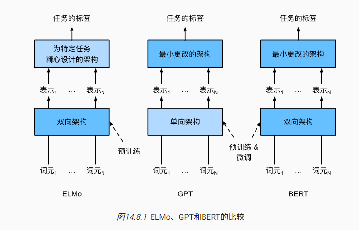
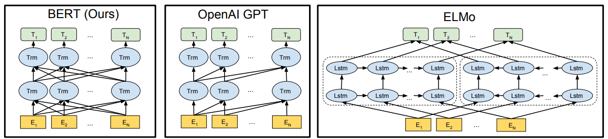
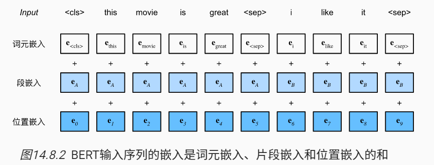

### 上下文敏感

词的表征取决于它们的上下文。因此，词元x的上下文敏感表示是函数f(x,c(x))，其取决于x及其上下文$c(x)$

### 特定任务的模型

流行的上下文敏感表示包括TagLM（language-model-augmented sequence tagger，语言模型增强的序列标记器） [[Peters et al., 2017b](https://zh.d2l.ai/chapter_references/zreferences.html#id124)]、CoVe（Context Vectors，上下文向量） [[McCann et al., 2017](https://zh.d2l.ai/chapter_references/zreferences.html#id105)]和ELMo（Embeddings from Language Models，来自语言模型的嵌入） [[Peters et al., 2018](https://zh.d2l.ai/chapter_references/zreferences.html#id126)]。

例如，通过将整个序列作为输入，ELMo是为输入序列中的每个单词分配一个表示的函数。具体来说，ELMo将来自预训练的双向长短期记忆网络的所有中间层表示组合为输出表示。然后，ELMo的表示将作为附加特征添加到下游任务的现有监督模型中，例如通过将ELMo的表示和现有模型中词元的原始表示（例如GloVe）连结起来。一方面，在加入ELMo表示后，冻结了预训练的双向LSTM模型中的所有权重。另一方面，现有的监督模型是专门为给定的任务定制的。利用当时不同任务的不同最佳模型，添加ELMo改进了六种自然语言处理任务的技术水平：情感分析、自然语言推断、语义角色标注、共指消解、命名实体识别和问答。

### 从特定任务到不可知任务

GPT（Generative Pre Training，生成式预训练）模型为上下文的敏感表示设计了通用的任务无关模型 [[Radford et al., 2018\]](https://zh.d2l.ai/chapter_references/zreferences.html#radford-narasimhan-salimans-ea-2018)。GPT建立在Transformer解码器的基础上，预训练了一个用于表示文本序列的语言模型。当将GPT应用于下游任务时，语言模型的输出将被送到一个附加的线性输出层，以预测任务的标签。与ELMo冻结预训练模型的参数不同，GPT在下游任务的监督学习过程中对预训练Transformer解码器中的所有参数进行微调。GPT在自然语言推断、问答、句子相似性和分类等12项任务上进行了评估，并在对模型架构进行最小更改的情况下改善了其中9项任务的最新水平


**然而**，由于语言模型的自回归特性，GPT只能向前看（从左到右）。在“i went to the bank to deposit cash”（我去银行存现金）和“i went to the bank to sit down”（我去河岸边坐下）的上下文中，由于“bank”对其左边的上下文敏感，GPT将返回“bank”的相同表示，尽管它有不同的含义。

### Bert：结合最好的两个

- ELMo对上下文双向编码，但用于特定任务
- GPT从左到右编码上下文，但任务无关
- Bert结合两者：双向编码，任务无关，只需要最少的架构改变可以用于多数任务。





### 输入表示

输入有两种：单个文本和一对文本序列；

对于A和B两个输入：

为了区分文本对，根据输入序列学到的片**段嵌入**eA和eB分别被添加到第一序列和第二序列的词元嵌入中。对于单文本输入，仅使用eA。

```python
#@save
def get_tokens_and_segments(tokens_a, tokens_b=None):
    """获取输入序列的词元及其片段索引"""
    tokens = ['<cls>'] + tokens_a + ['<sep>']
    # 0和1分别标记片段A和B
    segments = [0] * (len(tokens_a) + 2)
    if tokens_b is not None:
        tokens += tokens_b + ['<sep>']
        segments += [1] * (len(tokens_b) + 1)
    return tokens, segments
```

BERT输入序列的嵌入是词元嵌入、片段嵌入和位置嵌入（可学习）的和。



### 预训练任务

#### 1. 掩蔽语言模型

语言模型使用左侧的上下文预测词元。为了双向编码上下文以表示每个词元，BERT随机掩蔽词元并使用来自双向上下文的词元**以自监督的方式预测掩蔽词元**。此任务称为*掩蔽语言模型*。

#### 2. 下一句预测

尽管掩蔽语言建模能够编码双向上下文来表示单词，但它不能显式地建模文本对之间的逻辑关系。为了帮助理解两个文本序列之间的关系，BERT在预训练中考虑了一个二元分类任务——*下一句预测*。

在为预训练生成句子对时，有一半的时间它们确实是标签为“真”的连续句子；在另一半的时间里，第二个句子是从语料库中随机抽取的，标记为“假”。