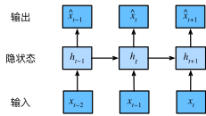

### 0. 统计工具

以富时100指数为例

$x_t$表示在时间步$t$的价格，$t$对于文本中的序列通常是离散的。

假设一个交易员想在$t$日故事表现良好，于是通过以下途径预测$x_t$
$$
x_t \sim P(x_t \mid x_{t-1}, \ldots, x_1).
$$

### 1. 自回归模型

问题：随着数据量增加，如何有效估计P

#### 1.1 自回归模型

假设相当长的序列不是必要的，我们只需要满足某个长度为$\tau$的时间跨度，使用序列$x_{t-1}, \ldots, x_{t-\tau}$。这样的好处是参数的数量总是不变的，能够训练一个深度模型。

这种模型被称为*自回归模型*（autoregressive models）， 因为它们是对自己执行回归。

#### 1.2 隐变量自回归模型

保留一些对过去观测的总结$h_t$，同时更新预测$\hat{x}_t$和$h_t$，产生了$\hat{x}_t = P(x_t \mid h_{t})$，以及$h_t = g(h_{t-1}, x_{t-1})$。

由于$h_t$从未被观测到，这类模型也被称为 *隐变量自回归模型*（latent autoregressive models）。

这两中模型的问题：如何生成训练数据？

一个常见的假设是虽然特定值xt可能会改变， 但是序列本身的动力学不会改变。 这样的假设是合理的，因为新的动力学一定受新的数据影响， 而我们不可能用目前所掌握的数据来预测新的动力学。

统计学家称不变的动力学为*静止的*（stationary）。 因此，整个序列的估计值都将通过以下的方式获得：
$$
P(x_1, \ldots, x_T) = \prod_{t=1}^T P(x_t \mid x_{t-1}, \ldots, x_1).
$$
注意，如果我们处理的是离散的对象（如单词）， 而不是连续的数字，则上述的考虑仍然有效。 唯一的差别是，对于离散的对象， 我们需要使用分类器而不是回归模型来估计$P(x_t \mid x_{t-1}, \ldots, x_1)$

### 2. 马尔可夫模型

在自回归模型的近似中，我们使用$x_{t-1}, \ldots, x_{t-\tau}$而不是$x_{t-1}, \ldots, x_1$来估计$x_t$。只要之中近似是精确的，可以认为序列满足*马尔可夫条件*（Markov condition）

如果$\tau=1$，则为**一阶马尔可夫模型**
$$
P(x_1, \ldots, x_T) = \prod_{t=1}^T P(x_t \mid x_{t-1}) \text{ 当 } P(x_1 \mid x_0) = P(x_1).
$$
在这种情况下，使用动态规划可以沿着马尔可夫链精确地计算结果。 例如，我们可以高效地计算$P(x_{t+1} \mid x_{t-1})$
$$
\begin{split}\begin{aligned}
P(x_{t+1} \mid x_{t-1})
&= \frac{\sum_{x_t} P(x_{t+1}, x_t, x_{t-1})}{P(x_{t-1})}\\
&= \frac{\sum_{x_t} P(x_{t+1} \mid x_t, x_{t-1}) P(x_t, x_{t-1})}{P(x_{t-1})}\\
&= \sum_{x_t} P(x_{t+1} \mid x_t) P(x_t \mid x_{t-1})
\end{aligned}\end{split}
$$
利用这一事实，我们只需要考虑过去观察中的一个非常短的历史：

### 3. 因果关系

可以将$P(x_1, \ldots, x_T)$倒序展开。基于条件概率
$$
P(x_1, \ldots, x_T) = \prod_{t=T}^1 P(x_t \mid x_{t+1}, \ldots, x_T).
$$
