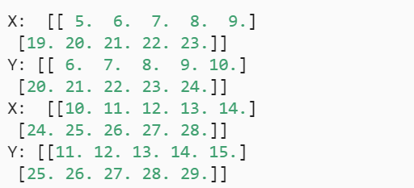

 假设长度为T的文本序列中的词元依次为$x_1, x_2, \ldots, x_T$，于是$1 \leq t \leq T$可以被认为是文本序列在时间步t处的观测或标签。 在给定这样的文本序列时，*语言模型*（language model）的目标是估计序列的联合概率：
$$
P(x_1, x_2, \ldots, x_T).
$$
只需要一次抽取一个词元$x_t \sim P(x_t \mid x_{t-1}, \ldots, x_1)$，理想的语言模型就能够**基于模型本身生成自然文本**。只需要基于前面的对话片断中的文本， 就足以生成一个有意义的对话。这是一个理想的语言模型。

用途：区别语音识别中的歧义、根据频率判断语句

### 1. 学习语言模型

$$
P(x_1, x_2, \ldots, x_T) = \prod_{t=1}^T P(x_t  \mid  x_1, \ldots, x_{t-1}).
$$

这里，我们假设训练数据集是一个大型的文本语料库。 比如，维基百科的所有条目、 [古登堡计划](https://en.wikipedia.org/wiki/Project_Gutenberg)， 或者所有发布在网络上的文本。 训练数据集中词的概率可以根据给定词的相对词频来计算。 例如，可以将估计值P^(deep) 计算为任何以单词“deep”开头的句子的概率。 一种（稍稍不太精确的）方法是统计单词“deep”在数据集中的出现次数， 然后将其除以整个语料库中的单词总数。 这种方法效果不错，特别是对于频繁出现的单词。 接下来，我们可以尝试估计
$$
\hat{P}(\text{learning} \mid \text{deep}) = \frac{n(\text{deep, learning})}{n(\text{deep})},
$$
其中$n(x)$和$n(x, x')$分别是单个单词和连续单词对的出现次数。困难之处在于来纳许单词对在语料库中出现的次数很少，可能为零

一种常见的策略是执行某种形式的*拉普拉斯平滑*（Laplace smoothing）， 具体方法是在所有计数中添加一个小常量。 用n表示训练集中的单词总数，用m表示唯一单词（去重后的单词数？）的数量。 此解决方案有助于处理单元素问题，例如通过：
$$
\begin{split}\begin{aligned}
    \hat{P}(x) & = \frac{n(x) + \epsilon_1/m}{n + \epsilon_1}, \\
    \hat{P}(x' \mid x) & = \frac{n(x, x') + \epsilon_2 \hat{P}(x')}{n(x) + \epsilon_2}, \\
    \hat{P}(x'' \mid x,x') & = \frac{n(x, x',x'') + \epsilon_3 \hat{P}(x'')}{n(x, x') + \epsilon_3}.
\end{aligned}\end{split}
$$
其中$\epsilon_1,\epsilon_2$和$\epsilon_3$是超参数，

### 2. 马尔可夫模型与n元语法

如果$P(x_{t+1} \mid x_t, \ldots, x_1) = P(x_{t+1} \mid x_t)$，则称为满足一阶马尔可夫性质。阶数越高，对应的依赖关系越长。这种性质推导出了许多可以应用于序列建模的近似公式：
$$
\begin{split}\begin{aligned}
P(x_1, x_2, x_3, x_4) &=  P(x_1) P(x_2) P(x_3) P(x_4),\\
P(x_1, x_2, x_3, x_4) &=  P(x_1) P(x_2  \mid  x_1) P(x_3  \mid  x_2) P(x_4  \mid  x_3),\\
P(x_1, x_2, x_3, x_4) &=  P(x_1) P(x_2  \mid  x_1) P(x_3  \mid  x_1, x_2) P(x_4  \mid  x_2, x_3).
\end{aligned}\end{split}
$$
涉及一个、两个和三个变量的概率公式分别被称为 “一元语法”（unigram）、“二元语法”（bigram）和“三元语法”（trigram）模型

### 3. 自然语言统计

最常用的词经常无意义，如“the”，称为停用词。

*齐普夫定律*（Zipf’s law）， 即第i个最常用单词的频率ni为
$$
n_i \propto \frac{1}{i^\alpha},
$$
等价于
$$
\log n_i = -\alpha \log i + c,
$$
这告诉我们想要通过计数统计和平滑来建模单词是不可行的， 因为这样建模的结果会大大高估尾部单词的频率

词频衰减速度

- 除了一元语法词，单词序列似乎也遵循齐普夫定律;
- 词表中n元组的数量并没有那么大，这说明语言中存在相当多的结构， 这些结构给了我们应用模型的希望
- 很多n元组很少出现，这使得拉普拉斯平滑非常不适合语言建模

### 4. 读取长序列

当序列变得太长而不能被模型一次性全部处理时， 我们可能希望拆分这样的序列方便模型读取

#### 4.1 随机采样

在随机采样中，每个样本都是在原始的长序列上任意捕获的子序列。 在迭代过程中，来自两个相邻的、随机的、小批量中的子序列不一定在原始序列上相邻。

对于语言建模，目标是基于到目前为止我们看到的词元来预测下一个词元， 因此标签是移位了一个词元的原始序列。

如：

#### 4.2 顺序分区

保证两个相邻的小批量中的子序列在原始序列上也是相邻的。 这种策略在基于小批量的迭代过程中保留了拆分的子序列的顺序，因此称为顺序分区。