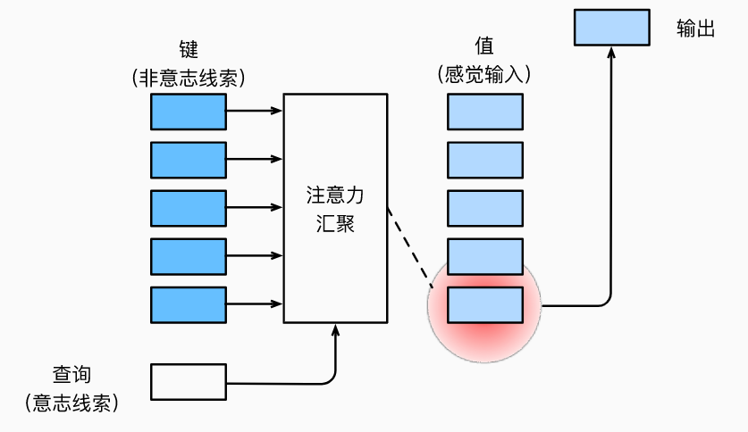

### 注意力的生物学解释

- 自主性：受到了认知和意识的控制
- 非自主性：基于环境中物体的突出性和易见性，比如突出的色彩。

### 查询、键与值

**非自主性**：简单的参数化全连接层、或者非参数化的最大汇聚层（池化层）

“是否包含自主性”是区别**注意力机制**与上述两种方法的关键。

此时，自主性提示被称为“**查询（qury）**”。给定查询，注意力机制通过注意力汇聚（attention pooling）江选择引导至感官输入（如中间特征表示）。这些输出为称为**值（value）**。

注意：每个值都有一个对应的**键（key）**，这可以想象为非自主性提示。如下图所示，我们可以设计注意力汇聚， 以便给定的查询（自主性提示）可以与键（非自主性提示）进行匹配， 这将引导得出最匹配的值（感官输入）。

### 注意力的可视化

注意力汇聚得到的是**加权平均的综合**，其中权重是在查询和键之间计算出来的。

