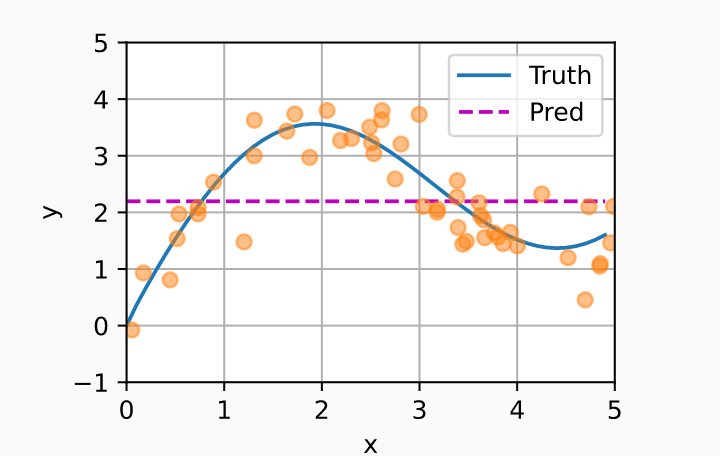
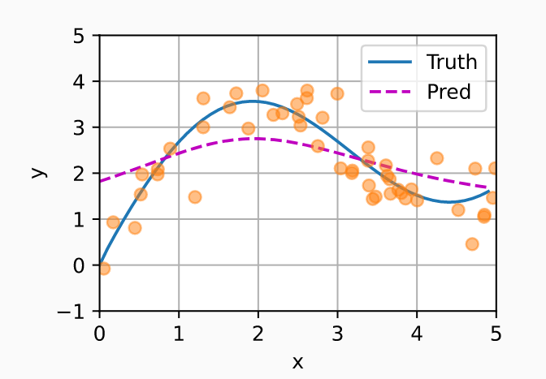
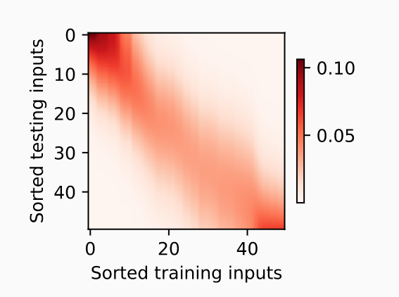
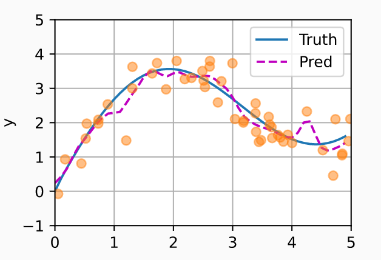

## Nadaraya-Watson核回归模型

下面举个例子


#### 生成数据

任务是学习f来预测任意新输入x的输出$\hat{y} = f(x)$

生成数据集：
$$
y_i = 2\sin(x_i) + x_i^{0.8} + \epsilon,
$$
$\epsilon$是均值为0标准差为0.5的正态分布，

### 1. 平均汇聚

使用平均汇聚：
$$
f(x) = \frac{1}{n}\sum_{i=1}^n y_i,
$$
结果



### 2. 非参数注意力汇聚

上一个方法完全会略了输入$x_i$，所以 于是Nadaraya [[Nadaraya, 1964](https://zh.d2l.ai/chapter_references/zreferences.html#id114)]和 Watson [[Watson, 1964](https://zh.d2l.ai/chapter_references/zreferences.html#id180)]提出了一个更好的想法， 根据输入的位置对输出yi进行加权：
$$
f(x) = \sum_{i=1}^n \frac{K(x - x_i)}{\sum_{j=1}^n K(x - x_j)} y_i,
$$
其中$K$为核（kernel），上式被称为被称为 *Nadaraya-Watson核回归*（Nadaraya-Watson kernel regression）。

参考上面的思路，写一个更通用的注意力汇聚公式
$$
f(x) = \sum_{i=1}^n \alpha(x, x_i) y_i,
$$
其中x是查询，(xi,yi)是键值对。

考虑一个高斯核；
$$
K(u) = \frac{1}{\sqrt{2\pi}} \exp(-\frac{u^2}{2}).
$$
得到：
$$
\begin{split}\begin{aligned} f(x) &=\sum_{i=1}^n \alpha(x, x_i) y_i\\ &= \sum_{i=1}^n \frac{\exp\left(-\frac{1}{2}(x - x_i)^2\right)}{\sum_{j=1}^n \exp\left(-\frac{1}{2}(x - x_j)^2\right)} y_i \\&= \sum_{i=1}^n \mathrm{softmax}\left(-\frac{1}{2}(x - x_i)^2\right) y_i. \end{aligned}\end{split}
$$
此时，如果$x_i$越接近给定的查询$x$，那么对应的权值越大，也就是**获得了更多的注意力**。

值得注意的是，Nadaraya-Watson核回归是一个非参数模型。 因此， [(10.2.6)](https://zh.d2l.ai/chapter_attention-mechanisms/nadaraya-waston.html#equation-eq-nadaraya-watson-gaussian)是 *非参数的注意力汇聚*（nonparametric attention pooling）模型。结果：



注意力汇聚图：



这里测试数据的输入相当于查询，而训练数据的输入相当于键。 因为两个输入都是经过排序的，因此由观察可知“查询-键”对越接近， 注意力汇聚的注意力权重就越高。

### 3. 带参数注意力汇聚

加入一个可学习的参数$w$:
$$
\begin{split}\begin{aligned}f(x) &= \sum_{i=1}^n \alpha(x, x_i) y_i \\&= \sum_{i=1}^n \frac{\exp\left(-\frac{1}{2}((x - x_i)w)^2\right)}{\sum_{j=1}^n \exp\left(-\frac{1}{2}((x - x_j)w)^2\right)} y_i \\&= \sum_{i=1}^n \mathrm{softmax}\left(-\frac{1}{2}((x - x_i)w)^2\right) y_i.\end{aligned}\end{split}
$$


#### 3.1 定义模型

先江训练集变换为**键和值**用于训练模型

```python
# X_tile的形状:(n_train，n_train)，每一行都包含着相同的训练输入
X_tile = x_train.repeat((n_train, 1))
# Y_tile的形状:(n_train，n_train)，每一行都包含着相同的训练输出
Y_tile = y_train.repeat((n_train, 1))
# keys的形状:('n_train'，'n_train'-1)
keys = X_tile[(1 - torch.eye(n_train)).type(torch.bool)].reshape((n_train, -1))
# values的形状:('n_train'，'n_train'-1)
values = Y_tile[(1 - torch.eye(n_train)).type(torch.bool)].reshape((n_train, -1))
```

训练：

(这里查询就是输入的x，期待输出为对应的y)，键和值分别有输入变换得到

```python
net = NWKernelRegression()
loss = nn.MSELoss(reduction='none')
trainer = torch.optim.SGD(net.parameters(), lr=0.5)
animator = d2l.Animator(xlabel='epoch', ylabel='loss', xlim=[1, 5])

for epoch in range(5):
    trainer.zero_grad()
    l = loss(net(x_train, keys, values), y_train)
    l.sum().backward()
    trainer.step()
    print(f'epoch {epoch + 1}, loss {float(l.sum()):.6f}')
    animator.add(epoch + 1, float(l.sum()))
```

预测：

```python
# keys的形状:(n_test，n_train)，每一行包含着相同的训练输入（例如，相同的键）
keys = x_train.repeat((n_test, 1))
# value的形状:(n_test，n_train)
values = y_train.repeat((n_test, 1))
y_hat = net(x_test, keys, values).unsqueeze(1).detach()
plot_kernel_reg(y_hat)
```


结果

