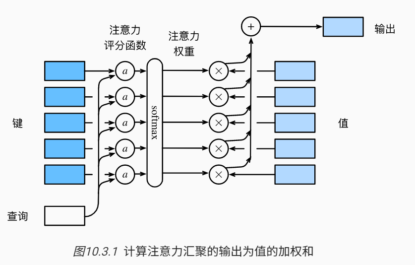

N-W模型中的高斯核**指数部分**被视为注意力评分函数，然后把这个函数的输出结果输入到softmax中进行运算，得到权重。

其中查询 $\mathbf{q}$ 和键 $\mathbf{k}_i$ 的注意力权重（标量） 是通过注意力评分函数 $\mathbf{q} \in \mathbb{R}^q$ 将两个向量映射成标量，再经过softmax运算得到的：
$$
\alpha(\mathbf{q}, \mathbf{k}_i) = \mathrm{softmax}(a(\mathbf{q}, \mathbf{k}_i)) = \frac{\exp(a(\mathbf{q}, \mathbf{k}_i))}{\sum_{j=1}^m \exp(a(\mathbf{q}, \mathbf{k}_j))} \in \mathbb{R}.
$$

接下来介绍两个流行的频分函数。

### 1. 掩蔽softmax操作

某些文本序列被填充了没有意义的特殊词元。 为了仅将有意义的词元作为值来获取注意力汇聚， 我们可以指定一个有效序列长度（即词元的个数）， 以便在计算softmax时过滤掉超出指定范围的位置。

### 2. 加性注意力

当查询和键是不同长度的矢量时， 我们可以使用加性注意力作为评分函数。

比如$\mathbf{q} \in \mathbb{R}^q$， $\mathbf{k} \in \mathbb{R}^k$，此时
$$
a(\mathbf q, \mathbf k) = \mathbf w_v^\top \text{tanh}(\mathbf W_q\mathbf q + \mathbf W_k \mathbf k) \in \mathbb{R},
$$
其中，$\mathbf W_q\in\mathbb R^{h\times q}$，$\mathbf W_k\in\mathbb R^{h\times k}$ 和 $\mathbf w_v\in\mathbb R^{h}$。

### 3. 缩放点击注意力

使用点积可以得到计算效率更高的评分函数， 但是点积操作要求查询和键具有相同的长度d。

假设查询和键的所有元素都是独立的随机变量， 并且都满足零均值和单位方差， 那么两个向量的点积的均值为0，方差为d。 为确保无论向量长度如何， 点积的方差在不考虑向量长度的情况下仍然是1， 我们将点积除以d， 则*缩放点积注意力*（scaled dot-product attention）评分函数为
$$
a(\mathbf q, \mathbf k) = \mathbf{q}^\top \mathbf{k}  /\sqrt{d}.
$$
此时：
$$
\mathrm{softmax}\left(\frac{\mathbf Q \mathbf K^\top }{\sqrt{d}}\right) \mathbf V \in \mathbb{R}^{n\times v}.
$$
