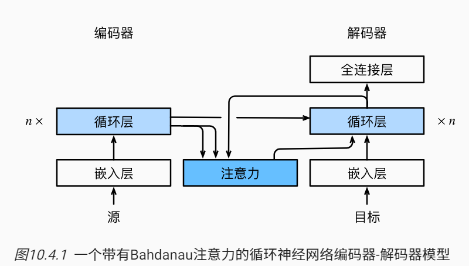

受学习对齐想法的启发，Bahdanau等人提出了一个没有严格单向对齐限制的 可微注意力模型 [[Bahdanau et al., 2014](https://zh.d2l.ai/chapter_references/zreferences.html#id6)]。 在预测词元时，如果不是所有输入词元都相关，模型将仅对齐（或参与）输入序列中与当前预测相关的部分。这是通过将上下文变量视为注意力集中的输出来实现的

### 模型

$$
\mathbf{c}_{t'} = \sum_{t=1}^T \alpha(\mathbf{s}_{t' - 1}, \mathbf{h}_t) \mathbf{h}_t,
$$

上下文变量c，时间步t'，假设输入有T个词元。时间步t′−1时的解码器隐状态st′−1是查询， 编码器隐状态ht既是键也是值， 注意力权重α是使用加性注意力。

