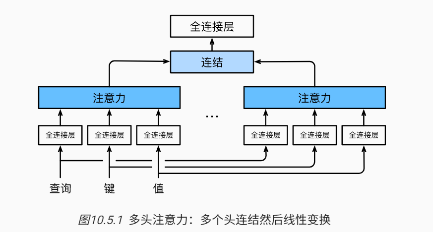

模型可以基于相同的注意力机制学习到不同的行为， 然后将不同的行为作为知识组合起来， 捕获序列内各种范围的依赖关系 （例如，短距离依赖和长距离依赖关系）

### 模型

$$
\mathbf{h}_i = f(\mathbf W_i^{(q)}\mathbf q, \mathbf W_i^{(k)}\mathbf k,\mathbf W_i^{(v)}\mathbf v) \in \mathbb R^{p_v},
$$

$f$可以是加性注意力或缩放点击注意力。

多头注意力的输出需要经过另一个线性转换， 它对应着h个头连结后的结果，因此其可学习参数是$\mathbf W_o\in\mathbb R^{p_o\times h p_v}$
$$
\begin{split}\mathbf W_o \begin{bmatrix}\mathbf h_1\\\vdots\\\mathbf h_h\end{bmatrix} \in \mathbb{R}^{p_o}.\end{split}
$$
基于这种设计，每个头都可能会关注输入的不同部分， 可以表示比简单加权平均值更复杂的函数。

### 实现

