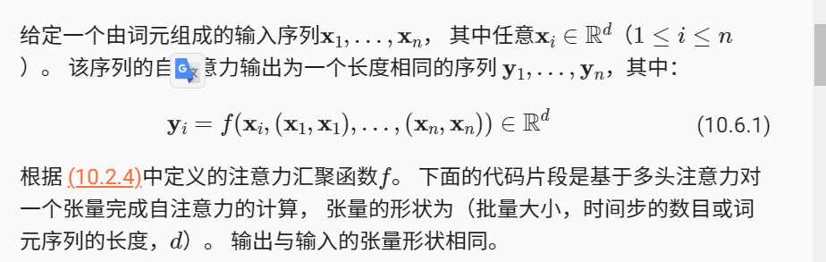
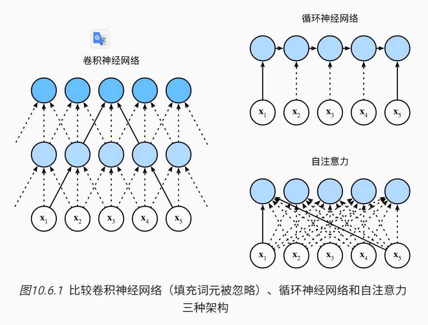
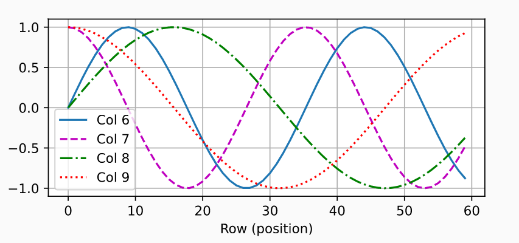

由于查询、键和值来自同一组输入，因此被称为 *自注意力*（self-attention）

### 自注意力

### 比较不同网络和自注意力

让我们比较下面几个架构，目标都是将由n个词元组成的序列映射到另一个长度相等的序列，其中的每个输入词元或输出词元都由d维向量表示

### 位置编码

自注意力则因为并行计算而放弃了顺序操作。 为了使用序列的顺序信息，我们通过在输入表示中添加 *位置编码*（positional encoding）来注入绝对的或相对的位置信息。 位置编码可以通过**学习得到**也可以**直接固定**得到。

$$
\begin{split}\begin{aligned} p_{i, 2j} &= \sin\left(\frac{i}{10000^{2j/d}}\right),\\p_{i, 2j+1} &= \cos\left(\frac{i}{10000^{2j/d}}\right).\end{aligned}\end{split}
$$
所以，随着j（列数）增加，频率变低（波长变大）

#### 绝对位置信息

**关键：节省空间**

#### 相对位置信息

上述位置表示还可以学习得到输入序列中相对位置。

对于任何位置偏移$\delta$，则其位置$i+\delta$可表示为：$(p_{i+\delta, 2j}, p_{i+\delta, 2j+1})$
$$
\begin{split}\begin{aligned}
&\begin{bmatrix} \cos(\delta \omega_j) & \sin(\delta \omega_j) \\  -\sin(\delta \omega_j) & \cos(\delta \omega_j) \\ \end{bmatrix}
\begin{bmatrix} p_{i, 2j} \\  p_{i, 2j+1} \\ \end{bmatrix}\\
=&\begin{bmatrix} \cos(\delta \omega_j) \sin(i \omega_j) + \sin(\delta \omega_j) \cos(i \omega_j) \\  -\sin(\delta \omega_j) \sin(i \omega_j) + \cos(\delta \omega_j) \cos(i \omega_j) \\ \end{bmatrix}\\
=&\begin{bmatrix} \sin\left((i+\delta) \omega_j\right) \\  \cos\left((i+\delta) \omega_j\right) \\ \end{bmatrix}\\
=&
\begin{bmatrix} p_{i+\delta, 2j} \\  p_{i+\delta, 2j+1} \\ \end{bmatrix},
\end{aligned}\end{split}
$$
