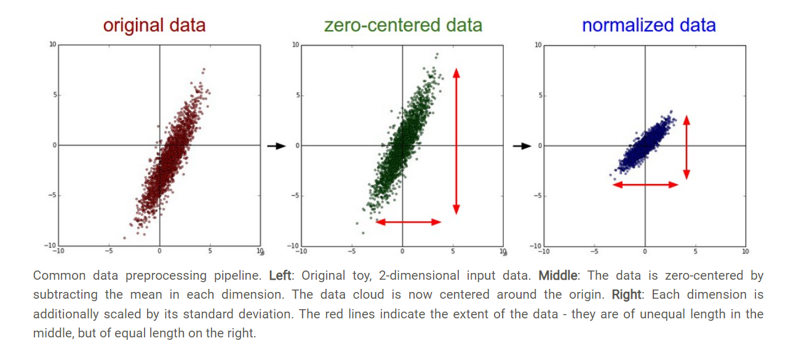
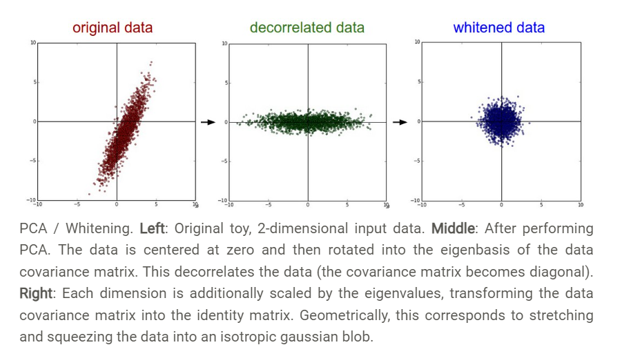
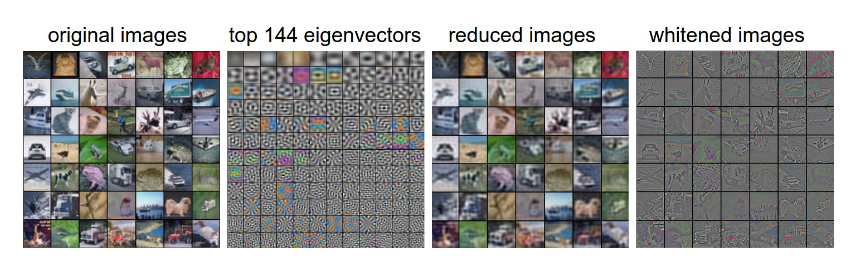

### 1. Mean subtraction

直接减去均值`X -= np.mean(X, axis = 0)`

### 2.normalization

两个方法：一个是除以均值，在zero-centered（减去均值）之后，计算：`X /= np.std(X, axis = 0)`；

另一个是令最大最小值为-1和1.




### 2. PCA and whitening

这个方法中，先求均值，再求协矩阵

```python
X -= np.mean(X, axis = 0) # zero-center the data (important)
cov = np.dot(X.T, X) / X.shape[0] # get the data covariance matrix
```

cov是一个对称正定阵，再用SVD分解

```python
U,S,V = np.linalg.svd(cov)
```

U是特征向量，S是奇异值；再去除相关性：To decorrelate the data, we project the original (but zero-centered) data into the eigenbasis:

```python
Xrot = np.dot(X, U) # decorrelate the data
```

上式相对于把X投影到正交的X上，Xrot是个对角阵。U是按大小排列的特征向量，我们截断只取前几个，这就是 [Principal Component Analysis (PCA)](http://en.wikipedia.org/wiki/Principal_component_analysis) dimensionality reduction

```python
Xrot_reduced = np.dot(X, U[:,:100])
```

通常再PCA的数据上都能取得很好的效果。


**白化**：如果输入数据是多变量高斯，那么白化可以实现零均值高斯和单位协矩阵。注意因为是除法，所以可能放大噪声。

```python
# whiten the data:
# divide by the eigenvalues (which are square roots of the singular values)
Xwhite = Xrot / np.sqrt(S + 1e-5)
```



### 在CIFAR-10中的实战



### 注意

PCA/Whitening在卷积网络中不常用。但是它对于zero-centered数据非常重要。

[CS231n Convolutional Neural Networks for Visual Recognition](https://cs231n.github.io/neural-networks-2/)