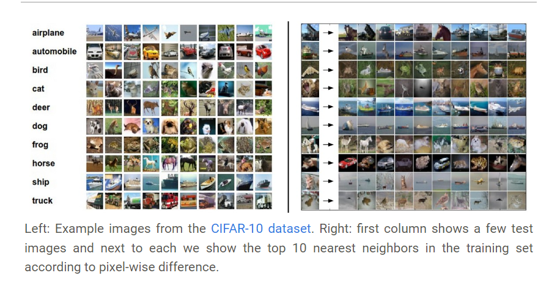
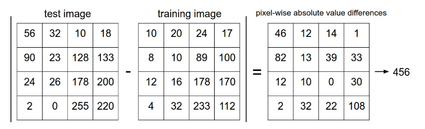
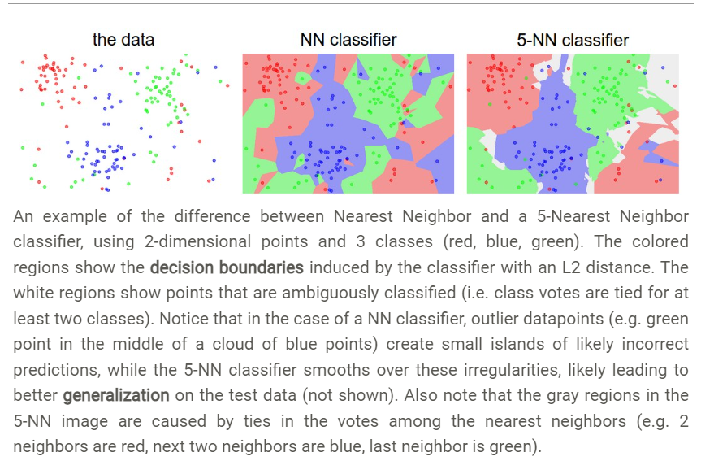
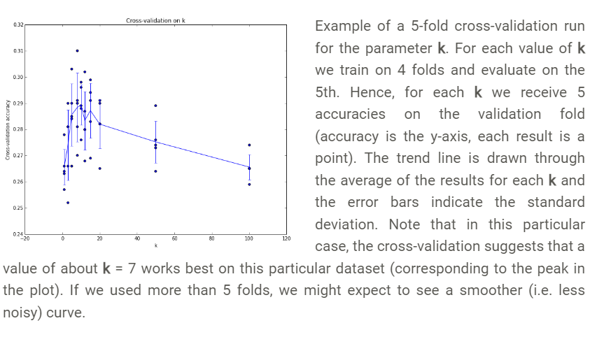

## 图像分类

其他类型的CV任务（比如目标检测、分割任务）可以reduced to 图像分类

把像素变成一个label

#### 挑战

- 视角变化
- 尺度变化
- 形变
- 遮挡（只有部分显示）
- 光照条件
- 背景干扰
- 类型多样：比如椅子就有很多种类

### 1. 最近邻分类法

该方法会对每一个测试图像，对比它和训练图像，预测其属于哪一类。



如何对比？

令两幅图分别为矢量I1，I2：
$$
d_1 (I_1, I_2) = \sum_{p} \left| I^p_1 - I^p_2 \right|
$$
L1距离如下图所示：



代码：

 `Xtr` (of size 50,000 x 32 x 32 x 3) holds all the imags in the training set, and a corresponding 1-dimensional array `Ytr` (of length 50,000) holds the training labels (from 0 to 9)

```python
Xtr, Ytr, Xte, Yte = load_CIFAR10('data/cifar10/') # a magic function we provide
# flatten out all imags to be one-dimensional
Xtr_rows = Xtr.reshape(Xtr.shape[0], 32 * 32 * 3) # Xtr_rows becomes 50000 x 3072
Xte_rows = Xte.reshape(Xte.shape[0], 32 * 32 * 3) # Xte_rows becomes 10000 x 3072

nn = NearestNeighbor() # create a Nearest Neighbor classifier class
nn.train(Xtr_rows, Ytr) # train the classifier on the training imags and labels
Yte_predict = nn.predict(Xte_rows) # predict labels on the test imags
# and now print the classification accuracy, which is the average number
# of examples that are correctly predicted (i.e. label matches)
print 'accuracy: %f' % ( np.mean(Yte_predict == Yte) )
```

```python

class NearestNeighbor(object):
  def __init__(self):
    pass

  def train(self, X, y):
    """ X is N x D where each row is an example. Y is 1-dimension of size N """
    # the nearest neighbor classifier simply remembers all the training data
    self.Xtr = X
    self.ytr = y

  def predict(self, X):
    """ X is N x D where each row is an example we wish to predict label for """
    num_test = X.shape[0]
    # lets make sure that the output type matches the input type
    Ypred = np.zeros(num_test, dtype = self.ytr.dtype)

    # loop over all test rows
    for i in range(num_test):
      # find the nearest training image to the i'th test image
      # using the L1 distance (sum of absolute value differences)
      distances = np.sum(np.abs(self.Xtr - X[i,:]), axis = 1)
      min_index = np.argmin(distances) # get the index with smallest distance
      Ypred[i] = self.ytr[min_index] # predict the label of the nearest example

    return Ypred
```

### 2. K-近邻分类

对比两种分类法：最近邻和K-近邻



- 如何选择最合适的K值？
- 距离计算方法？

#### 训练集、验证集、测试集

从原始训练集中分离一小部分作为验证集（比如从5万图像中取1000个作为验证集），来调整超参数，而测试集只用来最后评价模型。

#### 交叉验证

当训练集很少的时候：5-fold cross-validation：其中4份训练，一份验证（迭代使用某份作为验证）。



实际上大家尽量避免交叉验证（计算量太大），而是指定一个验证集；50%~90%的训练集作为验证集

### 要素一：距离

### 要素二：K值选择

- 如果当K的取值过小时，一旦有噪声得成分存在们将会对预测产生比较大影响，例如取K值为1时，一旦最近的一个点是噪声，那么就会出现偏差，K值的减小就意味着整体模型变得复杂，容易发生过拟合；
- 如果K的值取的过大时，就相当于用较大邻域中的训练实例进行预测，学习的近似误差会增大。这时与输入目标点较远实例也会对预测起作用，使预测发生错误。K值的增大就意味着整体的模型变得简单；
- 如果K==N的时候，那么就是取全部的实例，即为取实例中某分类下最多的点，就对预测没有什么实际的意义了；

K 的取值尽量要取奇数，以保证在计算结果最后会产生一个较多的类别，如果取偶数可能会产生相等的情况，不利于预测。

- 常用的方法是从k=1开始，使用检验集估计分类器的误差率。重复该过程，每次K增值1，允许增加一个近邻。选取产生最小误差率的K。
- 一般k的取值不超过20，上限是n的开方，随着数据集的增大，K的值也要增大。

### 要素三：分类决策


[CS231n Convolutional Neural Networks for Visual Recognition](https://cs231n.github.io/classification/)

[3.2 k 最近邻算法 (charmve.github.io)](https://charmve.github.io/computer-vision-in-action/#/1_理论篇/chapter3_Image-Classification/chapter3.2_knn)