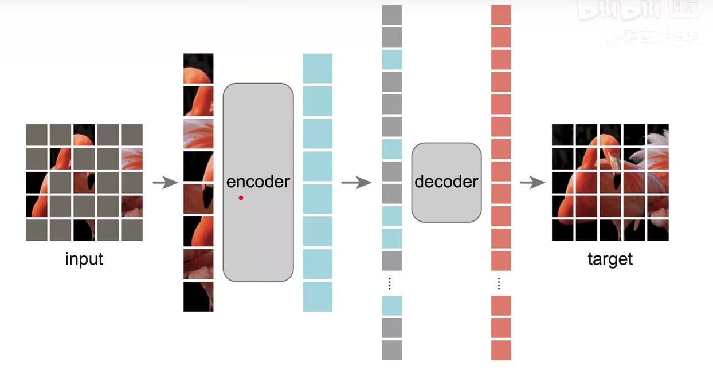

Masked Autoencoders（MAE）是一种scalable的自监督学习器。MAE方法很简单：我们随机mask掉输入图像的patches并重建这部分丢失的像素。

transformer：编码——解码器

Bert：transformer编码器，自监督训练，没有标签的数据

ViT：把图片划分为16个patch（domain）

MAE：ViT + Bert

任务：掩盖图片中部分pathc，预测这些被盖住的

架构： **非对称**编码-解码器

主要计算在encoder。

一方面decoder采用比encoder更轻量级设计，另外一方面encoder只处理一部分patchs（visible patchs，除了masked patchs之外的patchs），而decoder处理所有的patchs，如上图。这也就是为什么MAE能够只用较少的内存和计算消耗就能训练大的encoders

### 理论

从句子中预测丢失的词本身就是一种复杂的语言理解任务，但是图像存在很大的信息冗余，一个丢失的图像块很容易利用周边的图像区域进行恢复；

用于重建的decoder在图像和文本任务发挥的角色有区别，从句子中预测单词属于高语义任务，encoder和decoder的gap小，所以BERT的decoder部分微不足道（只需要一个MLP），而对图像重建像素属于低语义任务（相比图像分类），decoder需要发挥更大作用：将高语义的中间表征恢复成低语义的像素值。