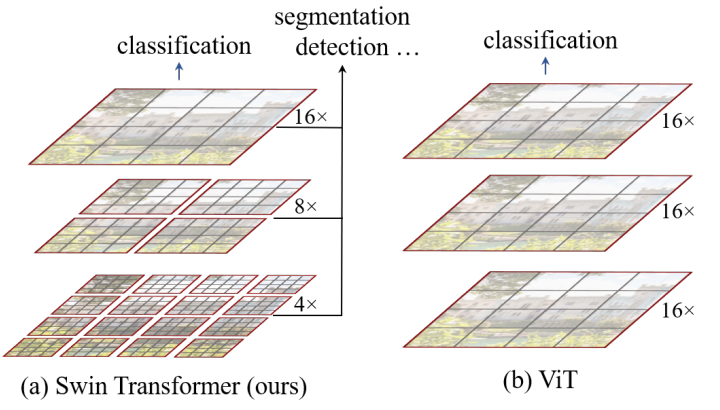
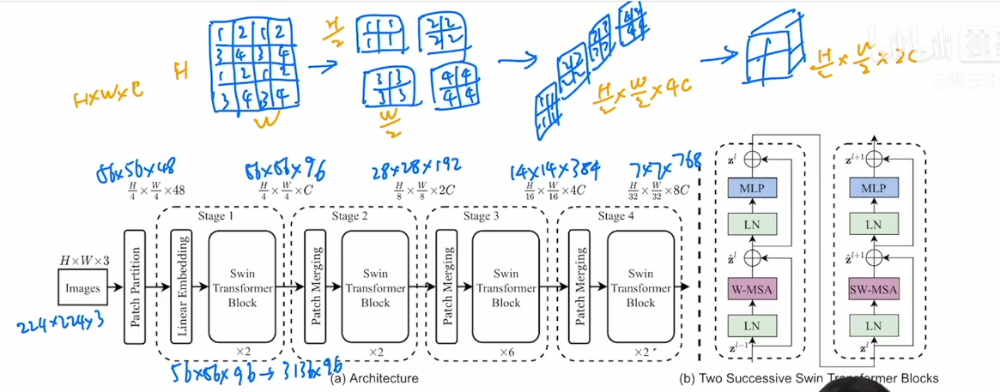
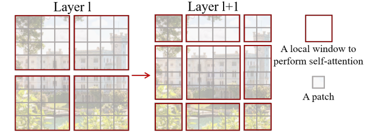
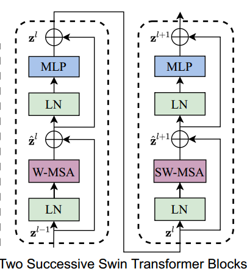
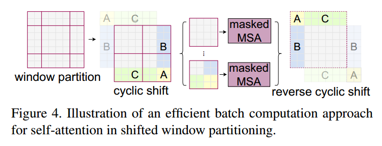
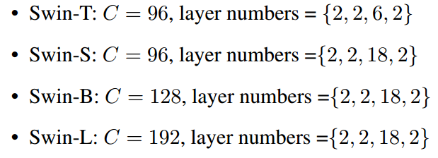

## 主要创新

Swin Transformer中采用local attention的方式，将patch划分成window，patch间的attention只在window内进行，以提升运行效率。但是这样的问题在于不同window之间的patch无法进行信息交互了。为了解决这个问题，Swin Transformer又提出Shifted Window方法，在不同层采用不同的window配置，如下面这张图，在下一层中会将window位置进行2个patch的横向和纵向偏移，以使得上一层不同window内的patch进行信息交互。

### 层级窗口

- 把图片变成patch：224x224x3 (4x4 patch)--> 56x56x48
- embedding: hyper parameters C=96; 56x56x96 --> 3136x96 
- 对第一层做 swin transformer， transformer尺寸不变；
- patch merging，比如：H\*W\*C--> H/2\*W/2*2C（类似卷积）；再做swin transformer
- 重复多层操作
- 根据任务需要加最后的网络

### shift windows

移动窗口增加窗口间的互动；

#### trick

如何计算shift后的窗口自注意力？

1. 加零，计算9个窗口
2. 循环移位+掩码（ABC区域）

### 变体

主要 不同：超参数c、blocks

[paper](https://arxiv.org/abs/2103.14030)

[microsoft/Swin-Transformer:  (github.com)](https://github.com/microsoft/Swin-Transformer)