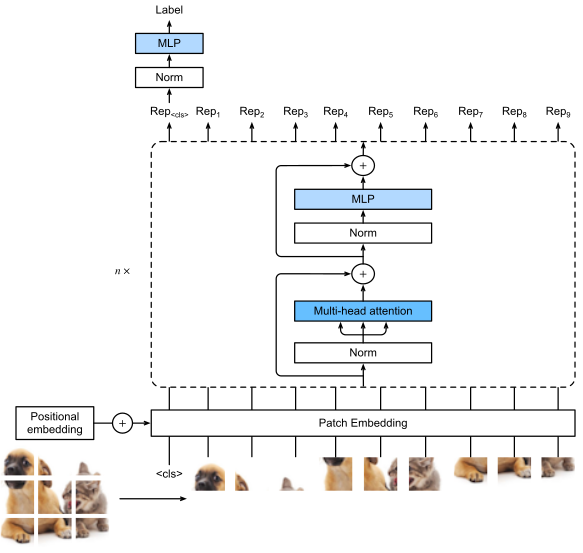

### Transformer用于CV历史

Ramachandran *et al.* ([2019](https://d2l.ai/chapter_references/zreferences.html#id471))：用self-attention代替convolution

Cordonnier *et al.* ([2020](https://d2l.ai/chapter_references/zreferences.html#id472))：理论证明两者等价，使用$2\times2$ 的 patch

([Dosovitskiy *et al.*, 2021](https://d2l.ai/chapter_references/zreferences.html#id60))：ViT，不需要特别指定patch size；且模型对大数据效果更好（对比ResNet），性能上升空间更多

ViT的思路：

- 直接把图像分成固定大小的patchs，然后通过线性变换得到patch embedding，这就类比NLP的words和word embedding
- 默认采用学习（训练的）的1-D positional embedding而不是固定的位置嵌入。

为什么小数据时CNN效果要好于VIT，大数据时VIT效果更好一些？
  传统的CNN卷积神经网络有很强的inductive biases（归纳偏置），是根据图像的本质而设计的一种网络，比如卷积核的平移不变性和局部性。因此在小数据时，VIT学不到这些，自然效果就不好，但是数据多起来后，就不太需要针对图像特意去设计这些小tips了。

进一步：[Swin Tranformer](E:\Git\Blogs\CS\DL\基础\网络——5.4.Swin transformer.md)

#### 参考：

[11.8. Transformers for Vision — Dive into Deep Learning 1.0.0-beta0 documentation (d2l.ai)](https://d2l.ai/chapter_attention-mechanisms-and-transformers/vision-transformer.html)

["未来"的经典之作ViT：transformer is all you need! - 知乎 (zhihu.com)](https://zhuanlan.zhihu.com/p/356155277)