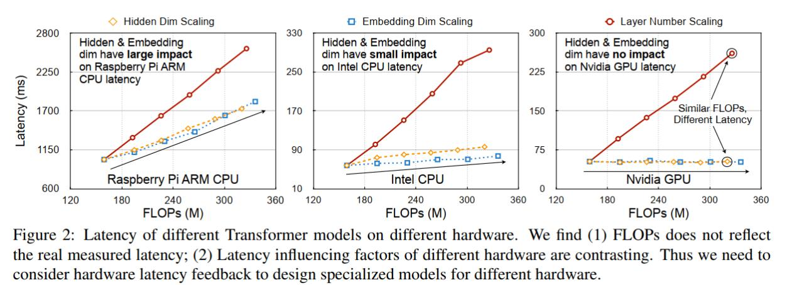

### 1. 精度比较

和传统的纯CNN模型相比，例如代表作resnet50比，在控制FLOPS下能够取得不错的精度优势，renet50冲到顶也就是80%了在imagenet 1k上。

| 模型                   | 精度  | Torch-推理时显存占用 |
| ---------------------- | ----- | -------------------- |
| Swin-Transformer-Base  | 83.4% | 6800M                |
| Swin-Transformer-small | 83.2% | 5100M                |
| Swin-Transformer-tiny  | 81.2% | 4900M                |

### 2. 推理速度

限制一个模型能否大规模商用更多的是时延（latency）的限制。

#### 2.1 Swin-Transformer v.s. ResNet50

在评估Transformer的时候，往往有两个问题，1是FLOPs并不反映测量的latency。虽然在现有很多论文里，FLOPs被用作效率的衡量标准，但是其实在不同硬件下，FLOPs和latency之间并不完全对应，下图可见，同样的FLOPs模型的latency其实可以差很远。

| Swin-Transformer-Base  | 83.4% | 6800M | 16/8【倍数关系】 | 842M/666M |
| ---------------------- | ----- | ----- | ---------------- | --------- |
| Swin-Transformer-small | 83.2% | 5100M | 11/6             | 696M/549M |
| Swin-Transformer-tiny  | 81.2% | 4900M | 6/3              | 610M/525M |
| Resnet101              | 79.9% |       | 6/2              | 721M/651M |
| Resnet50               | 79.1% |       | 3/1              | 636M/579M |

从上面表格可以得到几个结论：

1、swin transformer跑的非常慢，哪怕最小尺寸的tiny版本，也比resnet50慢了一倍

2、swin transformer对量化不友好，可以看到从fp32到fp16，时延都是下降了1倍，但是resnet结果可以下降3倍

### 总结

Tansformer的崛起似乎已经势不可挡，在CV领域也取得了不错成效，但是距离商业化在CV领域落地还存在一定的距离，这个距离可靠大厂在推理引擎对Tansformer结构更好的适配，也可以靠学者们提出更加elegant的结构，个人感觉现在ViT还是处在VGG16时代，距离ViT的resnet时代尚未到来

#### 参考

[Vision Transformer(ViT)在2022年能否落地在实际业务上？-云社区-华为云 (huaweicloud.com)](https://bbs.huaweicloud.com/blogs/327738)