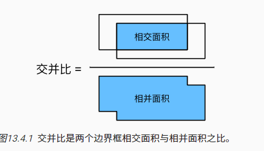
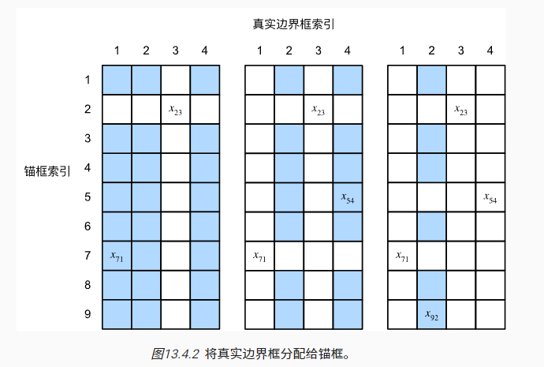
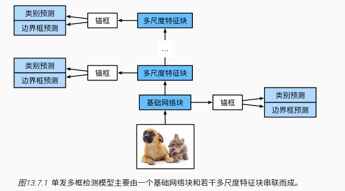

### 边界框

两种表达

- 左上角和右下角坐标
- 中心坐标和宽高

注意：

- 目标检测不仅可以识别图像中所有感兴趣的物体，还能识别它们的位置，该位置通常由矩形边界框表示。
- 我们可以在两种常用的边界框表示（中间，宽度，高度）和（左上，右下）坐标之间进行转换。

### 锚框

目标检测算法通常会在输入图像中采样大量的区域，然后判断这些区域中是否包含我们感兴趣的目标。

以每个像素为中心，生成多个缩放比和宽高比（aspect ratio）不同的边界框。 这些边界框被称为*锚框*（anchor box）

#### 标注锚框

计算真实边框和锚框的交并比



用矩阵表示两者的比值：



然后寻找最大值。

**偏移量**


### 单发多框检测（SSD）

通过多尺度特征块，单发多框检测生成不同大小的锚框，并通过预测**边界框的类别**和**偏移量**来检测大小不同的目标，因此这是一个多尺度目标检测模型。



#### 模型结构

网络前向传播：输入（图像）--> 锚框+类别+偏移量

```python
anchors, cls_preds, bbox_preds = net(X)
```


标签数据：锚框+ 类别+偏移量

```python
bbox_labels, bbox_masks, cls_labels = d2l.multibox_target(anchors, Y) # Y 为标签 [class, x0,y0,x1,y1]
```

计算损失函数

```python
l = calc_loss(cls_preds, cls_labels, bbox_preds, bbox_labels,
                      bbox_masks)
```

