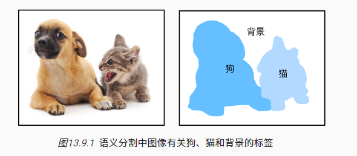

### 

计算机视觉领域还有2个与语义分割相似的重要问题，即*图像分割*（image segmentation）和*实例分割*（instance segmentation）。 我们在这里将它们同语义分割简单区分一下。

- *图像分割*将图像划分为若干组成区域，这类问题的方法通常利用图像中像素之间的相关性。它在训练时不需要有关图像像素的标签信息，在预测时也无法保证分割出的区域具有我们希望得到的语义。以 [图13.9.1](https://zh.d2l.ai/chapter_computer-vision/semantic-segmentation-and-dataset.html#fig-segmentation)中的图像作为输入，图像分割可能会将狗分为两个区域：一个覆盖以黑色为主的嘴和眼睛，另一个覆盖以黄色为主的其余部分身体。
- *实例分割*也叫*同时检测并分割*（simultaneous detection and segmentation），它研究如何识别图像中各个目标实例的像素级区域。与语义分割不同，实例分割不仅需要区分语义，还要区分不同的目标实例。例如，如果图像中有两条狗，则实例分割需要区分像素属于的两条狗中的哪一条。