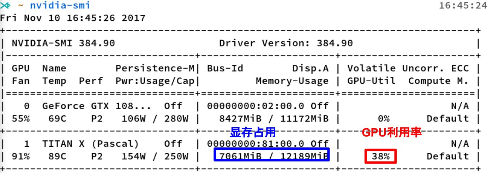
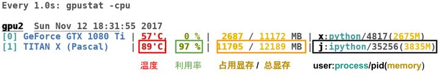
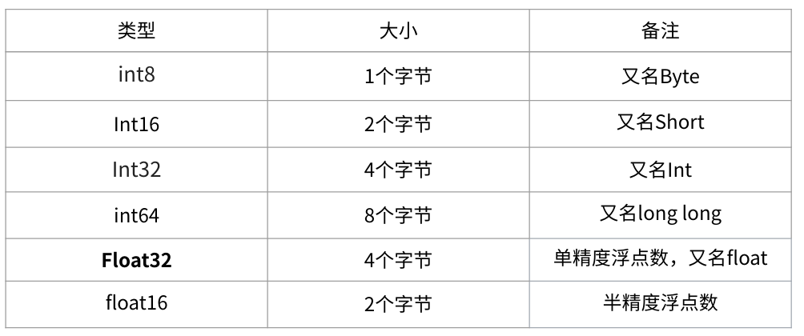
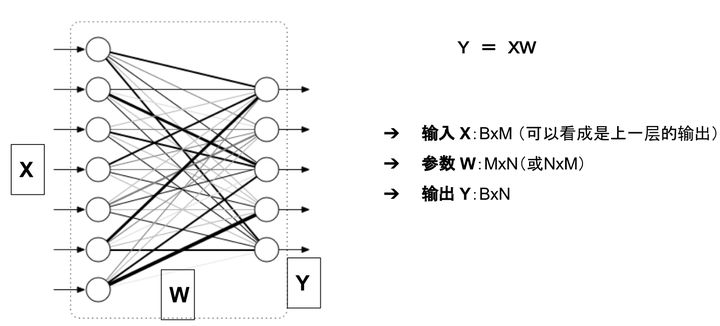

### 0. 预备知识

`nvidia-smi`是Nvidia显卡命令行管理套件，基于NVML库，旨在管理和监控Nvidia GPU设备

关键指标：显存占用和GPU利用率；有点类似内存和cpu的关系。




这里推荐一个好用的小工具：`gpustat`,直接`pip install gpustat`即可安装，gpustat基于`nvidia-smi`，可以提供更美观简洁的展示，结合watch命令，可以**动态实时监控**GPU的使用情况。

```bash
watch --color -n1 gpustat -cpu 
```



### 1. 显存

空间，类似于内存

- 用于存放模型，数据
- 显存越大，所能运行的网络也就越大



其中Float32 是在深度学习中最常用的数值类型，称为单精度浮点数，每一个单精度浮点数占用4Byte的显存。

举例来说：有一个1000x1000的 矩阵，float32，那么占用的显存差不多就是

> 1000x1000x4 Byte = 4MB

32x3x256x256的四维数组（BxCxHxW）占用显存为：24M

#### 1.1 神经网络显存占用

**模型参数**

举例来说，对于如下图所示的一个全连接网络(不考虑偏置项b)



模型的输入输出和参数

模型的显存占用包括：

- 参数：二维数组 W
- 模型的输出： 二维数组 Y

输入X可以看成是上一层的输出，因此把它的显存占用归于上一层。

在PyTorch中，当你执行完`model=MyGreatModel().cuda()`之后就会占用相应的显存，占用的显存大小基本与上述分析的显存差不多（*会稍大一些，因为其它开销*）。

**梯度与动量的显存**

优化器如果是SGD：

$W_{t+1}=W_t-\alpha\nabla F(W_t)$

可以看出来，除了保存W之外还要保存对应的梯度 ，因此显存占用等于参数占用的显存x2,

如果是带Momentum-SGD

这时候还需要保存动量， 因此显存x3

如果是Adam优化器，动量占用的显存更多，显存x4

总结一下，模型中**与输入无关的显存占用**包括：

- 参数 **W**
- 梯度 **dW**（一般与参数一样）
- 优化器的**动量**（普通SGD没有动量，momentum-SGD动量与梯度一样，Adam优化器动量的数量是梯度的两倍）

**输入输出的显存**

模型输出的显存占用，总结如下：

- 需要计算每一层的feature map的形状（多维数组的形状）
- 需要保存输出对应的梯度用以反向传播（链式法则）
- **显存占用与 batch size 成正比**
- 模型输出不需要存储相应的动量信息。

深度学习中神经网络的显存占用，我们可以得到如下公式：

```text
显存占用 = 模型显存占用 + batch_size × 每个样本的显存占用
```

可以看出显存不是和batch-size简单的成正比，尤其是模型自身比较复杂的情况下：比如全连接很大，Embedding层很大

另外需要注意：

- 输入（数据，图片）一般不需要计算梯度
- 神经网络的每一层输入输出都需要保存下来，用来反向传播，但是在某些特殊的情况下，我们可以不要保存输入。比如ReLU，在PyTorch中，使用`nn.ReLU(inplace = True)` 能将激活函数ReLU的输出直接覆盖保存于模型的输入之中，节省不少显存。感兴趣的读者可以思考一下，这时候是如何反向传播的（提示：y=relu(x) -> *dx = dy.copy();dx[y<=0]=0*）

节省显存一般有如下方法：

- 降低batch-size
- 下采样(NCHW -> (1/4)*NCHW)
- 减少全连接层（一般只留最后一层分类用的全连接层）

### 2. 计算量分析


#### 0.2 GPU计算单元

衡量计算量的单位是flop： *the number of floating-point multiplication-adds*，浮点数先乘后加算一个flop。计算能力越强大，速度越快。衡量计算能力的单位是flops： 每秒能执行的flop数量

```python
1*2+3                  1 flop
1*2 + 3*4 + 4*5        3 flop 
```


[科普帖：深度学习中GPU和显存分析 - 知乎 (zhihu.com)](https://zhuanlan.zhihu.com/p/31558973)

