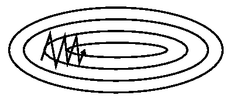

## 1. 梯度法

### 1. 1直观解释

比如我们在一座大山上的某处位置，由于我们不知道怎么下山，于是决定走一步算一步，也就是在每走到一个位置的时候，求解当前位置的梯度，沿着梯度的负方向，也就是当前最陡峭的位置向下走一步，然后继续求解当前位置梯度，向这一步所在位置沿着最陡峭最易下山的位置走一步。这样一步步的走下去，一直走到觉得我们已经到了山脚。当然这样走下去，有可能我们不能走到山脚，而是到了某一个局部的山峰低处（局部最小值）

梯度下降法(Gradient descent)或最速下降法(steepest descent)是求解无约束最优化问题的一种常用的、实现简单的方法。

梯度下降法是一种迭代算法。选取适当的初值 ，不断迭代，更新 的值，进行目标函数的极小化，直到收敛。由于负梯度方向是使函数下降最快的的方向，在迭代的每一步，以负梯度方向更新 x 的值，从而达到减少函数值的目的。
$$
\theta = \theta - \eta \cdot \nabla_{\theta} J(\theta)
$$
### 1.2 梯度下降的算法调优

在使用梯度下降时，需要进行调优。哪些地方需要调优呢？

1. **算法的步长选择**。步长取值取决于数据样本，可以多取一些值，从大到小，分别运行算法，看看迭代效果，如果损失函数在变小，说明取值有效，否则要增大步长。步长太大，会导致迭代过快，甚至有可能错过最优解。步长太小，迭代速度太慢，很长时间算法都不能结束。所以算法的步长需要多次运行后才能得到一个较为优的值。
2. **算法参数的初始值选择**。初始值不同，获得的最小值也有可能不同，因此梯度下降求得的只是局部最小值；当然如果损失函数是凸函数则一定是最优解。由于有局部最优解的风险，需要多次用不同初始值运行算法，关键损失函数的最小值，选择损失函数最小化的初值。
3. **归一化**。由于样本不同特征的取值范围不一样，可能导致迭代很慢，为了减少特征取值的影响，可以对特征数据归一化。

### 1.3 算法家族

#### 1.3.1 批量梯度下降(Batch Gradient Descent)
批量梯度下降法，是梯度下降法最常用的形式，具体做法也就是在更新参数时使用所有的样本来进行更新。

#### 1.3.2 随机批量梯度下降(Stochastic Gradient Descent)

随机梯度下降法，其实和批量梯度下降法原理类似，区别在与求梯度时没有用所有的样本的数据，而是仅仅选取一个样本来求梯度。
随机梯度下降法，和批量梯度下降法是两个极端，一个采用所有数据来梯度下降，一个用一个样本来梯度下降。自然各自的优缺点都非常突出。对于训练速度来说，随机梯度下降法由于每次仅仅采用一个样本来迭代，训练速度很快，而批量梯度下降法在样本量很大的时候，训练速度不能让人满意。对于准确度来说，随机梯度下降法用于仅仅用一个样本决定梯度方向，导致解很有可能不是最优。对于收敛速度来说，由于随机梯度下降法一次迭代一个样本，导致迭代方向变化很大，不能很快的收敛到局部最优解。

#### 1.3.3 **小批量梯度下降法（Mini-batch Gradient Descent）**

#### 动量

$$
v_t = \gamma v_{t-1} + \eta \nabla_\theta J( \theta)
$$
$$
\theta = \theta - v_t
$$

moment 加速SGD，通过添加一个因子$\gamma$来更新过去的vector。Momentum改进自SGD，让每一次的参数更新方向**不仅取决于当前位置的梯度，还受到上一次参数更新方向的影响**

$\gamma$一般设置成0.9或相似的数，

## 自适应方法

学习速率自适应调整（learning rate adaption）：在训练过程中适当的**修改学习速率**来达到更好的收敛性

### Adagrad

利用每次迭代历史的梯度平方根的和来修改学习速率

$$r_0=0\\ r_i = r_{i-1} + g_i \bigodot g_i\\ \theta_i = \theta_{i-1} - \frac{\epsilon}{\delta \bigoplus \sqrt{r_i}} \bigodot g$$

SGD、SGD-M 和 NAG 均是以相同的学习率去更新 $\theta$的各个分量。而深度学习模型中往往涉及大量的参数，不同参数的更新频率往往有所区别。对于更新不频繁的参数（典型例子：更新 word embedding 中的低频词，稀疏性），我们希望单次步长更大，多学习一些知识；对于更新频繁的参数，我们则希望步长较小，使得学习到的参数更稳定，不至于被单个样本影响太多。

### RMSprop

$$
\begin{split}\begin{aligned}
    \mathbf{r}_t & \leftarrow \gamma \mathbf{r}_{t-1} + (1 - \gamma) \mathbf{g}_t^2, \\
    \mathbf{x}_t & \leftarrow \mathbf{x}_{t-1} - \frac{\eta}{\sqrt{\mathbf{r}_t + \epsilon}} \odot \mathbf{g}_t.
\end{aligned}\end{split}
$$

在 Adagrad 中， $v_k$ 是单调递增的，使得学习率逐渐递减至 0，可能导致训练过程提前结束。为了改进这一缺点，可以考虑在计算二阶动量时不累积全部历史梯度，而只关注最近某一时间窗口内的下降梯度。

### Adam

Adam[6] 可以认为是 RMSprop 和 Momentum 的结合。和 RMSprop 对二阶动量使用指数移动平均类似，Adam 中对一阶动量也是用指数移动平均计算。

## 2. 牛顿法

一般来说，牛顿法主要应用在两个方面，1：求方程的根；2：最优化。这里只讲最优化。

假定函数$f(x)$有二阶连续i暗道，若第k次迭代值为$x^{(k)}$，则可以将$f(x)$在$x^{(k)}$附近泰勒展开
$$
\begin{align*} \\& f\left(x\right) = f\left(x^{\left(k\right)}\right)+g_{k}^{T}\left(x-x^{\left(k\right)}\right)+\dfrac{1}{2}\left(x-x^{\left(k\right)}\right)^{T} H\left(x^{\left(k\right)}\right)\left(x-x^{\left(x\right)}\right)\end{align*} \\
$$

$g_k$是$f(x)$在点$x^{(k)}$的梯度向量，$H$是海塞矩阵

$f(x)$有极值的必要条件是在极值点的一阶导数为0.

对$\nabla f(x)$在$x^{(k)}$处展开得到：
$$
\begin{align*} \\& \nabla f\left(x\right)=g_{k}+H_{k}\left(x-x^{\left(k\right)}\right)\end{align*} \\
$$

其中，$H_k=H(x^{(x)})$，上式为0，那么：
$$
\begin{align*} \\& g_{k}+H_{k}\left(x^{\left(k+1\right)}-x^{\left(k\right)}\right)=0 \\ & x^{\left(k+1\right)}=x^{\left(k\right)}-H_{k}^{-1}g_{k}\end{align*} \\
$$

令：

$$
\begin{align*} \\& H_{k}p_{k}=-g_{k}\end{align*} \\
$$
得到迭代公式：
$$
\begin{align*} \\& x^{\left(k+1\right)}=x^{\left(k\right)}+p_{k}\end{align*} \\
$$
### 牛顿法与梯度下降法比较

梯度下降法和牛顿法相比，两者都是迭代求解，不过梯度下降法是梯度求解，而牛顿法是用二阶的海森矩阵的逆矩阵求解。相对而言，使用牛顿法收敛更快（迭代更少次数）。但是每次迭代的时间比梯度下降法长。

梯度下降：$$x^{(k+1)}=x^{(k)}-\lambda \nabla f(x^k)$$

牛顿法：$$x^{(k+1)}=x^{(k)}-\lambda (H^{(k)})^{-1} \nabla f(x^k)$$

牛顿法由于考虑了二阶导，所以看得更远一点，迭代次数少，但每次迭代计算时间更长。

### 拟牛顿法

找到海塞矩阵的近似代替

#### BFGS(Broyden-Fletcher-Goldfard-Shano)算法(BFGS algorithm)

参考：https://ruder.io/optimizing-gradient-descent/

https://zhuanlan.zhihu.com/p/25572077