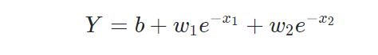
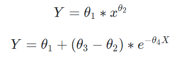

## 优化问题

优化问题的描述分为两部分:目标函数和约束函数. 

可以分为两个大类:离散问题（分类）和连续问题（离散）. 

凸问题和非凸问题. 所谓凸问题是指目标函数和约束函数(或可行域)都是凸的, 而函数或集合是否为凸需要诉诸凸集的概念阐述. 非凸问题是图问题的反面. 计算智能通常用非凸问题测试算法的好坏, 由此也有一些比较出名的测试问题.

另外, 从问题的条件来区分, 可以分为约束问题和无约束问题.

#### 问题转换

**非凸问转换成凸问题**. 这样可以保证从初始点收敛到唯一最优解. 比如, 对于一个单变量的, 并且有多个极值点的目标函数, 可以通过拟合一个近似的凸的目标函数来求解其近似解.

**约束问题转换成无约束问题**. 实际上, 最后要解决的问题都是无约束的问题. 简单的约束可以通过在迭代中作映射确保在可行域内迭代. 更一般的做法是将约束条件和目标函数整合在一起, 增广Lagrange就是此类一种比较常用的方法.

### 线性与非线性

#### 线性模型

一个模型如果是线性的，就意味着它的参数项要么是常数，要么是原参数和要预测的特征之间的乘积加和就是我们要预测的值。

典型的线性模型：

统计意义上，如果回归等式是线性的，那么相对于参数也是线性的。

如果相对于参数是线性的，那么即使样本变量的特征是多次方（非线性），这个模型也是线性的。

**对于线性方程组**，常用的求解方法有直接法和迭代法

**直接法**：一般是矩阵分解，见最小二乘法那一章，包括LU分解，SVD分解，QR分解等

**迭代法**：高斯-赛德尔迭代和超松弛迭代

#### 非线性回归的等式

判断它的参数是不是非线性的。非线性有很多种形象，这也是为什么非线性模型能够那么好的拟合那些曲折的函数曲线的原因。比如下面这个：

与线性模型不一样的是，这些非线性模型的特征因子对应的参数不止一个（？）

**对于非线性方程组**，需要求取雅可比矩阵才能计算，一般用梯度下降法？

**思考**：那么ELM相当于去掉了传统DNN中的非线性部分（不可训练），而最终只求它的线性部分）。

**参考**：https://segmentfault.com/a/1190000009596712

## 优化方法

### 1. 最小二乘

最小二乘法的矩阵公式是$(A^TA)^{-1}A^Tb$。

由于计算一个矩阵的逆非常耗费时间，求逆也存在数值不稳定的情况； (比如对希尔伯特矩阵求逆就几乎是不可能的). 

#### 狭义最小二乘

**在线性回归下采用最小二乘准则（或者说叫做最小平方），进行线性拟合参数求解的、矩阵形式的公式方法**

线性回归的模型假设，这是最小二乘方法的优越性前提，否则不能推出最小二乘是最佳（即方差最小）的无偏估计，具体请参考高斯-马尔科夫定理。特别地，当随机噪声服从正态分布时，最小二乘与最大似然等价。

由于是线性回归/拟合，因此可以很容易的求出**全局最优的闭式解** **close form solution**，也即我们通常看到的那几个矩阵形式，给了input data可以一步到位算拟合参数，而不是像梯度下降法或者牛顿法那样一点点地迭代优化调参最后到达极值点。

#### 广义最小二乘

本质上是一种evaluation rule或者说objective funcion，这里的「最小二乘法」应叫做**「最小二乘法则」或者「最小二乘准则」，英文可呼为** **LSE（least square error）**

举个例子，我要优化一个深度神经网络DNN（Deep neural network）的网络参数（换言之，优化此网络对于已知数据拟合结果的正确性），可不可以用最小二乘准则去衡量某一拟合结果相对于标准答案的偏差程度呢？可以。而同时，由于DNN模型本身的复杂性，我们没有办法像线性拟合时那样，在理论和公式的层面求出一个close form solution，因此需要引入所谓的BP算法（实质上就是梯度下降法）进行参数的迭代求解。

原因在于DNN这一体系相当于非线性回归，因此最小二乘不好，反而是logistic回归+最大似然=交叉熵准则Cross Entropy在DNN参数优化算法中的更有效和广泛一些。当然，这就是另一个话题了。

### 2. 梯度下降法

迭代次数比较高；

迭代法还可以求极值。

### 最小二乘与梯度法的区别

计算一个矩阵的逆是相当耗费时间的, 而且求逆也会存在数值不稳定的情况 (比如对希尔伯特矩阵求逆就几乎是不可能的). 因而这样的计算方法有时不值得提倡.
相比之下, 梯度下降法虽然有一些弊端, 迭代的次数可能也比较高, 但是相对来说计算量并不是特别大. 而且, 在最小二乘法这个问题上, 收敛性有保证. 故在大数据量的时候, 反而是梯度下降法 (其实应该是其他一些更好的迭代方法) 更加值得被使用.

综上：
　　狭义的最小二乘方法，是线性假设下的一种有闭式解的参数**求解**方法，最终结果为全局最优；
　　梯度下降法，是假设条件更为广泛（无约束）的，一种通过迭代更新来逐步进行的参数**优化**方法，最终结果为局部最优；
　　广义的最小二乘准则，是一种对于偏差程度的评估准则，与上两者不同。

**参考**：https://www.zhihu.com/question/20822481

### 3. 牛顿法

计算二阶海森矩阵的代价比较大

拟牛顿法就是用一个正定矩阵去代替这个海森矩阵H的逆，具体这个正定矩阵怎么求，有两个方法**DFP算法**和**BFGS**算法

参考：https://herechen.github.io/post/optimization-method-in-mathematics/

https://zhuanlan.zhihu.com/p/42522867