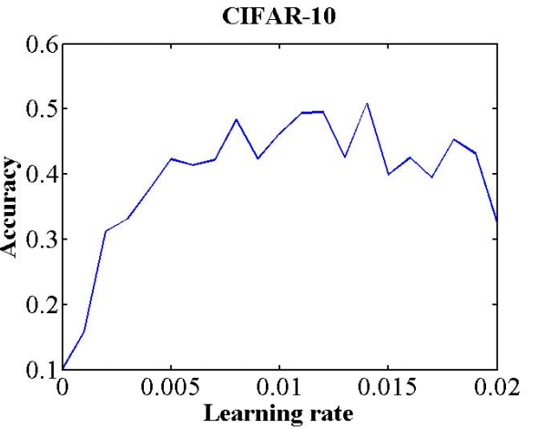
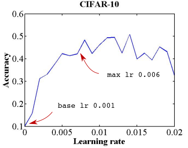
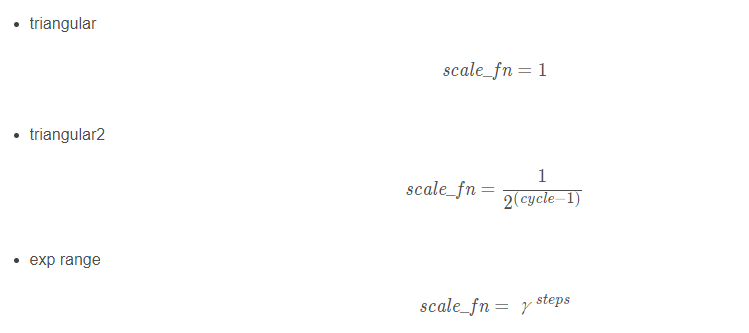
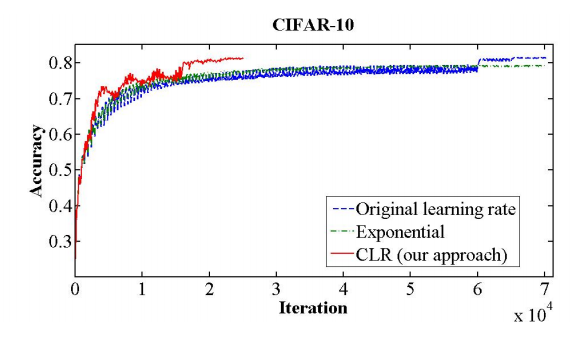

### 如何寻找最佳学习率

参考：[[1506.01186\] Cyclical Learning Rates for Training Neural Networks (arxiv.org)](https://arxiv.org/abs/1506.01186)


该方法很简单，首先设置一个十分小的学习率，在每个epoch之后增大学习率，并记录好每个epoch的loss或者acc，迭代的epoch越多，那被检验的学习率就越多，最后将不同学习率对应的loss或acc进行对比。




```python
def find_lr(net, trn_loader, optimizer, loss_fn, weight_bound, init_value=1e-8, final_value=10., beta=0.98, device='cuda:1'):
    # https://sgugger.github.io/how-do-you-find-a-good-learning-rate.html
    num = len(trn_loader) - 1
    mult = (final_value / init_value) ** (1 / num)
    lr = init_value
    optimizer.param_groups[0]['lr'] = lr
    avg_loss = 0.
    best_loss = 0.
    batch_num = 0
    losses = []
    log_lrs = []
    for (input,)in trn_loader:
        batch_num += 1
        #As before, get the loss for this mini-batch of inputs/outputs
        input = input.to(device)
        optimizer.zero_grad()
        output = net(input)
        loss = loss_fn(input, output, weight_bound)
        # loss = criterion(outputs, labels)
        #Compute the smoothed loss
        avg_loss = beta * avg_loss + (1-beta) *loss.item()
        smoothed_loss = avg_loss / (1 - beta**batch_num)
        #Stop if the loss is exploding
        if batch_num > 1 and smoothed_loss > 4 * best_loss:
            return log_lrs, losses
        #Record the best loss
        if smoothed_loss < best_loss or batch_num==1:
            best_loss = smoothed_loss
        #Store the values
        losses.append(smoothed_loss)
        log_lrs.append(math.log10(lr))
        #Do the SGD step
        loss.backward()
        optimizer.step()
        #Update the lr for the next step
        lr *= mult
        optimizer.param_groups[0]['lr'] = lr
    print('finished find lr')
    return log_lrs, losses   
```

### 调整学习率

虽然采用学习率衰减的方法能让模型收敛的更好，但是如果遇到鞍点的时候，模型就没法继续收敛，如下图所示，黑点即是鞍点，如果学习率此时很小，那将永远无法走出鞍点。

那么怎么解决这个鞍点的问题，这叫要回到我们上文说到过的论文中了，这篇论文的主要内容其实就是介绍了一种方法，能在遇到鞍点时尽快从中走出去，该方法称为Cyclical Learning Rates，其思想如下，首先论文中提出了两个参数，base_lr和max_lr，我们继续以之前的图讲解，

Leslie建议，用两个等长的步骤组成一个cycle:从很小的学习率开始，慢慢增大学习率，然后再慢慢降低回到最小值。最大学习率应该根据Learning Rate Finder来确定，**最小值则可以取最大值的十分之一。这个cycle的长度应该比总的epoch次数越小，在训练的最后阶段，可以将学习率降低到最小值以下几个数量级。**

答案是先跑几个epoch，并且让学习率线性增加，观察准确率的变化，从中选出合适的base 和max lr。

我们让学习率按照上面的斜率进行增长，跑了几轮，结果如下图所示。




在0.006的位置，开始出现了acc的负增长之后并趋于平缓，这个点即可作为max_lr，base_lr通常是设置为max_lr的1/3或1/4，因此0.001可以作为base_lr。

接下来就根据这两个参数进行实时的学习率的计算，论文中提到了三种更新学习率的方法：






已经有论文做过实验，他们将stepsize设成一个epoch包含的iteration数量的2-10倍。拿我们之前举的例子来说，我们一个epoch包含500个iteration，那么stepsize就设成1000-5000。该论文实验表明，stepsize设成2倍或者10倍，两者结果并没有太大的不同。


```python
class OneCycleSchedule
r(object):
    """
    (0, pct_start) -- linearly increase lr
    (pct_start, 1) -- cos annealing
    """
    def __init__(self, lr_max, div_factor=25., pct_start=0.3):
        super(OneCycleScheduler, self).__init__()
        self.lr_max = lr_max
        self.div_factor = div_factor
        self.pct_start = pct_start
        self.lr_low = self.lr_max / self.div_factor
    
    def step(self, pct):
        # pct: [0, 1]
        if pct <= self.pct_start:
            return annealing_linear(self.lr_low, self.lr_max, pct / self.pct_start)

        else:
            return annealing_cos(self.lr_max, self.lr_low / 1e4, (
                pct - self.pct_start) / (1 - self.pct_start))


def adjust_learning_rate(optimizer, lr):
    for param_group in optimizer.param_groups:
        param_group['lr'] = lr
    return lr
```


[一文看懂学习率Learning Rate，从入门到CLR_爱编程真是太好了的博客-CSDN博客_学习率](https://blog.csdn.net/u012526436/article/details/90486021)

[周期性学习率(Cyclical Learning Rate)技术 | LonePatient'Blog](https://lonepatient.top/2018/09/25/Cyclical_Learning_Rate)
