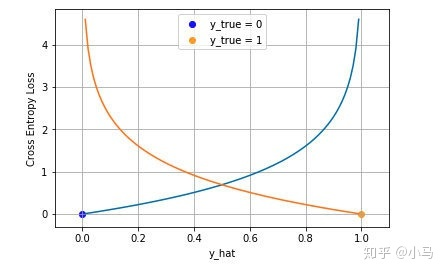

### 1. 绝对误差

### 2. 均方误差

### 3. Huber Loss

在误差接近0时使用MSE，误差较大时使用MAE，公式为：

### 4. 分位数损失

### 5. 交叉熵损失

Cross Entropy Loss

#### 5.1 二分类

蓝线是目标值为0时输出不同输出的损失，黄线是目标值为1时的损失。可以看到约接近目标值损失越小，随着误差变差，损失呈指数增长

#### 5.2 多分类

#### 5.3 为什么用交叉熵

（1）均方误差实际假设了服从高斯分布

（2）另一个角度是用信息论来解释交叉熵损失

参考：[深度学习-Loss函数 - 知乎 (zhihu.com)](https://zhuanlan.zhihu.com/p/97698386)