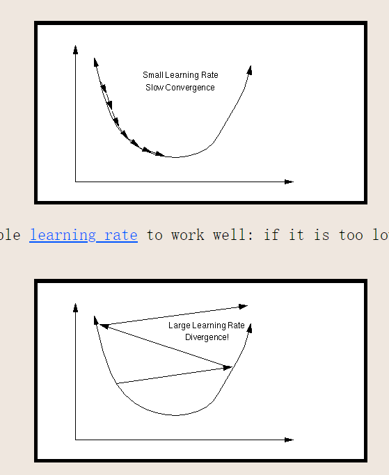

### 病态问题的来源

针对数据驱动模型

1. 训练数据
2. 网络架构
3. 初始权重
4. 可能loss function

#### 小学习率与大学习率

太小收敛慢，太大则一致震荡

## 解决方案

### 1. 输入输出归一化

输入数据幅值太大，意味着权重要很小；

为什么输出也要归一化：影响输出层权重？与激活函数也有关

### 2. 初始化权重

### 3. 设置local学习率

batch size 越大，学习率也越大

[Preconditioning the Network (salk.edu)](https://cnl.salk.edu/~schraudo/teach/NNcourse/precond.html)