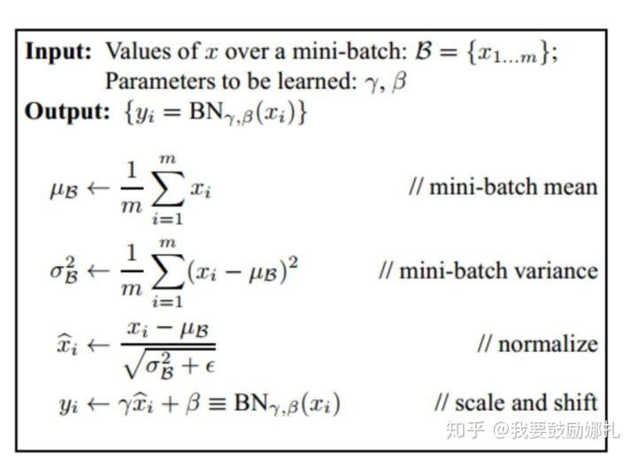
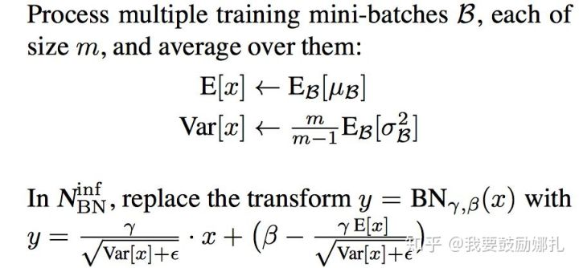

## **Batch Normalization 批量归一化**

注意，这与样本输入前的归一化不是一回事，这里是对每层网络中的输入输出归一化

#### 1. 为什么要BN

神经网络本身就是为了**学习数据的分布**，如果训练集和测试集的分布不同，那么导致学习的神经网络泛化性能大大下降。

我们用mini-batch对网络训练时，不同batch的数据分布也可能不同，那么网络就要在每次迭代时适应不同的分布，这会降低训练速度。

具体解释：

对于深度网络的训练是一个复杂的过程，只要网络的前面几层发生微小的改变，那么后面几层就会被累积放大下去。一旦网络某一层的输入数据的分布发生改变，那么这一层网络就需要去适应学习这个新的数据分布，所以如果训练过程中，训练数据的分布一直在发生变化，那么将会影响网络的训练速度。

网络一旦train起来，那么参数就要发生更新，除了输入层的数据外(因为输入层数据，我们已经人为的为每个样本归一化)，后面网络每一层的输入数据分布是一直在发生变化的，因为在训练的时候，**前面层训练参数的更新将导致后面层输入数据分布的变化**。我们把网络中间层在训练过程中，数据分布的改变称之为：**Internal Covariate Shift（输入分布不稳定）**。为了解决Internal Covariate Shift，便有了Batch Normalization的诞生。

#### 2. 如何训练

**2.1 训练时：**

对于每一层：

注意最后一步，**变换重构**；为什么要增加这一步呢？其实**如果是仅仅使用上面的归一化公式，对网络某一层A的输出数据做归一化，然后送入网络下一层B，这样是会影响到本层网络A所学习到的特征的**。打个比方，比如网络中间某一层学习到特征数据本身就分布在S型激活函数的两侧，你强制把它给我归一化处理、标准差也限制在了1，把数据变换成分布于s函数的中间部分，这样就相当于我这一层网络所学习到的特征分布被你搞坏了。于是我们增加了**变换重构**，**保留了网络所学习到的特征**。

**2.2 测试时**

一个网络一旦训练完了，就没有了min-batch这个概念了。测试阶段我们一般只输入一个测试样本，看看结果而已。因此测试样本，前向传导的时候，上面的均值u、标准差σ 要哪里来？其实网络一旦训练完毕，参数都是固定的，这个时候即使是每批训练样本进入网络，那么BN层计算的均值u、和标准差都是固定不变的。

因此**在预测阶段，对于均值来说直接计算所有训练batch u值的平均值；然后对于标准偏差采用训练阶段每个batch σB的无偏估计**，过程如下：

#### 3. 适用范围

例如，在神经网络训练时遇到收敛速度很慢，或梯度爆炸等无法训练的状况时可以尝试BN来解决。另外，在一般使用情况下也可以加入BN来加快训练速度，提高模型精度。

#### 4. bitch_size问题

参考：https://zhuanlan.zhihu.com/p/89422962