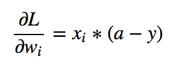

## 为什么要归一化

如果你的输入数据全是正数或全是负数，那么根据激活函数的特性，会出现锯齿形的loss，

但如果映射为接近为0的正负数，结果会更好；

2.

输入的feature可能有尺度效应，可以去除

3.

归一化之后，梯度自然也就变小了。

4.

如果输入数据尺度不一样，导致梯度大小不一，学习率则很难兼顾。

参考：[Why Data should be Normalized before Training a Neural Network | by Timo Stöttner | Towards Data Science](https://towardsdatascience.com/why-data-should-be-normalized-before-training-a-neural-network-c626b7f66c7d)

## 常见的数据归一化方法

#### min-max标准化

$$
X^*=\frac{x-min}{max-min}
$$

or映射到[-1,1]

$$
X^*=\frac{x-mean}{max-min}
$$

当有新的数据加入时，需要重新定义

#### z-score 标准化(zero-mean normalization)
x* = (x - μ ) / σ

 

#### log函数转换
$$
X^*=log_{10}(x)/log_{10}(max)
$$

#### atan 函数

## 归一化和标准化

归一化没有改变数据分布的形状，归一化包括：min-max，mean归一化

标准化使样本数据的分布近似于某种分布，标准化为：

$$x'=\frac{x-\mu}{\sigma}$$

