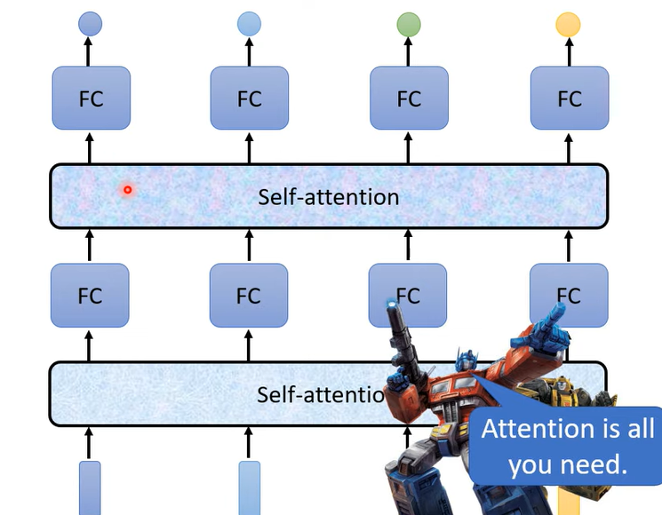
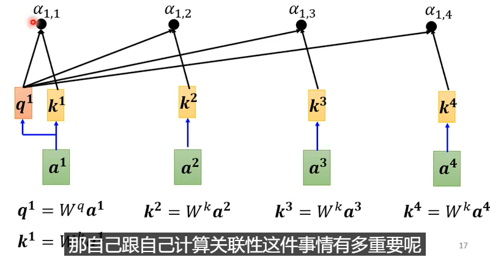
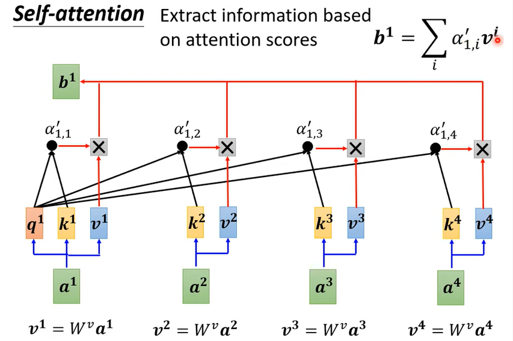
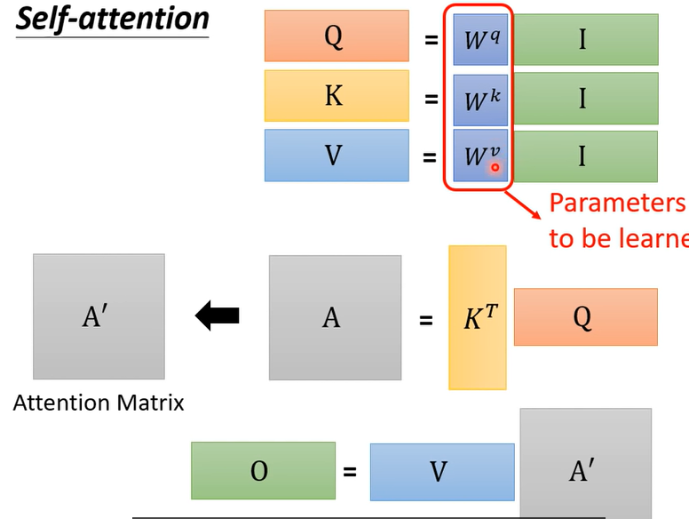
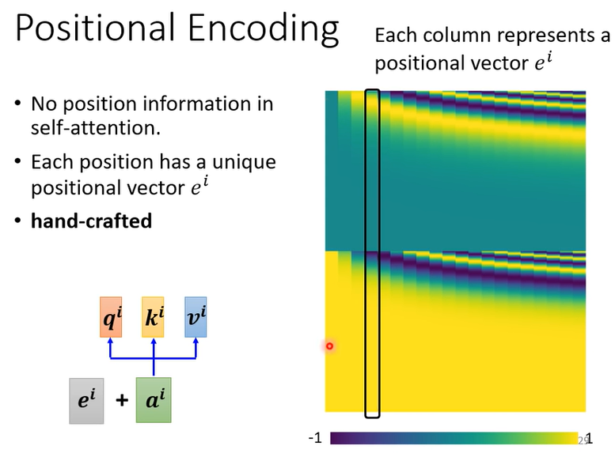
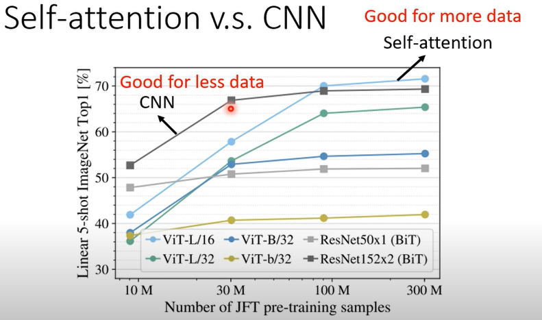

之前我们都把输入当作一个vector，但现在输入和输出都是一系列vector

## self-attention

解决seq2seq问题中上下文之间没有联系的问题

attention：计算相似度，可以用dot-product、addictive

之后可以用soft-max归一化，也可以用其他

b的值可能决定于α，那么b越大可能接近于相对应的v的值

输入是I，即原始输入值经过hidden layer得到，，输出是O，self-attention的操作为：

## 多头self-attention

## positional encoding

可以用三角函数代表位置

## attention vs CNN

attention不需要人为指定filter

对比RNN：可以并行处理