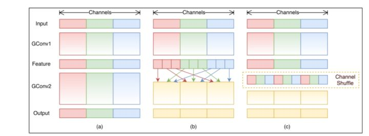
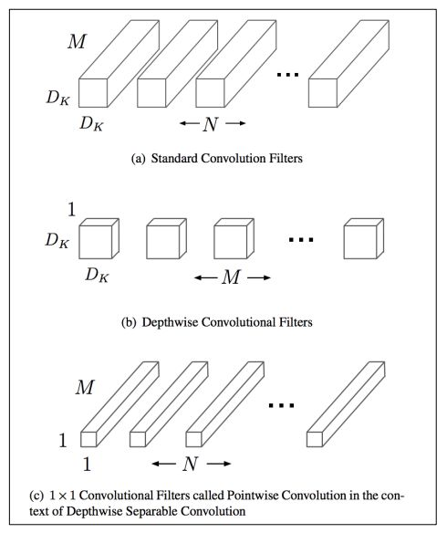
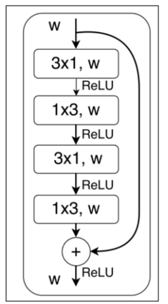

### 介绍

大模型参数过多，对于手机嵌入式设备等落地难度较大，因此需要加速计算。

**理论基础：**

- 必要性：目前主流的网络，如VGG16，参数量1亿3千多万，占用500多MB空间，需要进行300多亿次浮点运算才能完成一次图像识别任务。

- 可行性：在深度卷积网络中，存在着大量冗余地节点，仅仅只有少部分（5-10%）权值参与着主要的计算，也就是说，仅仅训练小部分的权值参数就可以达到和原来网络相近的性能。

从数据，模型和硬件多维度的层面来分析，压缩和加速模型的方法

-  压缩已有的网络，包含：低秩分解，模型剪枝，模型量化（共享）；
- 构建新的小型网络，包含：知识蒸馏，紧凑网络设计；

参数共享和低秩分解较为灵活，既能重新训练也能用于预训练模型，

参数剪枝只能依赖于预训练模型；

紧凑网络设计和知识蒸馏只能重新训练

## 1. 加速网络设计

### 1.1 分组卷积

分组卷积即将输入的feature maps分成不同的组（沿channel维度进行分组），然后对不同的组分别进行卷积操作，即每一个卷积核至于输入的feature maps的其中一组进行连接，而普通的卷积操作是与所有的feature maps进行连接计算。分组数k越多，卷积操作的总参数量和总计算量就越少（减少k倍

缺陷：不同组之间减少了信息流通，因此在实际应用时会在分组卷积后进行信息融合。

#### 1.1.1 shuffleNet

a是一般的分组卷积，，b为shuffleNet网络，

#### 1.1.2 mobileNet

可以看成是每组只有一个通道的分组卷积，最后使用开销较小的1x1卷积进行通道融合，可以大大减少计算量。

### 1.2 分解卷积

即将普通的kxk卷积分解为kx1和1xk卷积，通过这种方式可以在感受野相同的时候大量减少计算量，

### 1.3 神经网络搜索

通过算法根据样本集自动设计出高性能的网络结构，在某些任务上甚至可以媲美人类专家的水准，甚至发现某些人类之前未曾提出的网络结构，这可以有效的降低神经网络的使用和实现成本

## 2. **模型裁剪与稀疏化**

参考：[深度学习模型压缩与加速综述 - 知乎 (zhihu.com)](https://zhuanlan.zhihu.com/p/67871864)