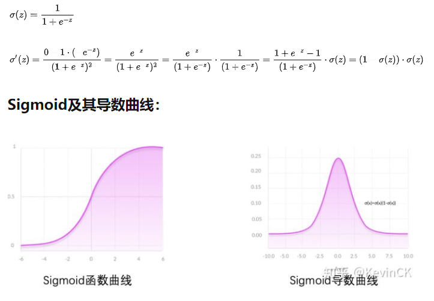
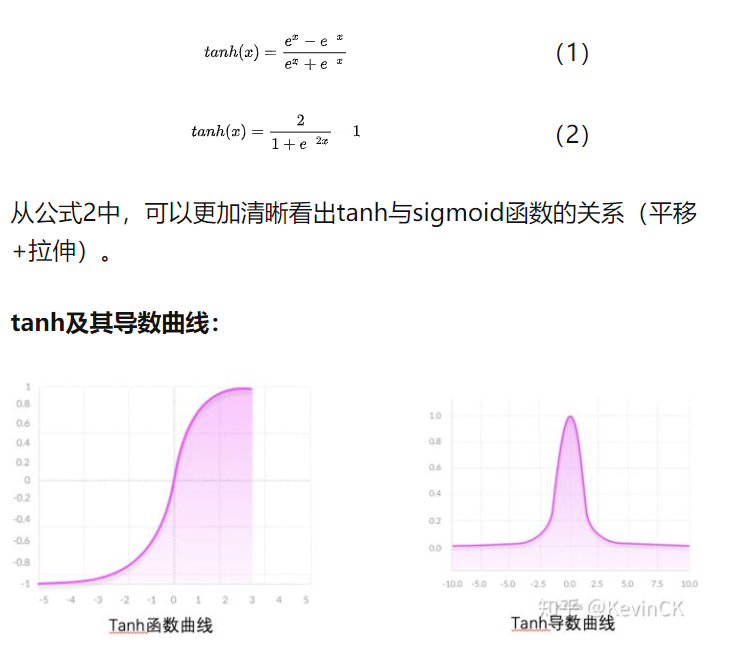
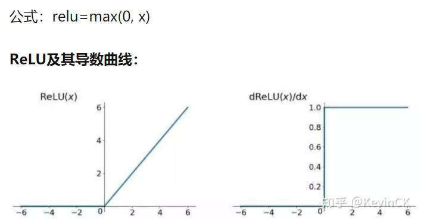
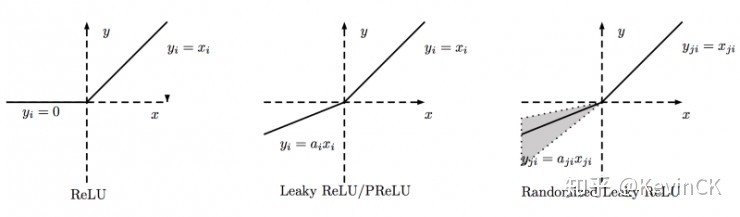
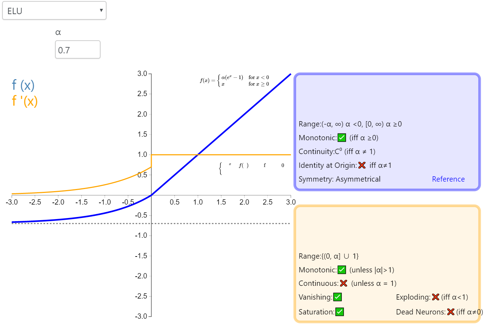
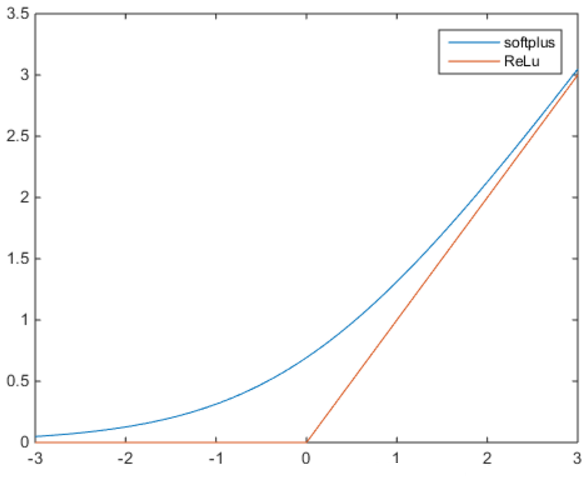

#### 1.  为什么需要

因为一般神经网络的计算是线性的，引入激活函数可以在神经网络中引入非线性，强化网络的学习能力

#### 2. 激活函数特点

Sigmoid和tanh的特点是将输出限制在(0,1)和(-1,1)之间，说明Sigmoid和tanh适合做概率值的处理，例如LSTM中的各种门

ReLU就不行，因为ReLU无最大值限制，可能会出现很大值。同样，根据ReLU的特征，Relu适合用于深层网络的训练，而Sigmoid和tanh则不行，因为它们会出现梯度消失。

#### 发展历程

激活函数的发展经历了Sigmoid -> Tanh -> ReLU -> Leaky ReLU -> Maxout这样的过程，还有一个特殊的激活函数Softmax，因为它只会被用在网络中的最后一层，用来进行最后的分类和归一化。

#### 1. sigmoid

特点：平滑易于求导

缺点：计算量大，反向传播涉及除法；导数范围在[0, 0.25]，很容易梯度消失；Sigmoid的输出不是0均值（即zero-centered）；这会导致后一层的神经元将得到上一层输出的非0均值的信号作为输入，随着网络的加深，会改变数据的原始分布

#### 2. tanh

相比Sigmoid函数，

1. tanh的输出范围时(-1, 1)，解决了Sigmoid函数的不是zero-centered输出问题；
2. 幂运算的问题仍然存在；
3. tanh导数范围在(0, 1)之间，相比sigmoid的(0, 0.25)，梯度消失（gradient vanishing）问题会得到缓解，但仍然还会存在。

#### 3. ReLu

ReLU的有效导数是常数1，解决了深层网络中出现的梯度消失问题，也就使得深层网络可训练。**同时ReLU又是非线性函数，所谓非线性，就是一阶导数不为常数；对ReLU求导，在输入值分别为正和为负的情况下，导数是不同的，即ReLU的导数不是常数，所以ReLU是非线性的（只是不同于Sigmoid和tanh，relu的非线性不是光滑的）。**

#### 4. Leaky ReLU, PReLU（Parametric Relu）, RReLU（Random ReLU）

为了防止模型的‘Dead’情况，后人将x<0部分并没有直接置为0，而是给了一个很小的负数梯度值

**Leaky ReLU**中的为常数，一般设置 0.01。这个函数通常比 Relu 激活函数效果要好，但是效果不是很稳定，所以在实际中 Leaky ReLu 使用的并不多。

**PRelu（参数化修正线性单元）** 中的!作为一个可学习的参数，会在训练的过程中进行更新。

**RReLU（随机纠正线性单元）**也是Leaky ReLU的一个变体。在RReLU中，负值的斜率在训练中是随机的，在之后的测试中就变成了固定的了。RReLU的亮点在于，在训练环节中，aji是从一个均匀的分布U(I,u)中随机抽取的数值。

ELU:

#### 5. softplus

可以看作ReLU的平滑；

$$y=ln(1+e^x)$$

#### 6. arctan

.png)

参考：

[常用激活函数的比较 - 知乎 (zhihu.com)](https://zhuanlan.zhihu.com/p/32610035)

[激活函数总结（持续更新） - 知乎 (zhihu.com)](https://zhuanlan.zhihu.com/p/73214810)

https://chmx0929.gitbook.io/machine-learning/shen-du-xue-xi/shen-du-xue-xi/shen-du-qian-kui-wang-luo/ji-huo-han-shu

参考：

[激活函数总结（持续更新） - 知乎 (zhihu.com)](https://zhuanlan.zhihu.com/p/73214810)