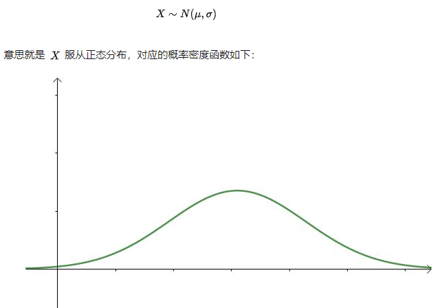
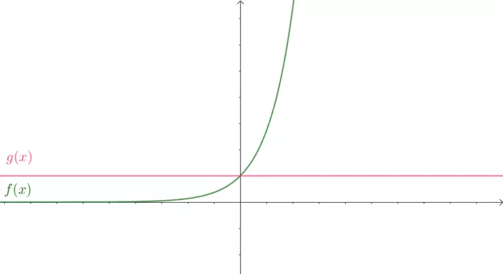
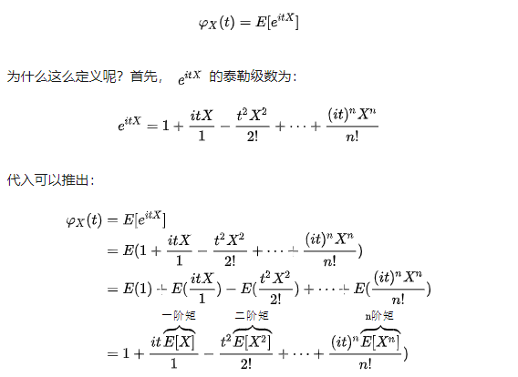

### 1. 概率密度函数

一般对于随机变量X的分布，习惯用概率密度函数表述：

### 2. 特征

#### 2.1 泰勒级数

从泰勒级数可知，两个函数f(x), g(x)的各阶导数相等的越多，那么函数越相似：

#### 2.2 随机变量的特征：

- 期望 ![[公式]](https://www.zhihu.com/equation?tex=%5Cmu+)
- 方差 ![[公式]](https://www.zhihu.com/equation?tex=%5Csigma+%5E2)
- 偏态 ![[公式]](https://www.zhihu.com/equation?tex=Skewness)
- 峰态 ![[公式]](https://www.zhihu.com/equation?tex=Kurtosis)
- ......
- 

矩：在统计学中，矩表征随机量的分布。如一个“二阶矩”在一维上可测量其“宽度”，在更高阶的维度上由于其使用于橢球的空间分布，我们还可以对点的云结构进行测量和描述。其他矩用来描述诸如与均值的偏差分布情况（偏态），或峰值的分布情况（峰态）；比如既往是一阶矩，方差是二阶矩

直觉上可以有以下推论（其实还是有条件的，这里先忽略这些严格性，在实际应用中如下思考问题不大）：

各阶矩相等-》特征相等-》分布相同

### 3. 特征函数

特征函数包含了分布函数所有的矩，也就是包含了分布函数所有的特征。

参考：如何理解统计中的特征函数？ - 马同学的回答 - 知乎 https://www.zhihu.com/question/23686709/answer/376439033