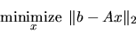
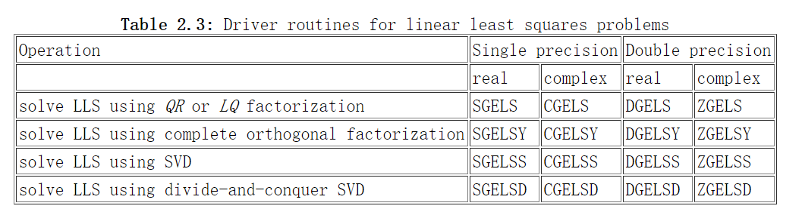

A是一个$m\times n$的矩阵，且$m\geq n$，$rank(A)=n$，**在这个例子中solution是unique；**这即是求超定方程组的最小二乘解

#### 当A是满秩的时候，即$rank(A)=min(m,n)$:

$m>n$是最小二乘解

$m<n$时是最小范数解


#### 当A不满秩时，$rank(A)<min(m,n)$:

寻找**minimum norm least squares**解，使得$|x|_2$和$|b-Ax|_2$同时最小。


### LAPAC 包

有xGELSX, xGELSY, xGELSS, and xGELSD

xGELSX and xGELSY use a **complete orthogonal factorization** of *A*, while xGELSS uses the **singular value decomposition** of *A*, and xGELSD uses the **singular value decomposition**（奇异值分解） of *A* with an algorithm based on divide and conquer




### scipy求解方程组

#### 矩阵的奇异值分解

设矩阵 为 阶的矩阵，则存在一个分解，使得： ，其中 为 阶酉矩阵； 为半正定的 阶的对焦矩阵； 而 为 阶酉矩阵。

 对角线上的元素为 的奇异值，通常按照从大到小排列。

```
scipy.linalg.svd(a, full_matrices=True, compute_uv=True, overwrite_a=False, 
  check_finite=True, lapack_driver='gesdd')
```

- `a`：一个矩阵，形状为`(M,N)`，待分解的矩阵。
- `full_matrices`：如果为`True`，则  的形状为`(M,M)`、  的形状为`(N,N)`；否则  的形状为`(M,K)`、 的形状为`(K,N)`，其中 `K=min(M,N)`
- `compute_uv`：如果`True`，则结果中额外返回`U`以及`Vh`；否则只返回奇异值
- `overwrite_a`：一个布尔值，指定是否将结果写到`a`的存储区。
- `overwrite_b`：一个布尔值，指定是否将结果写到`b`的存储区。
- `check_finite`：如果为`True`，则检测输入中是否有`nan`或者`inf`
- `lapack_driver`：一个字符串，指定求解算法。可以为：`'gesdd'/'gesvd'`。默认的`'gesdd'`。

返回值：

- `U`：  矩阵
- `s`：奇异值，它是一个一维数组，按照降序排列。长度为 `K=min(M,N)`
- `Vh`：就是  矩阵

#### `lstsq`

可以求欠定/满秩或超定方程组

比`solve`更一般化，它不要求矩阵 是方阵。 它找到一组解 ，使得 最小，我们称得到的结果为最小二乘解。

```
scipy.linalg.lstsq(a, b, cond=None, overwrite_a=False, overwrite_b=False,
  check_finite=True, lapack_driver=None)
```

- `a`：为矩阵，形状为`(M,N)`
- `b`：一维向量，形状为`(M,)`。它求解的是线性方程组 。如果有  个线性方程组要求解，且 `a`，相同，则 `b`的形状为 `(M,k)`
- `cond`：一个浮点数，去掉最小的一些特征值。当特征值小于`cond * largest_singular_value`时，该特征值认为是零
- `overwrite_a`：一个布尔值，指定是否将结果写到`a`的存储区。
- `overwrite_b`：一个布尔值，指定是否将结果写到`b`的存储区。
- `check_finite`：如果为`True`，则检测输入中是否有`nan`或者`inf`
- `lapack_driver`：一个字符串，指定求解算法。可以为：`'gelsd'/'gelsy'/'gelss'`。默认的`'gelsd'`效果就很好，但是在许多问题上`'gelsy'`效果更好。

返回值：

- `x`：最小二乘解，形状和`b`相同
- `residures`：残差。如果  大于`N`或者小于`M`，或者使用了`gelsy`，则是个空数组；如果`b`是一维的，则它的形状是`(1,)`；如果`b`是二维的，则形状为`(K,)`
- `rank`：返回矩阵`a`的秩
- `s`：`a`的奇异值。如果使用`gelsy`，则返回`None`


## 总结

I think a few things may be getting conflated here, so I'll distinguish the following:

1. Exact solution of `V x = b` using LU
2. Exact solution of `V x = b` using QR
3. Least-square solution of `V x = b` using QR
4. Least-square solution of `V x = b` using SVD
5. Exact solution of `V^T V x = V^T b` using LU
6. Exact solution of `V^T V x = V^T b` using Cholesky


参考：https://www.netlib.org/lapack/lug/node27.html

https://stackoverflow.com/questions/55367024/fastest-way-of-solving-linear-least-squares