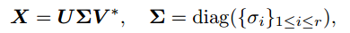

## 1. 矩阵分解（直接解法）

### 1.1 QR分解

将矩阵分解成一个正规正交矩阵与上三角形矩阵,所以称为QR分解法,与此正规正交矩阵的通用符号Q有关

### 1.2 SVD（奇异值）分解

奇异值分解 (singular value decomposition,SVD) 是另一种正交矩阵分解法；SVD是最可靠的分解法，但是它比QR 分解法要花上近十倍的计算时间。[U,S,V]=svd(A)，其中U和V分别代表两个正交矩阵，而S代表一对角矩阵。 和QR分解法相同， 原矩阵A不必为正方矩阵。使用SVD分解法的用途是解最小平方误差法和数据压缩。

按照SVD的方式必有解，这里 Σ是对角矩阵，求逆很简单， U和V都是正交矩阵，因此转置与其逆矩阵相等。

#### 1.2.1 奇异值阈值算法（Singular Value Thresholding,SVT）

  通常情况下 Σ是按照奇异值由大到小排列的，且衰减的特别快，一般前10%的奇异值之和就占到了总和的95%以上，因此我们可以**将小于某个阈值的的奇异值及其对应的左右奇异向量全部舍弃掉**，进而进一步的进行矩阵规模的缩减，在sklearn中就是采用的这种方式

### 1.3 LU分解

三角分解法

将原正方 (square) 矩阵分解成一个上三角形矩阵或是排列(permuted) 的上三角形矩阵和一个 下三角形矩阵

### 1.4 柯列斯基分解(Cholesky decomposition)

把矩阵分解为一个**下三角矩阵**以及它的共轭转置矩阵的乘积。与一般的矩阵分解求解方程的方法比较，Cholesky分解效率很高。
