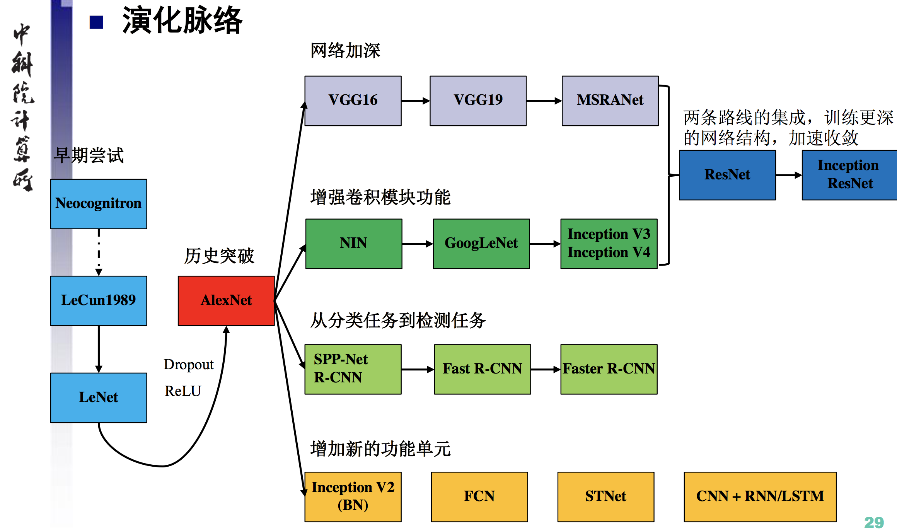
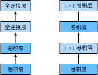
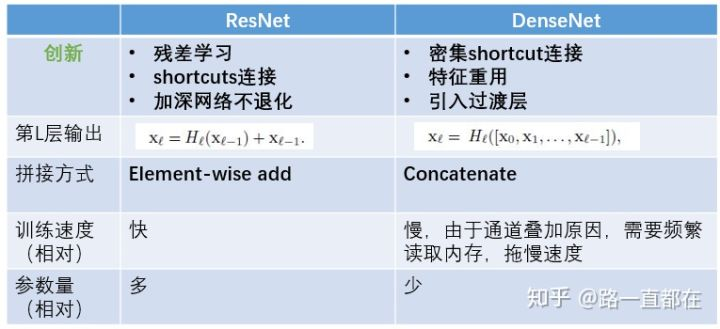
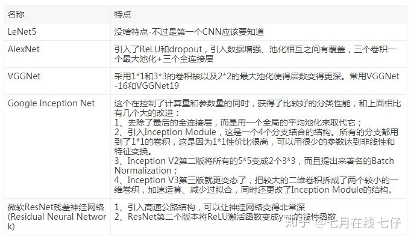
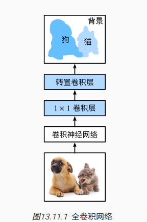

**主要应用与图像分类**



### 1. LeNet

卷积块：卷积层+池化层

全连接层块：将每个样本faltten

对手写体的识别准度非常高（层数有限，后来被向量机超越）

### 2. AlexNet

深度卷积神经网络

问题：

- 当时的硬件条件，训练速度有限

- 没有研究参数初始化和非凸优化，使得复杂的神经网络的训练困难

过去研究图像问题的思路

- 获取数据集
- 使用已有的特征提取函数生成图像的特征
- 使用机器学习模型对图像特征分类

特征应该手工提取还是学习获得？

AlexNet证明学习到的特征可以超过手工特征的优势。

特点：

- 网络更深，卷积核更大（因为数据集尺寸也更大了）
- 用ReLu代替sigmoid
- 使用dropout控制模型复杂度
- 引入图片增广，如翻转裁剪颜色变化等，扩大了数据集缓解了过拟合问题

### 3. VGG

提出了可以重复使用简单的块来构建深度模型的思路。指导如何构建深度网络

即使用相同的卷积核，卷积层保持输入的高和宽不变，而池化层则对其减半

### 4. NiN



使用1x1卷积代替最后的全连接层

最后三层：1x1卷积层——卷积层——1x1卷积层

原始全连接层：卷积层——全连接层——全连接层

因为1x1卷积层可以看作是全连接层。

**优点：显著减少模型参数，缓解过拟合，但有时会导致训练时间增加**

### 5. ResNet


更容易优化，学习的不是f(x) ，而是拟合f(x)-x；

### 6. DenseNet


 ResNet（左）与DenseNet（右）在跨层连接上的主要区别：使用相加和使用连结concatenate

两个组件：稠密块体和过渡层

优势：

- 参数更小且计算更高效，实现了特征重用
- 容易训练，每层可以直达最后的误差信号，实现了隐式的[“deep supervision”](https://link.zhihu.com/?target=https%3A//arxiv.org/abs/1409.5185)；
- 由于特征复用，最后的分类器使用了低级特征。

#### 稠密块体

定义义如何连接输入和输出，

增长率：由于使用连结，通道数会迅速增加

#### 过渡层

控制模型复杂度。 它通过1×1卷积层来减小通道数，并使用步幅为2的平均汇聚层减半高和宽，从而进一步降低模型复杂度

```python
def transition_block(input_channels, num_channels):
    return nn.Sequential(
        nn.BatchNorm2d(input_channels), nn.ReLU(),
        nn.Conv2d(input_channels, num_channels, kernel_size=1),
        nn.AvgPool2d(kernel_size=2, stride=2))
```

[7.7. 稠密连接网络（DenseNet） — 动手学深度学习 2.0.0-beta0 documentation (d2l.ai)](https://zh.d2l.ai/chapter_convolutional-modern/densenet.html)






### FCN



*全卷积网络*（fully convolutional network，FCN）采用卷积神经网络实现了从图像像素到像素类别的变换 [[Long et al., 2015\]](https://zh.d2l.ai/chapter_references/zreferences.html#long-shelhamer-darrell-2015)。 与我们之前在图像分类或目标检测部分介绍的卷积神经网络不同

(与NiN相比，多了转置卷积层)

- 全卷积网络先使用卷积神经网络抽取图像特征，然后通过1×1卷积层将通道数变换为类别个数，最后通过转置卷积层将特征图的高和宽变换为输入图像的尺寸。
- 在全卷积网络中，我们可以将转置卷积层初始化为双线性插值的上采样。