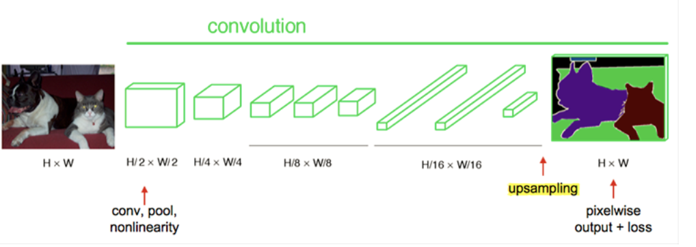
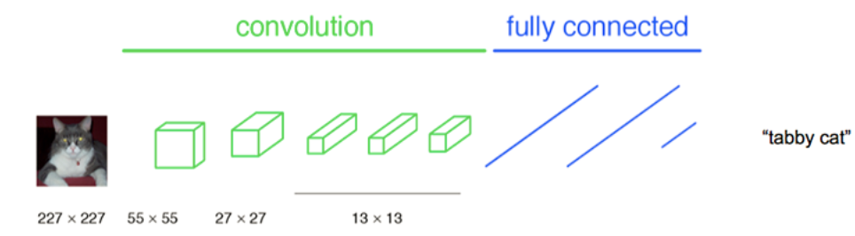
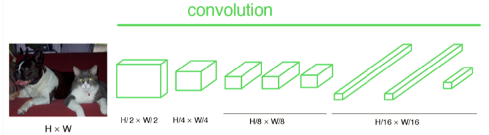
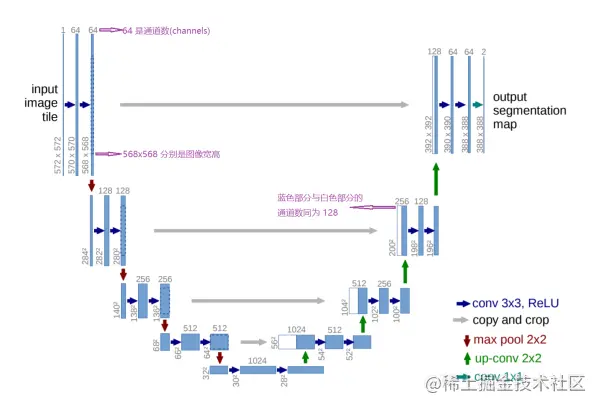

### 0. 语义分割与图像分类的区别

语义分割即是对图像中每一个**像素点**进行分类，确定每个点的类别（如属于背景、人或车等），从而进行区域划分。目前，语义分割已经被广泛应用于自动驾驶、无人机落点判定等场景中。

**图像分类是图像级别的！**

### CNN架构


得到类别概率信息，但不能得到像素点类别。


### 1. FCN

对于一般的分类CNN网络，如VGG和Resnet，都会在网络的最后加入一些全连接层，经过softmax后就可以获得类别概率信息。但是这个概率信息是1维的，即只能标识整个图片的类别，不能标识每个像素点的类别，所以这种全连接方法不适用于**图像分割**。而FCN提出可以把**后面几个全连接都换成卷积，这样就可以获得一张2维的feature map，后接softmax获得每个像素点的分类信息，从而解决了分割问题**

同时，预测样本和训练样本的尺寸不需要一致



主要区别：

#### 全卷积部分

全卷积部分使用经典的CNN网络（以AlexNet网络为例），并把最后的全连接层换成卷积，用于提取特征。

- 在传统的Alex结构中，前5层是卷积层，第6层和第7层分别是一个长度为4096的一维向量，第8层是长度为1000的一维向量，分别对应1000个不同类别的概率。



- FCN将最后的3层转换为卷积层，卷积核的大小 (通道数，宽，高) 分别为 (4096,1,1)、(4096,1,1)、(1000,1,1)，虽然参数数目相同，但是计算方法就不一样了，这时还可使用预训练模型的参数。


- CNN中输入的图像固定成227x227大小，第一层pooling后为55x55，第二层pooling后图像大小为27x27，第五层pooling后的图像大小为13x13, 而FCN输入的图像是H*W大小，第一层pooling后变为原图大小的½，第二层变为原图大小的¼，第五层变为原图大小的⅛，第八层变为原图大小的1/16，如下所示：



- 经过多次卷积和pooling以后，得到的图像越来越小，分辨率越来越低。对最终的特征图进行upsampling，把图像进行放大到原图像的大小，就得到原图像的分割结果。

#### 上采样部分

上采样部分将最终得到的特征图上采样得到原图像大小的语义分割结果。

在这里采用的上采样方法是反卷积（Deconvolution），也叫做转置卷积（Transposed Convolution）：

- 反卷积是一种特殊的正向卷积
- 通俗的讲，就是输入补0+卷积。先按照一定的比例通过补0来扩大输入图像的尺寸，再进行正向卷积即可。

如下图所示：输入图像尺寸为3x3，卷积核kernel为3x3，步长strides=2，填充padding=1


假设反卷积的输入是n x n ，反卷积的输出为mxm ，padding=p，stride=s，kernel_size = k。

那么此时反卷积的输出就为：

m=s(n−1)+k−2pm=s(n−1)+k−2p


与正向卷积不同的是，要先根据步长strides对输入的内部进行填充，这里strides可以理解成输入放大的倍数，而不能理解成卷积移动的步长。

这样我们就可以通过反卷积实现上采样。

#### 跳层连接

#### 总结

端到端的，可以接受任意大小的输入图像尺寸，比较高效。

- 局限性

得到的结果还是不够精细。进行8倍上采样虽然比32倍的效果好了很多，但是上采样的结果还是比较模糊的，对图像中的细节不敏感。而且在对各个像素进行分类时，没有考虑像素与像素之间的关系。

### 4. U-Net



如上图，Unet 网络结构是对称的，形似英文字母 U 所以被称为 Unet。整张图都是由蓝/白色框与各种颜色的箭头组成，其中，**蓝/白色框表示 feature map；蓝色箭头表示 3x3 卷积，用于特征提取；灰色箭头表示 skip-connection，用于特征融合；红色箭头表示池化 pooling，用于降低维度；绿色箭头表示上采样 upsample，用于恢复维度；青色箭头表示 1x1 卷积，用于输出结果。**

可能你会问为啥是 5 层而不是 4 层或者 6 层，emmm，这应该去问作者本人，可能对于当时作者拿到的数据集来说，这个层数的表现更好，但不代表所有的数据集这个结构都适合。我们该多关注这种 Encoder-Decoder 的设计思想，具体实现则应该因数据集而异。

Encoder 由卷积操作和下采样操作组成，文中所用的**卷积结构统一为 3x3 的卷积核**，padding 为 0 ，striding 为 1。没有 padding 所以每次卷积之后 feature map 的 H 和 W 变小了，在 skip-connection 时要注意 feature map 的维度(其实也可以将 padding 设置为 1 避免维度不对应问题)，pytorch 代码：

```
nn.Sequential(nn.Conv2d(in_channels, out_channels,  3), 
              nn.BatchNorm2d(out_channels), 
              nn.ReLU(inplace=True))
复制代码
```

上述的两次卷积之后是一个 stride 为 2 的 max pooling，输出大小变为 1/2 *(H, W)：


### U-Net网络代码示例

```python
class Block(nn.Module):
    def __init__(self, in_ch, out_ch):
        super().__init__()
        self.conv1 = nn.Conv2d(in_ch, out_ch, 3)
        self.relu  = nn.ReLU()
        self.conv2 = nn.Conv2d(out_ch, out_ch, 3)
    
    def forward(self, x):
        return self.conv2(self.relu(self.conv1(x)))


class Encoder(nn.Module):
    def __init__(self, chs=(3,64,128,256,512,1024)):
        super().__init__()
        self.enc_blocks = nn.ModuleList([Block(chs[i], chs[i+1]) for i in range(len(chs)-1)])
        self.pool       = nn.MaxPool2d(2)
    
    def forward(self, x):
        ftrs = []
        for block in self.enc_blocks:
            x = block(x)
            ftrs.append(x)
            x = self.pool(x)
        return ftrs


class Decoder(nn.Module):
    def __init__(self, chs=(1024, 512, 256, 128, 64)):
        super().__init__()
        self.chs         = chs
        self.upconvs    = nn.ModuleList([nn.ConvTranspose2d(chs[i], chs[i+1], 2, 2) for i in range(len(chs)-1)])
        self.dec_blocks = nn.ModuleList([Block(chs[i], chs[i+1]) for i in range(len(chs)-1)]) 
        
    def forward(self, x, encoder_features):
        for i in range(len(self.chs)-1):
            x        = self.upconvs[i](x)
            enc_ftrs = self.crop(encoder_features[i], x)
            x        = torch.cat([x, enc_ftrs], dim=1)
            x        = self.dec_blocks[i](x)
        return x
    
    def crop(self, enc_ftrs, x):
        _, _, H, W = x.shape
        enc_ftrs   = torchvision.transforms.CenterCrop([H, W])(enc_ftrs)
        return enc_ftrs


class UNet(nn.Module):
    def __init__(self, enc_chs=(3,64,128,256,512,1024), dec_chs=(1024, 512, 256, 128, 64), num_class=1, retain_dim=False, out_sz=(572,572)):
        super().__init__()
        self.encoder     = Encoder(enc_chs)
        self.decoder     = Decoder(dec_chs)
        self.head        = nn.Conv2d(dec_chs[-1], num_class, 1)
        self.retain_dim  = retain_dim

    def forward(self, x):
        enc_ftrs = self.encoder(x)
        out      = self.decoder(enc_ftrs[::-1][0], enc_ftrs[::-1][1:])
        out      = self.head(out)
        if self.retain_dim:
            out = F.interpolate(out, out_sz)
        return out
```


## 两者区别

上采样：FCN是直接反卷积，后面没有跟上卷积

skip connection：FCN是相加(summation)，而U-Net是叠加(concatnation)


链接：https://juejin.cn/post/6844903924999127047

参考：[图像语义分割入门+FCN/U-Net网络解析 - 知乎 (zhihu.com)](https://zhuanlan.zhihu.com/p/31428783)

[语义分割：FCN和UNet - 深度学习与CV](http://121.199.45.168:10006/imageSegmentation/section2/)

代码示例：[U-Net: A PyTorch Implementation in 60 lines of Code | Committed towards better future (amaarora.github.io)](https://amaarora.github.io/2020/09/13/unet.html)

