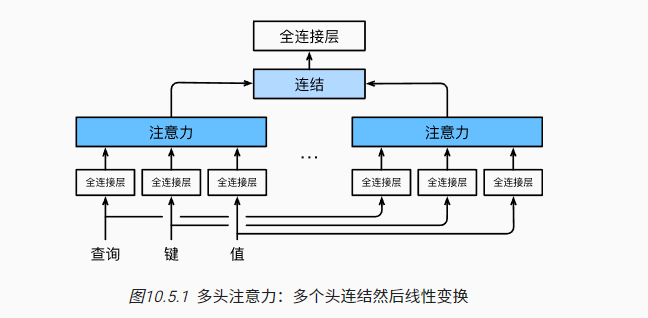

### 介绍

希望模型可以基于相同的注意力机制学习到不同的行为， 然后将不同的行为作为知识组合起来， 捕获序列内各种范围的依赖关系 （例如，短距离依赖和长距离依赖关系）。 因此，允许注意力机制组合使用查询、键和值的不同 *子空间表示*（representation subspaces）可能是有益的。

#### 数学表达

每个注意头：
$$
\mathbf{h}_i = f(\mathbf W_i^{(q)}\mathbf q, \mathbf W_i^{(k)}\mathbf k,\mathbf W_i^{(v)}\mathbf v) \in \mathbb R^{p_v},
$$
W表示可学习的参数，f表示注意力汇聚的函数； f可以是 [10.3节](https://zh.d2l.ai/chapter_attention-mechanisms/attention-scoring-functions.html#sec-attention-scoring-functions)中的 加性注意力和缩放点积注意力。 多头注意力的输出需要经过另一个线性转换， 它对应着h个头连结后的结果，因此其可学习参数是 $W_o$
$$
\begin{split}\mathbf W_o \begin{bmatrix}\mathbf h_1\\\vdots\\\mathbf h_h\end{bmatrix} \in \mathbb{R}^{p_o}.\end{split}
$$
