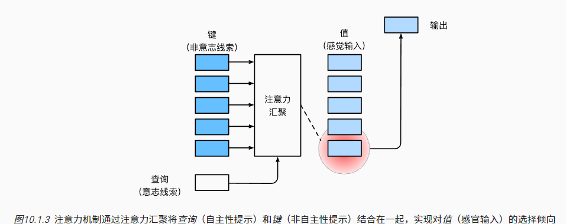
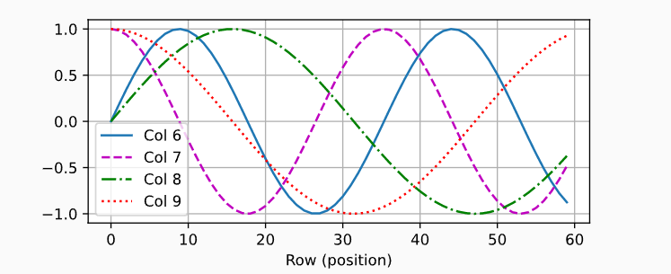
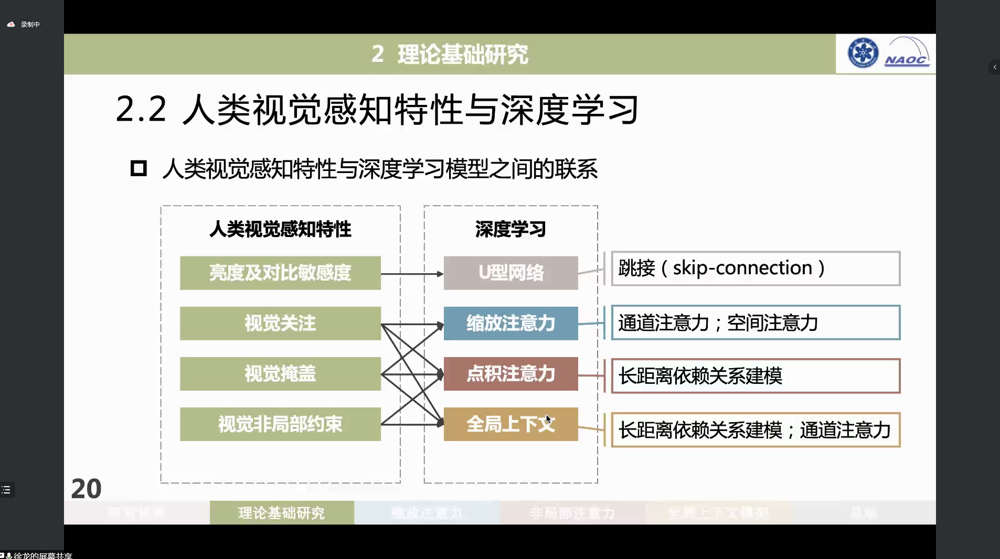

### 生物学中的注意力

非自主性注意力

自主性注意力

### 查询、键、值

“是否包含自主性提示”将注意力机制与全连接层或汇聚层区别开来

在注意力机制的背景下，我们将自主性提示称为*查询*（query）。 给定任何查询，注意力机制通过*注意力汇聚*（attention pooling） 将选择引导至*感官输入*（sensory inputs，例如中间特征表示）

所以关键在于查询的存在？

## 注意力汇聚（池化？）

如何定义Q、K和V

#### Nadaraya-Watson核回归模型

求一个x和y之间的回归模型；假定K为核函数，

$$f(x) = \sum_{i=1}^n \frac{K(x - x_i)}{\sum_{j=1}^n K(x - x_j)} y_i,$$

非参数注意力：使用高斯核。

$$K(u) = \frac{1}{\sqrt{2\pi}} \exp(-\frac{u^2}{2}).$$

参数化注意力(多了一个权重系数w）：

$$\begin{split}\begin{aligned}f(x) &= \sum_{i=1}^n \alpha(x, x_i) y_i \\&= \sum_{i=1}^n \frac{\exp\left(-\frac{1}{2}((x - x_i)w)^2\right)}{\sum_{j=1}^n \exp\left(-\frac{1}{2}((x - x_j)w)^2\right)} y_i \\&= \sum_{i=1}^n \mathrm{softmax}\left(-\frac{1}{2}((x - x_i)w)^2\right) y_i.\end{aligned}\end{split}$$

## 注意力评价函数

令高斯核中的指数部分视为*注意力评分函数*（attention scoring function）， 然后把这个函数的输出结果输入到softmax函数中进行运算。 通过上述步骤，我们将得到与键对应的值的概率分布（即注意力权重）。 最后，注意力汇聚的输出就是基于这些注意力权重的值的加权和。

#### 掩蔽softmax操作

在某些情况下，并非所有的值都应该被纳入到注意力汇聚中，为了去掉某些无意义的序列

#### 加性注意力

为确保无论向量长度如何， 点积的**方差**在不考虑向量长度的情况下仍然是1， 我们将点积除以$\sqrt d$， 则*缩放点积注意力*（scaled dot-product attention）评分函数为：
$$
a(\mathbf q, \mathbf k) = \mathbf{q}^\top \mathbf{k}  /\sqrt{d}.
$$
得到
$$
\mathrm{softmax}\left(\frac{\mathbf Q \mathbf K^\top }{\sqrt{d}}\right) \mathbf V \in \mathbb{R}^{n\times v}.
$$

#### 缩放点积注意力

使用点积可以得到计算效率更高的评分函数， 但是点积操作要求查询和键具有相同的长度d，

[10.3. 注意力评分函数 — 动手学深度学习 2.0.0-beta0 documentation (d2l.ai)](https://zh.d2l.ai/chapter_attention-mechanisms/attention-scoring-functions.html)

## 自注意力

 由于查询、键和值来自同一组输入，因此被称为 *自注意力*（self-attention）

### 比较卷积神经网络、循环神经网络和自注意力

让我们比较下面几个架构，目标都是将由n个词元组成的序列映射到另一个长度相等的序列，其中的每个输入词元或输出词元都由d维向量表示。具体来说，我们将比较的是卷积神经网络、循环神经网络和自注意力这几个架构的计算复杂性、顺序操作和最大路径长度。请注意，顺序操作会妨碍并行计算，而任意的序列位置组合之间的路径越短，则能更轻松地学习序列中的远距离依赖关系 [[Hochreiter et al., 2001\]](https://zh.d2l.ai/chapter_references/zreferences.html#hochreiter-bengio-frasconi-ea-2001)。

总而言之，卷积神经网络和自注意力都拥有并行计算的优势， 而且自注意力的最大路径长度最短。 但是因为其计算复杂度是关于序列长度的二次方，所以在很长的序列中计算会非常慢。

### 位置编码

RNN是按顺序处理次元，而自注意力因为并行计算而放弃了顺序。

为了使用顺序信息，添加位置编码（positional encoding）。位置编码可以通过学习得到也可以直接固定得到。

#### 绝对位置编码

$$
\begin{split}\begin{aligned} p_{i, 2j} &= \sin\left(\frac{i}{10000^{2j/d}}\right),\\p_{i, 2j+1} &= \cos\left(\frac{i}{10000^{2j/d}}\right).\end{aligned}\end{split}
$$

在位置嵌入矩阵P中， 行代表词元在序列中的位置，列代表位置编码的不同维度。 在下面的例子中，我们可以看到位置嵌入矩阵的第6列和第7列的频率高于第8列和第9列。 第6列和第7列之间的偏移量（第8列和第9列相同）是由于正弦函数和余弦函数的交替。

#### 相对位置编码

可以用一个转换函数表示两个的相对位置
$$
\begin{split}\begin{aligned}
&\begin{bmatrix} \cos(\delta \omega_j) & \sin(\delta \omega_j) \\  -\sin(\delta \omega_j) & \cos(\delta \omega_j) \\ \end{bmatrix}
\begin{bmatrix} p_{i, 2j} \\  p_{i, 2j+1} \\ \end{bmatrix}\\
=&\begin{bmatrix} \cos(\delta \omega_j) \sin(i \omega_j) + \sin(\delta \omega_j) \cos(i \omega_j) \\  -\sin(\delta \omega_j) \sin(i \omega_j) + \cos(\delta \omega_j) \cos(i \omega_j) \\ \end{bmatrix}\\
=&\begin{bmatrix} \sin\left((i+\delta) \omega_j\right) \\  \cos\left((i+\delta) \omega_j\right) \\ \end{bmatrix}\\
=&
\begin{bmatrix} p_{i+\delta, 2j} \\  p_{i+\delta, 2j+1} \\ \end{bmatrix},
\end{aligned}\end{split}
$$

