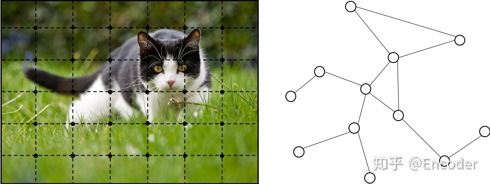

## 1. 介绍

CNN的关键在于：本地连接，共享权重和多层使用。这些特点对于解决图域问题也非常重要，因为

1. 图是最典型的局部连接结构；
2. 与传统的频谱图理论相比，共享权重降低了计算成本；
3. 多层结构是处理分层模式的关键，它捕获了各种大小的特征。

CNN只适用于张量数据，例如二维图像或一维文本序列。然而，有许多数据及其关系是难以简单的用张量表示的，而是需要借助另一种常见的数据结构，即**由顶点（vertex）和边（edge）表示的图**。

对结构数据表现很好；

#### 降维

即图嵌入（graph embedding）

## 2. 变种

- 针对不同图类型拓展使用的GNN
- 图上机制的一些改进（卷积，门机制，注意机制和skip connection
- 提高训练

## 3. 图卷积网络

## 4. 图注意力机制

[【深度学习】图神经网络与图卷积网络 - 知乎 (zhihu.com)](https://zhuanlan.zhihu.com/p/70028587)