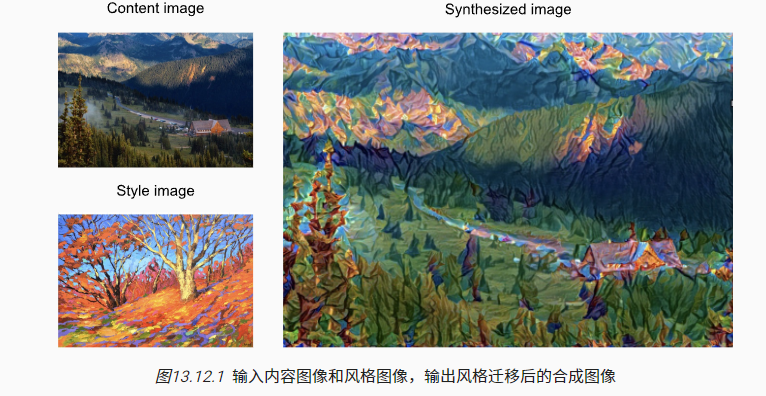
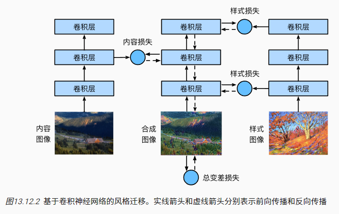

在本节中，我们将介绍如何使用卷积神经网络，自动将一个图像中的风格应用在另一图像之上，即*风格迁移*（style transfer） [[Gatys et al., 2016\]](https://zh.d2l.ai/chapter_references/zreferences.html#gatys-ecker-bethge-2016)。 这里我们需要两张输入图像：一张是*内容图像*，另一张是*风格图像*。 我们将使用神经网络修改内容图像，使其在风格上接近风格图像。 

### 方法

