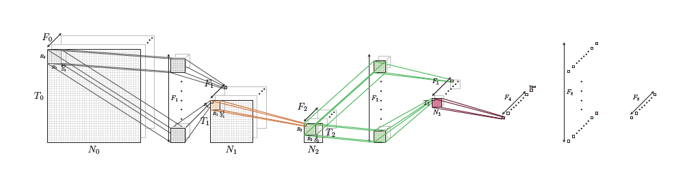
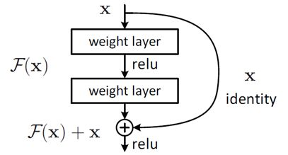
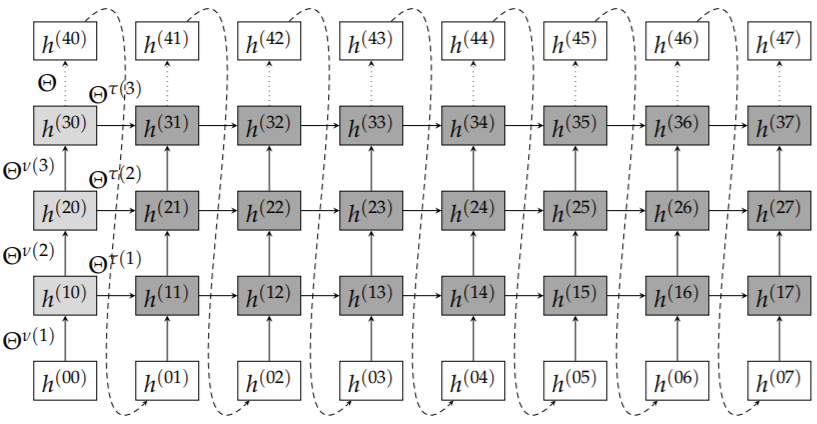

## 1. FNN

前馈神经网络，也叫全连接神经网络。

#### 前向传播

每个神经元以上一个节点输出作为输入，通过线性变换（结合偏置）和非线性函数激活，得到这个节点的输出

#### 反向传播

链式求导+最优化问题（损失函数最小化）

#### 其他

MfNN：多输入前馈神经网络

## 2. CNN

卷积神经网络，擅长图像分类

与FNN相比，卷积和池化是 CNN 的构建基元。

### 2.1 ResNet

深度残差网络（Deep residual network, ResNet）

退化问题：网络深度增加时，网络准确度出现饱和，甚至退化；

假定函数输入为x1，输出为x2；

$$
y1 = x1 + F(x1,W)\\
x2 = f(y1)
$$

F为残差函数，f是激活函数，

这样，梯度至少不会是0？

## 3. 循环神经网络RNN

而不仅仅是在空间方向上进行传播，数据也以新的时间依赖方向传递

目前最流行的一种：LSTM

上图中时间尺寸为8，空间为4.