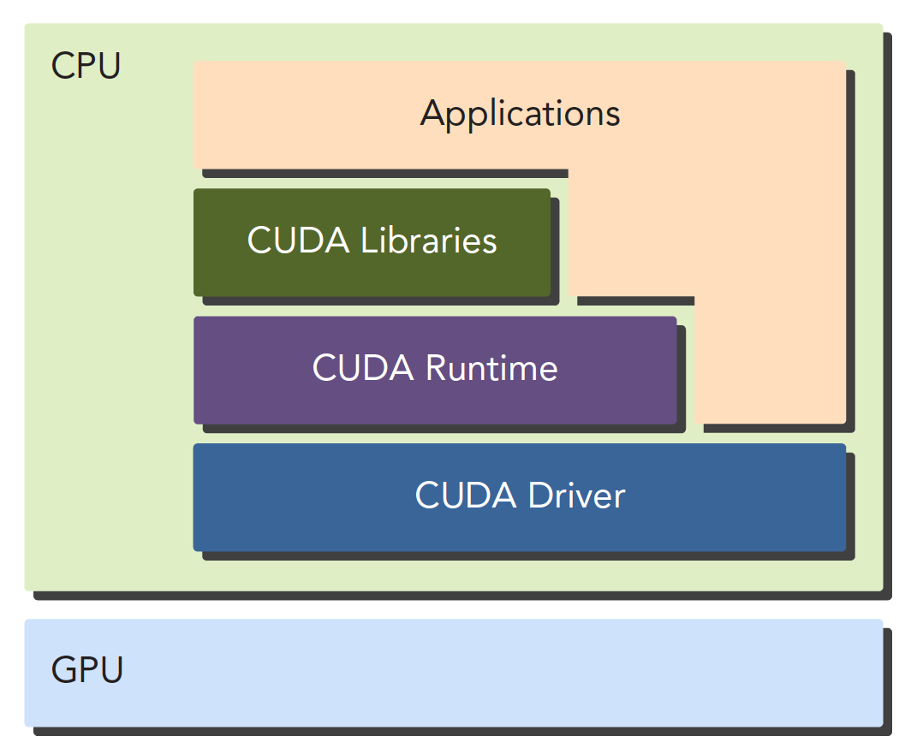

### 异构

不同的计算机平台，比如 CPU＋GPU。

性能指标：

- 延迟是指操作从开始到结束所需要的时间，一般用微秒计算，延迟越低越好。

- 带宽是单位时间内处理的数据量，一般用MB/s或者GB/s表示。
- 吞吐量是单位时间内成功处理的运算数量，一般用gflops来表示（十亿次浮点计算），吞吐量和延迟有一定关系，都是反应计算速度的，一个是时间除以运算次数，得到的是单位次数用的时间–延迟，一个是运算次数除以时间，得到的是单位时间执行次数–吞吐量。

**CPU和GPU线程的区别**：

1. CPU线程是重量级实体，操作系统交替执行线程，线程上下文切换花销很大
2. GPU线程是轻量级的，GPU应用一般包含成千上万的线程，多数在排队状态，线程之间切换基本没有开销。
3. CPU的核被设计用来尽可能减少一个或两个线程运行时间的延迟，而GPU核则是大量线程，最大幅度提高吞吐量

**GPU性能指标：**

- 峰值计算能力
- 内存带宽

### CUDA

CUDA本身就是一种异构系统，同时调用CPU和GPU

### CUDA API

对于API也有两种不同的层次，一种相对交高层，一种相对底层。

- CUDA驱动API
- CUDA运行时API

这两种API是互斥的，也就是你只能用一个，两者之间的函数不可以混合调用，只能用其中的一个库。

### 代码编译

一个CUDA应用通常可以分解为两部分，

- CPU 主机端代码
- GPU 设备端代码

CUDA nvcc编译器会自动分离你代码里面的不同部分，如图中主机代码用C写成，使用本地的C语言编译器编译，设备端代码，也就是核函数，用CUDA C编写，通过nvcc编译，链接阶段，在内核程序调用或者明显的GPU设备操作时，添加运行时库。

### CUDA编程模型

GPU中大致可以分为：

- 核函数
- 内存管理
- 线程管理
- 流

从宏观上我们可以从以下几个环节完成CUDA应用开发：

1. 领域层
2. 逻辑层
3. 硬件层

第一步就是在领域层（也就是你所要解决问题的条件）分析数据和函数，以便在并行运行环境中能正确，高效地解决问题。
当分析设计完程序就进入了编程阶段，我们关注点应转向如何组织并发进程，这个阶段要从逻辑层面思考。
CUDA模型主要的一个功能就是线程层结构抽象的概念，以允许控制线程行为。这个抽象为并行变成提供了良好的可扩展性（这个扩展性后面有提到，就是一个CUDA程序可以在不同的GPU机器上运行，即使计算能力不同）。
在硬件层上，通过理解线程如何映射到机器上，能充分帮助我们提高性能。

### CUDA编程结构

多个CPU多个GPU，他们都通过PCIe总线相互通信