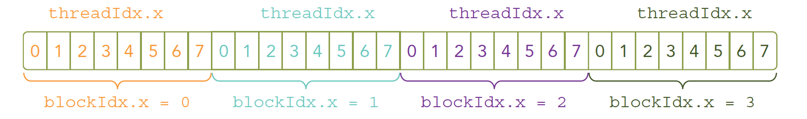

## 核函数

### 启动核函数

```C
kernel_name<<<grid,block>>>(argument list);
```

当主机启动了核函数，控制权马上回到主机，而不是主机等待设备完成核函数的运行

想要host等待device执行可以

- 使用`cudaDeviceSynchronize(void)`

- 也有隐式方法，隐式方法就是不明确说明主机要等待设备端，而是设备端不执行完，主机没办法进行，比如内存拷贝函数：

#### 线程布局

```C
kernel_name<<<4,8>>>(argument list);
```



#### 编写核函数

|   限定符   |    执行    |                     调用                      |           备注           |
| :--------: | :--------: | :-------------------------------------------: | :----------------------: |
| __global__ | 设备端执行 | 可以从主机调用也可以从计算能力3以上的设备调用 | 必须有一个void的返回类型 |
| __device__ | 设备端执行 |                  设备端调用                   |                          |
|  __host__  | 主机端执行 |                   主机调用                    |         可以省略         |

有些函数可以同时定义为 **device** 和 **host** ，这种函数可以同时被设备和主机端的代码调用

**for并行**

```C
__global__ void sumArraysOnGPU(float *A, float *B, float *C) {
  int i = threadIdx.x;
  C[i] = A[i] + B[i];
}
```

#### 验证核函数

```C
/*
* https://github.com/Tony-Tan/CUDA_Freshman
* 3_sum_arrays
*/
#include <cuda_runtime.h>
#include <stdio.h>
#include "freshman.h"


void sumArrays(float * a,float * b,float * res,const int size)
{
  for(int i=0;i<size;i+=4)
  {
    res[i]=a[i]+b[i];
    res[i+1]=a[i+1]+b[i+1];
    res[i+2]=a[i+2]+b[i+2];
    res[i+3]=a[i+3]+b[i+3];
  }
}
__global__ void sumArraysGPU(float*a,float*b,float*res)
{
  int i=threadIdx.x;
  res[i]=a[i]+b[i];
}
int main(int argc,char **argv)
{
  int dev = 0;
  cudaSetDevice(dev);

  int nElem=32;
  printf("Vector size:%d\n",nElem);
  int nByte=sizeof(float)*nElem;
  float *a_h=(float*)malloc(nByte);
  float *b_h=(float*)malloc(nByte);
  float *res_h=(float*)malloc(nByte);
  float *res_from_gpu_h=(float*)malloc(nByte);
  memset(res_h,0,nByte);
  memset(res_from_gpu_h,0,nByte);

  float *a_d,*b_d,*res_d;
  CHECK(cudaMalloc((float**)&a_d,nByte));
  CHECK(cudaMalloc((float**)&b_d,nByte));
  CHECK(cudaMalloc((float**)&res_d,nByte));

  initialData(a_h,nElem);
  initialData(b_h,nElem);

  CHECK(cudaMemcpy(a_d,a_h,nByte,cudaMemcpyHostToDevice));
  CHECK(cudaMemcpy(b_d,b_h,nByte,cudaMemcpyHostToDevice));

  dim3 block(nElem);
  dim3 grid(nElem/block.x);
  sumArraysGPU<<<grid,block>>>(a_d,b_d,res_d);
  printf("Execution configuration<<<%d,%d>>>\n",block.x,grid.x);

  CHECK(cudaMemcpy(res_from_gpu_h,res_d,nByte,cudaMemcpyDeviceToHost));
  sumArrays(a_h,b_h,res_h,nElem);

  checkResult(res_h,res_from_gpu_h,nElem);
  cudaFree(a_d);
  cudaFree(b_d);
  cudaFree(res_d);

  free(a_h);
  free(b_h);
  free(res_h);
  free(res_from_gpu_h);

  return 0;
}
```

在开发阶段，每一步都进行验证是绝对高效的，比把所有功能都写好，然后进行测试这种过程效率高很多，同样写CUDA也是这样的每个代码小块都进行测试，看起来慢，实际会提高很多效率。
CUDA小技巧，当我们进行调试的时候可以把核函数配置成单线程的：

#### 错误处理

定义宏

```C
#define CHECK(call)\
{\
  const cudaError_t error=call;\
  if(error!=cudaSuccess)\
  {\
      printf("ERROR: %s:%d,",__FILE__,__LINE__);\
      printf("code:%d,reason:%s\n",error,cudaGetErrorString(error));\
      exit(1);\
  }\
}
```


### 编译

```shell
nvcc xxxx.cu -o xxxx

```

