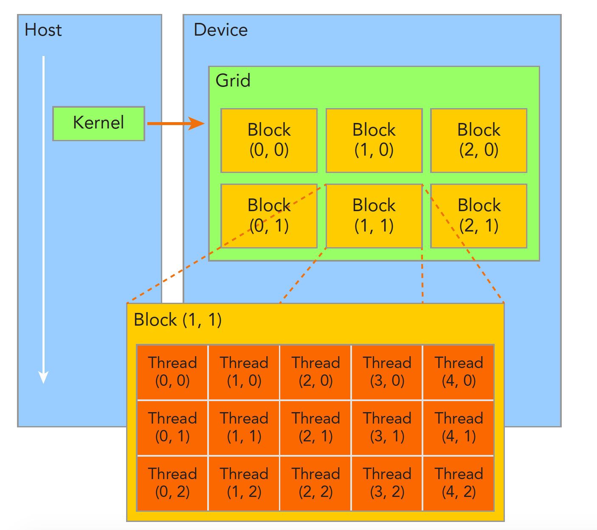

### 建立索引


横坐标
$$
ix=threadIdx.x+blockIdx.x \times blockDim.x
$$
纵坐标
$$
iy=threadIdx.y+blockIdx.y \times blockDim.y
$$
为了让不同线程处理不同的数据，CUDA常用的做法是让不同的线程对应不同的数据，也就是用线程的全局标号对应不同组的数据。
设备内存或者主机内存都是线性存在的，比如一个二维矩阵 (8×6)，存储在内存中是这样的：


线性位置的计算方法是：
$$
idx=ix+iy∗nx
$$
用线程的全局坐标对应矩阵的坐标，也就是说，线程的坐标(ix,iy)对应矩阵中(ix,iy)的元素，

```C
#include <cuda_runtime.h>
#include <stdio.h>
#include "freshman.h"

__global__ void printThreadIndex(float *A,const int nx,const int ny)
{
  int ix=threadIdx.x+blockIdx.x*blockDim.x;
  int iy=threadIdx.y+blockIdx.y*blockDim.y;
  unsigned int idx=iy*nx+ix;
  printf("thread_id(%d,%d) block_id(%d,%d) coordinate(%d,%d)"
          "global index %2d ival %2d\n",threadIdx.x,threadIdx.y,
          blockIdx.x,blockIdx.y,ix,iy,idx,A[idx]);
}
int main(int argc,char** argv)
{
  initDevice(0);
  int nx=8,ny=6;
  int nxy=nx*ny;
  int nBytes=nxy*sizeof(float);

  //Malloc
  float* A_host=(float*)malloc(nBytes);
  initialData(A_host,nxy);
  printMatrix(A_host,nx,ny);

  //cudaMalloc
  float *A_dev=NULL;
  CHECK(cudaMalloc((void**)&A_dev,nBytes));

  cudaMemcpy(A_dev,A_host,nBytes,cudaMemcpyHostToDevice);

  dim3 block(4,2);
  dim3 grid((nx-1)/block.x+1,(ny-1)/block.y+1);

  printThreadIndex<<<grid,block>>>(A_dev,nx,ny);

  CHECK(cudaDeviceSynchronize());
  cudaFree(A_dev);
  free(A_host);

  cudaDeviceReset();
  return 0;
}
```

注意，核函数能调用printf这个特性是CUDA后来加的，最早的版本里面不能printf.

#### 示例：二维矩阵加法

```C
__global__ void sumMatrix(float * MatA,float * MatB,float * MatC,int nx,int ny)
{
    int ix=threadIdx.x+blockDim.x*blockIdx.x;
    int iy=threadIdx.y+blockDim.y*blockIdx.y;
    int idx=ix+iy*ny;
    if (ix<nx && iy<ny)
    {
      MatC[idx]=MatA[idx]+MatB[idx];
    }
}
```

#### 测试

用不同的线程组织形式会得到正确结果，但是效率有所区别：

|       线程配置       | 执行时间 |
| :------------------: | :------: |
|     0. CPU单线程     | 0.060022 |
| 1. (128,128),(32,32) | 0.002152 |
| 2. (524288,1),(32,1) | 0.002965 |
| 3. (128,4096),(32,1) | 0.002965 |

对于方法1：

```C
dim3 block_0(dimx,dimy);
dim3 grid_0((nx-1)/block_0.x+1,(ny-1)/block_0.y+1);
iStart=cpuSecond();
sumMatrix<<<grid_0,block_0>>>(A_dev,B_dev,C_dev,nx,ny);
```

方法2：

```C
dimx=32;
dim3 block_1(dimx);
dim3 grid_1((nxy-1)/block_1.x+1);
iStart=cpuSecond();
sumMatrix<<<grid_1,block_1>>>(A_dev,B_dev,C_dev,nx*ny ,1);
```

方法3：

```C
// 2d block and 1d grid
dimx=32;
dim3 block_2(dimx);
dim3 grid_2((nx-1)/block_2.x+1,ny);
iStart=cpuSecond();
sumMatrix<<<grid_2,block_2>>>(A_dev,B_dev,C_dev,nx,ny);
```

