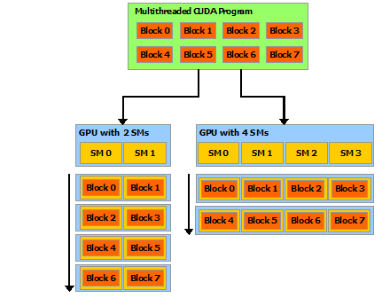

### GPU结构

- 核函数
- 内存管理
- 线程管理
- 流

一个完整的CUDA应用可能的执行顺序如下图：

从host的串行到调用核函数（核函数被调用后控制马上归还主机线程，也就是在**第一个并行代码执行时，很有可能第二段host代码已经开始同步执行了**）。

#### 研究对象

- 内存
- 线程
- 核函数
  - 启动
  - 编写
  - 验证
- 错误处理


### 内存管理

内存管理在传统串行程序是非常常见的，寄存器空间，栈空间内的内存由机器自己管理，堆空间由用户控制分配和释放，CUDA程序同样，只是CUDA提供的API可以分配管理设备上的内存，当然也可以用CDUA管理主机上的内存，主机上的传统标准库也能完成主机内存管理。
下面表格有一些主机API和CUDA C的API的对比：

| 标准C函数 | CUDA C 函数 |   说明   |
| :-------: | :---------: | :------: |
|  malloc   | cudaMalloc  | 内存分配 |
|  memcpy   | cudaMemcpy  | 内存复制 |
|  memset   | cudaMemset  | 内存设置 |
|   free    |  cudaFree   | 释放内存 |

#### 内存拷贝

```c++
cudaError_t cudaMemcpy(void * dst,const void * src,size_t count,
  cudaMemcpyKind kind)
```

`cudaMemcpyKind kind`有以下几种：

- cudaMemcpyHostToHost
- cudaMemcpyHostToDevice
- cudaMemcpyDeviceToHost
- cudaMemcpyDeviceToDevice

如果函数执行成功，则会返回 cudaSuccess 否则返回 cudaErrorMemoryAllocation

#### 内存层次


### 线程管理

当内核函数开始执行，如何组织GPU的线程就变成了最主要的问题了，我们必须明确，一个核函数只能有一个grid，一个grid可以有很多个块，每个块可以有很多的线程，这种分层的组织结构使得我们的并行过程更加自如灵活：


#### 线程分离

- blockIdx（线程块在线程网格内的位置索引）
- threadIdx（线程在线程块内的位置索引）

，这两个内置结构体基于 uint3 定义，包含三个无符号整数的结构，通过三个字段来指定：

- blockIdx.x
- blockIdx.y
- blockIdx.z
- threadIdx.x
- threadIdx.y
- threadIdx.z

上面这两个是坐标，当然我们要有同样对应的两个结构体来保存其范围，也就是blockIdx中三个字段的范围threadIdx中三个字段的范围：

- blockDim
- gridDim

他们是dim3类型(基于uint3定义的数据结构)的变量，也包含三个字段x,y,z.

- blockDim.x
- blockDim.y
- blockDim.z

网格和块的维度一般是二维和三维的，也就是说一个网格通常被分成二维的块，而每个块常被分成三维的线程。
注意：dim3是手工定义的，主机端可见。uint3是设备端在执行的时候可见的，不可以在核函数运行时修改，初始化完成后uint3值就不变了。他们是有区别的！这一点必须要注意。

```C
#include <cuda_runtime.h>
#include <stdio.h>
__global__ void checkIndex(void)
{
  printf("threadIdx:(%d,%d,%d) blockIdx:(%d,%d,%d) blockDim:(%d,%d,%d)\
  gridDim(%d,%d,%d)\n",threadIdx.x,threadIdx.y,threadIdx.z,
  blockIdx.x,blockIdx.y,blockIdx.z,blockDim.x,blockDim.y,blockDim.z,
  gridDim.x,gridDim.y,gridDim.z);
}
int main(int argc,char **argv)
{
  int nElem=6;
  dim3 block(3);
  dim3 grid((nElem+block.x-1)/block.x);
  printf("grid.x %d grid.y %d grid.z %d\n",grid.x,grid.y,grid.z);
  printf("block.x %d block.y %d block.z %d\n",block.x,block.y,block.z);
  checkIndex<<<grid,block>>>();
  cudaDeviceReset();
  return 0;
}
```
结果

```
grid.x 2 grid.y 1 grid.z 1
block.x 3 block.y 1 block.z 1
threadIdx:(0,0,0) blockIdx:(1,0,0) blockDim:(3,1,1)  gridDim(2,1,1)
threadIdx:(1,0,0) blockIdx:(1,0,0) blockDim:(3,1,1)  gridDim(2,1,1)
threadIdx:(2,0,0) blockIdx:(1,0,0) blockDim:(3,1,1)  gridDim(2,1,1)
threadIdx:(0,0,0) blockIdx:(0,0,0) blockDim:(3,1,1)  gridDim(2,1,1)
threadIdx:(1,0,0) blockIdx:(0,0,0) blockDim:(3,1,1)  gridDim(2,1,1)
threadIdx:(2,0,0) blockIdx:(0,0,0) blockDim:(3,1,1)  gridDim(2,1,1)
```

检查网络和块大小

```C
#include <cuda_runtime.h>
#include <stdio.h>
int main(int argc,char ** argv)
{
  int nElem=1024;
  dim3 block(1024);
  dim3 grid((nElem-1)/block.x+1);
  printf("grid.x %d block.x %d\n",grid.x,block.x);

  block.x=512;
  grid.x=(nElem-1)/block.x+1;
  printf("grid.x %d block.x %d\n",grid.x,block.x);

  block.x=256;
  grid.x=(nElem-1)/block.x+1;
  printf("grid.x %d block.x %d\n",grid.x,block.x);

  block.x=128;
  grid.x=(nElem-1)/block.x+1;
  printf("grid.x %d block.x %d\n",grid.x,block.x);

  cudaDeviceReset();
  return 0;
}
```


结果

```
grid.x 1 block.x 1024
grid.x 2 block.x 512
grid.x 4 block.x 256
grid.x 8 block.x 128
```


### 声明

在函数前增加修饰词来指定。

| 关键字     | 执行位置 | 调用位置 |
| ---------- | -------- | -------- |
| __host__   | CPU      | CPU      |
| __global__ | GPU      | CPU      |
| __device__ | GPU      | GPU      |


__global__描述的函数就是“被CPU调用，在GPU上运行的代码”，同时它也打通了__host__和__device__修饰的函数。__global__修饰的函数是被异步执行的。__global__修饰的函数只能是void类型。我们假设其可以有返回值，则其调用者是可以捕获这个值的。但是__global__函数是异步调用的，当函数返回时，接受返回值的变量可能已经被销毁了。所以设计其有返回值也没太多意义。

如果一段代码既需要运行于CPU，也要运行于GPU，怎么办？难道要写两次？当然不用，我们可以同时使用__host__和__device__修饰。这样编译器就会帮我们生成两份代码逻辑。但是注意：__global__不能和__host__、__device__任何一个修饰符一起使用。

### Kernels

这些函数在被调用时由N个不同的CUDA线程并行执行N次，而不是像常规C ++函数那样仅执行一次。使用__global__声明说明符定义内核，并使用<<< … >>>执行配置语法指定为给定内核调用执行该内核的CUDA线程数（请参阅C ++语言扩展）。 每个执行内核的线程都有一个唯一的线程ID，可通过内置变量在内核内访问该ID。

```C++
// Kernel definition
__global__ void VecAdd(float* A, float* B, float* C)
{
    int i = threadIdx.x;
    C[i] = A[i] + B[i];
}

int main()
{
    ...
    // Kernel invocation with N threads
    VecAdd<<<1, N>>>(A, B, C);
    ...
}
```

### Thread Hierarchy

`threadIdx`是一个三分量向量，因此可以使用一维，二维或三维线程索引来标识线程，从而形成一个一维，二维或三维块。

线程，称为线程块。 这提供了一种自然的方法来调用跨域中的元素（例如向量，矩阵或体积）的计算。

线程的索引：对于一维块，它们是相同的；对于大小为（$D_x,D_y$）的二维块，索引为（$x，y$）的线程的线程ID为$x+yD_y$； 对于大小为（$D_x,D_y,D_z$）的三维块，索引为（x，y，z）的线程的线程ID为（$x+yD_y+zD_z$）。

例如，以下代码将两个大小为NxN的矩阵A和B相加，并将结果存储到矩阵C中

```C++
// Kernel definition
__global__ void MatAdd(float A[N][N], float B[N][N],
                       float C[N][N])
{
    int i = threadIdx.x;
    int j = threadIdx.y;
    C[i][j] = A[i][j] + B[i][j];
}

int main()
{
    ...
    // Kernel invocation with one block of N * N * 1 threads
    int numBlocks = 1;
    dim3 threadsPerBlock(N, N);
    MatAdd<<<numBlocks, threadsPerBlock>>>(A, B, C);
    ...
}
```

每个块的线程数量是有限制的，因为一个块的所有线程都应该驻留在同一个处理器核心上，并且必须共享该核心有限的内存资源。在当前的gpu上，一个线程块可能包含多达1024个线程。

但是，一个内核可以由多个形状相同的线程块执行，因此线程总数等于每个块的线程数乘以块数。

块被组织成一维、二维或三维的线程块网格(`grid`)，如下图所示。网格中的线程块数量通常由正在处理的数据的大小决定，通常超过系统中的处理器数量。


`<<<...>>> `语法中指定的每个块的线程数和每个网格的块数可以是 `int` 或 `dim3` 类型。如上例所示，可以指定二维块或网格。

网格中的每个块都可以由一个一维、二维或三维的惟一索引标识，该索引可以通过内置的`blockIdx`变量在内核中访问。线程块的维度可以通过内置的`blockDim`变量在内核中访问。

扩展前面的`MatAdd()`示例来处理多个块，代码如下所示。

```C++
// Kernel definition
__global__ void MatAdd(float A[N][N], float B[N][N],
float C[N][N])
{
    int i = blockIdx.x * blockDim.x + threadIdx.x;
    int j = blockIdx.y * blockDim.y + threadIdx.y;
    if (i < N && j < N)
        C[i][j] = A[i][j] + B[i][j];
}

int main()
{
    ...
    // Kernel invocation
    dim3 threadsPerBlock(16, 16);
    dim3 numBlocks(N / threadsPerBlock.x, N / threadsPerBlock.y);
    MatAdd<<<numBlocks, threadsPerBlock>>>(A, B, C);
    ...
}
```

线程块大小为16×16(256个线程)，尽管在本例中是任意更改的，但这是一种常见的选择。网格是用足够的块创建的，这样每个矩阵元素就有一个线程来处理。为简单起见，本例假设每个维度中每个网格的线程数可以被该维度中每个块的线程数整除，尽管事实并非如此。

程块需要独立执行：必须可以以任何顺序执行它们，并行或串行。 这种独立性要求允许跨任意数量的内核以任意顺序调度线程块，如下图所示，使程序员能够编写随内核数量扩展的代码。



块内的线程可以通过一些共享内存共享数据并通过同步它们的执行来协调内存访问来进行协作。 更准确地说，可以通过调用 `__syncthreads()` 内部函数来指定内核中的同步点； `__syncthreads()` 充当屏障，块中的所有线程必须等待，然后才能继续。 [Shared Memory](https://docs.nvidia.com/cuda/cuda-c-programming-guide/index.html#shared-memory) 给出了一个使用共享内存的例子。 除了` __syncthreads()` 之外，[Cooperative Groups API](https://docs.nvidia.com/cuda/cuda-c-programming-guide/index.html#cooperative-groups) 还提供了一组丰富的线程同步示例。

为了高效协作，共享内存是每个处理器内核附近的低延迟内存（很像 L1 缓存），并且 `__syncthreads()` 是轻量级的。

### 存储

CUDA 线程可以在执行期间从多个内存空间访问数据，如下图所示。每个线程都有私有的本地内存。 每个线程块都具有对该块的所有线程可见的共享内存，并且具有与该块相同的生命周期。 所有线程都可以访问相同的全局内存。


还有两个额外的只读内存空间可供所有线程访问：常量和纹理内存空间。 全局、常量和纹理内存空间针对不同的内存使用进行了优化（请参阅[设备内存访问](https://docs.nvidia.com/cuda/cuda-c-programming-guide/index.html#device-memory-accesses)）。 纹理内存还为某些特定数据格式提供不同的寻址模式以及数据过滤（请参阅[纹理和表面内存](https://docs.nvidia.com/cuda/cuda-c-programming-guide/index.html#texture-and-surface-memory)）。

全局、常量和纹理内存空间在同一应用程序的内核启动中是持久的。

[CUDA 编程手册系列第二章: CUDA 编程模型概述 - NVIDIA 技术博客](https://developer.nvidia.com/zh-cn/blog/cuda-model-intro-cn/)