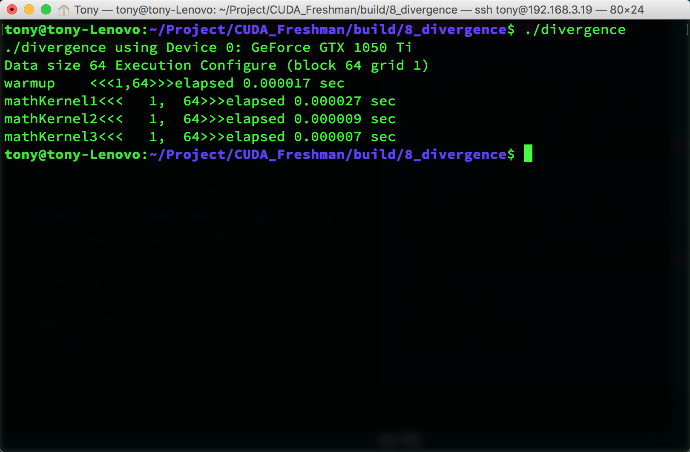

### 线程束和线程块

线程束是SM中基本的执行单元，当一个网格被启动（网格被启动，等价于一个内核被启动，每个内核对应于自己的网格），网格中包含线程块，线程块被分配到某一个SM上以后，将分为多个线程束，每个线程束一般是32个线程（目前的GPU都是32个线程，但不保证未来还是32个）在一个线程束中，所有线程按照单指令多线程SIMT的方式执行，每一步执行相同的指令，但是处理的数据为私有的数据，下图反应的就是逻辑，实际，和硬件的图形化


内存总是一维线性存在的，但程序可以写成三维，变与处理三维数据

在块中，每个线程有唯一的编号（可能是个三维的编号），threadIdx。
网格中，每个线程块也有唯一的编号(可能是个三维的编号)，blockIdx
那么每个线程就有在网格中的唯一编号。
当一个线程块中有128个线程的时候，其分配到SM上执行时，会分成4个块：

```
warp0: thread  0,........thread31
warp1: thread 32,........thread63
warp2: thread 64,........thread95
warp3: thread 96,........thread127
```

当编号使用三维编号时，x位于最内层，y位于中层，z位于最外层，想象下c语言的数组，如果把上面这句话写成c语言，假设三维数组t保存了所有的线程，那么(threadIdx.x,threadIdx.y,threadIdx.z)表示为

```
t[z][y][x];
```

计算出三维对应的线性地址是：
$$
tid = threadIdx.x+threadIdx.y\times blockDim.x+threadIdx.z\times blockDim.x \times blockDim.y
$$
一个线程块包含多少个线程束呢？
$$
\text{WarpsPerBlock}=\text{ceil}\begin{pmatrix}\frac{\text{ThreadsPerBlock}}{\text{warpSize}}\end{pmatrix}
$$
ceil函数是向正无穷取整的函数(即全部入最大值，ceil(1.1)=2)

### 线程束分化

在CPU上，如果有多重循环，胡私用分支预测 技术，避免等待上一分支执行产生的延迟。GPU没有这么复杂的处理。

如下一段代码：

```c
if (con)
{
    //do something
}
else
{
    //do something
}
```


假设这段代码是核函数的一部分，那么当一个线程束的32个线程执行这段代码的时候，如果其中16个执行if中的代码段，而另外16个执行else中的代码块，同一个线程束中的线程，执行不同的指令，这叫做线程束的**分化**。

这似乎是矛盾？

解决矛盾的办法就是每个线程都执行所有的if和else部分，当一部分con成立的时候，执行if块内的代码，有一部分线程con不成立，那么他们怎么办？继续执行else？不可能的，因为分配命令的调度器就一个，所以这些con不成立的线程等待，就像分水果，你不爱吃，那你就只能看着别人吃，等大家都吃完了，再进行下一轮（也就是下一个指令）线程束分化会产生严重的性能下降。**条件分支越多，并行性削弱越严重**。

当一个线程束中所有的线程都执行if或者，都执行else时，不存在性能下降；只有当线程束内有分歧产生分支的时候，性能才会急剧下降。

```c
__global__ void mathKernel2(float *c)
{
	int tid = blockIdx.x* blockDim.x + threadIdx.x;
	float a = 0.0;
	float b = 0.0;
	if ((tid/warpSize) % 2 == 0)
	{
		a = 100.0f;
	}
	else
	{
		b = 200.0f;
	}
	c[tid] = a + b;
}
```

warpSize就是线程束中线程数量。

第一个线程束内的线程编号tid从0到31，tid/warpSize都等于0，那么就都执行if语句。
第二个线程束内的线程编号tid从32到63，tid/warpSize都等于1，执行else
线程束内没有分支，效率较高。

```c
#include <cuda_runtime.h>
#include <stdio.h>
#include <stdlib.h>
#include "freshman.h"
__global__ void warmup(float *c)
{
	int tid = blockIdx.x* blockDim.x + threadIdx.x;
	float a = 0.0;
	float b = 0.0;

	if ((tid/warpSize) % 2 == 0)
	{
		a = 100.0f;

	}
	else
	{
		b = 200.0f;
	}
	//printf("%d %d %f \n",tid,warpSize,a+b);
	c[tid] = a + b;
}
__global__ void mathKernel1(float *c)
{
	int tid = blockIdx.x* blockDim.x + threadIdx.x;

	float a = 0.0;
	float b = 0.0;
	if (tid % 2 == 0)
	{
		a = 100.0f;
	}
	else
	{
		b = 200.0f;
	}
	c[tid] = a + b;
}

__global__ void mathKernel2(float *c)
{
	int tid = blockIdx.x* blockDim.x + threadIdx.x;
	float a = 0.0;
	float b = 0.0;
	if ((tid/warpSize) % 2 == 0)
	{
		a = 100.0f;
	}
	else
	{
		b = 200.0f;
	}
	c[tid] = a + b;
}
__global__ void mathKernel3(float *c)
{
	int tid = blockIdx.x* blockDim.x + threadIdx.x;
	float a = 0.0;
	float b = 0.0;
	bool ipred = (tid % 2 == 0);
	if (ipred)
	{
		a = 100.0f;
	}
	else
	{
		b = 200.0f;
	}
	c[tid] = a + b;
}

int main(int argc, char **argv)
{
	int dev = 0;
	cudaDeviceProp deviceProp;
	cudaGetDeviceProperties(&deviceProp, dev);
	printf("%s using Device %d: %s\n", argv[0], dev, deviceProp.name);

	//set up data size
	int size = 64;
	int blocksize = 64;
	if (argc > 1) blocksize = atoi(argv[1]);
	if (argc > 2) size = atoi(argv[2]);
	printf("Data size %d ", size);

	//set up execution configuration
	dim3 block(blocksize,1);
	dim3 grid((size - 1) / block.x + 1,1);
	printf("Execution Configure (block %d grid %d)\n", block.x, grid.x);

	//allocate gpu memory
	float * C_dev;
	size_t nBytes = size * sizeof(float);
	float * C_host=(float*)malloc(nBytes);
	cudaMalloc((float**)&C_dev, nBytes);

	//run a warmup kernel to remove overhead
	double iStart, iElaps;
	cudaDeviceSynchronize();
	iStart = cpuSecond();
	warmup<<<grid,block>>> (C_dev);
	cudaDeviceSynchronize();
	iElaps = cpuSecond() - iStart;

	printf("warmup	  <<<%d,%d>>>elapsed %lf sec \n", grid.x, block.x, iElaps);

	//run kernel 1
	iStart = cpuSecond();
	mathKernel1 <<< grid,block >>> (C_dev);
	cudaDeviceSynchronize();
	iElaps = cpuSecond() - iStart;
	printf("mathKernel1<<<%4d,%4d>>>elapsed %lf sec \n", grid.x, block.x, iElaps);
	cudaMemcpy(C_host,C_dev,nBytes,cudaMemcpyDeviceToHost);
	//for(int i=0;i<size;i++)
	//{
	//	printf("%f ",C_host[i]);
	//}
	//run kernel 2
	iStart = cpuSecond();
	mathKernel2 <<<grid,block >>> (C_dev);
	cudaDeviceSynchronize();
	iElaps = cpuSecond() - iStart;
	printf("mathKernel2<<<%4d,%4d>>>elapsed %lf sec \n", grid.x, block.x, iElaps);

	//run kernel 3
	iStart = cpuSecond();
	mathKernel3 << <grid, block >> > (C_dev);
	cudaDeviceSynchronize();
	iElaps = cpuSecond() - iStart;
	printf("mathKernel3<<<%4d,%4d>>>elapsed %lf sec \n", grid.x, block.x, iElaps);

	cudaFree(C_dev);
	free(C_host);
	cudaDeviceReset();
	return EXIT_SUCCESS;
}
```



代码中warmup部分是提前启动一次GPU，因为第一次启动GPU时会比第二次速度慢一些


参考：[【CUDA 基础】3.2 理解线程束执行的本质(Part I) | 谭升的博客 (face2ai.com)](https://face2ai.com/CUDA-F-3-2-理解线程束执行的本质-P1/)