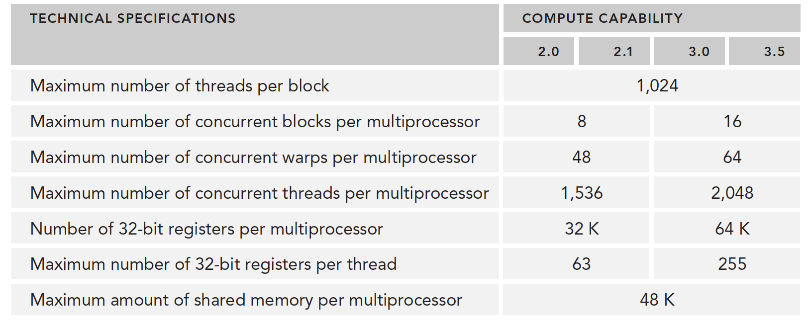

### GPU架构

GPU架构是围绕一个流式多处理器（SM）的扩展阵列（如下图）搭建的。通过复制这种结构来实现GPU的硬件并行。

GPU中每个SM都能支持数百个线程并发执行，每个GPU通常有多个SM，当一个核函数的网格被启动的时候，多个block会被同时分配给可用的SM上执行。

当一个blcok被分配给一个SM后，他就只能在这个SM上执行了，不可能重新分配到其他SM上了，多个线程块可以被分配到同一个SM上。

#### 线程束

CUDA 采用单指令多线程SIMT架构管理执行线程，不同设备有不同的线程束大小，但是到目前为止基本所有设备都是维持在**32**，也就是说每个SM上有多个block，一个block有多个线程（可以是几百个，但不会超过某个最大值），但是从机器的角度，在某时刻T，SM上只执行一个线程束，也就是32个线程在同时同步执行，线程束中的每个线程执行同一条指令，包括有分支的部分。

#### SIMD vs SIMT

SIMD：类似矢量并行，所有分支执行相同指令

SIMT：SIMT的某些线程可以选择不执行

SIMT包括以下SIMD不具有的关键特性：

1. 每个线程都有自己的指令地址计数器
2. 每个线程都有自己的寄存器状态
3. 每个线程可以有一个独立的执行路径

而上面这三个特性在编程模型可用的方式就是给每个线程一个唯一的标号（blckIdx,threadIdx），并且这三个特性保证了各线程之间的独立

#### CUDA编程的组件与逻辑

SM中共享内存，和寄存器是关键的资源，线程块中线程通过共享内存和寄存器相互通信协调。
**寄存器和共享内存**的分配可以严重影响性能！

并行就会引起竞争，多线程以未定义的顺序访问同一个数据，就导致了不可预测的行为，CUDA只提供了一种块内同步的方式，块之间没办法同步！
同一个SM上可以有不止一个常驻的线程束，有些在执行，有些在等待，他们之间状态的转换是不需要开销的。

### fermi架构

经典架构

### profile优化

性能分析通过以下方法来进行：

1. 应用程序代码的空间(内存)或时间复杂度
2. 特殊指令的使用
3. 函数调用的频率和持续时间

开发高性能计算程序的两步：

1. 保证结果正确，和程序健壮性
2. 优化速度

Profile可以帮助我们观察程序内部。

- 一个原生的内核应用一般不会产生最佳效果，也就是我们基本不能一下子就写出最好最快的内核，需要通过性能分析工具分析性能。找出性能瓶颈
- CUDA将SM中的计算资源在该SM中的多个常驻线程块之间进行分配，这种分配方式可能导致一些资源成为性能限制因素，性能分析工具可以帮我们找出来这些资源是如何被使用的
- CUDA提供了一个硬件架构的抽象。它能够让用户控制线程并发。性能分析工具可以检测和优化，并肩优化可视化

想优化速度，先学好怎么用性能分析工具。

- nvvp
- nvprof

参考：[【CUDA 基础】3.1 CUDA执行模型概述 | 谭升的博客 (face2ai.com)](https://face2ai.com/CUDA-F-3-1-CUDA执行模型概述/)