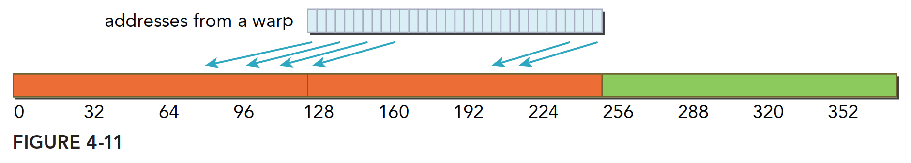
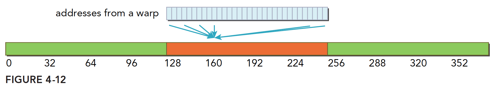
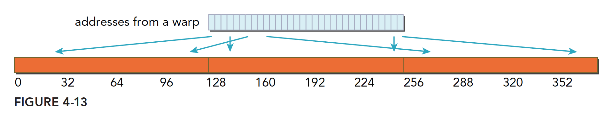

### 对齐与合并访问

全局内存通过缓存实现加载和存储的过程如下图


全局内存是一个**逻辑层面**的模型

L1表示一级缓存，每个SM都有自己L1，但是L2是所有SM公用的，除了L1缓存外，还有只读缓存和常量缓存，这个我们后面会详细介绍。
核函数运行时需要从全局内存（DRAM）中读取数据，只有两种粒度，这个是关键的：

- 128字节
- 32字节

对于CPU来说，一级缓存或者二级缓存是不能被编程的，但是CUDA是支持通过编译指令停用一级缓存的。

- 如果启用一级缓存，那么每次从DRAM上加载数据的粒度是128字节，

- 如果不适用一级缓存，只是用二级缓存，那么粒度是32字节。

当一个SM中正在被执行的某个线程需要访问内存，那么，和它同线程束的其他31个线程也要访问内存，这个基础就表示，即使每个线程只访问一个字节，那么在执行的时候，只要有内存请求，至少是32个字节，所以不使用一级缓存的内存加载，一次粒度是32字节而不是更小。

#### 对齐访问

当一个SM中正在被执行的某个线程需要访问内存，那么，和它同线程束的其他31个线程也要访问内存，这个基础就表示，即使每个线程只访问一个字节，那么在执行的时候，只要有内存请求，至少是32个字节，所以不使用一级缓存的内存加载，一次粒度是32字节而不是更小。

当一个内存事务的首个访问地址是缓存粒度（32或128字节）的偶数倍的时候：比如二级缓存32字节的偶数倍64，128字节的偶数倍256的时候，这个时候被称为对齐内存访问，非对齐访问就是除上述的其他情况，非对齐的内存访问会造成带宽浪费。

#### 合并访问

当一个线程束内的线程访问的内存都在一个内存块里的时候，就会出现合并访问。

对齐合并访问的状态是理想化的，也是最高速的访问方式，当线程束内的所有线程访问的数据在一个内存块，并且数据是从内存块的首地址开始被需要的，那么对齐合并访问出现了。为了最大化全局内存访问的理想状态，尽量将线程束访问内存组织成对齐合并的方式，这样的效率是最高的。

#### 举例

一个线程束加载数据，使用一级缓存，并且这个事务所请求的所有数据在一个128字节的对齐的地址段上（对齐的地址段是我自己发明的名字，就是首地址是粒度的偶数倍，那么上面这句话的意思是，所有请求的数据在某个首地址是粒度偶数倍的后128个字节里），具体形式如下图，这里请求的数据是连续的，其实可以不连续，但是不要越界就好。


不对齐的情况


### 全局内存读取

SM加载数据，根据不同的设备和类型分为三种路径：

1. 一级和二级缓存
2. 常量缓存
3. 只读缓存

常规的路径是一级和二级缓存，需要使用常量和只读缓存的需要在代码中显式声明。但是提高性能，主要还是要取决于访问模式。

控制全局加载操作是否通过一级缓存可以通过编译选项来控制，当然比较老的设备可能就没有一级缓存。
编译器禁用一级缓存的选项是：

```shell
-Xptxas -dlcm=cg
```

编译器启用一级缓存的选项是：

```shell
-Xptxas -dlcm=ca
```

#### 内存加载

内存加载可以分为两类：

- 缓存加载
- 没有缓存的加载

内存访问有以下特点：

- 是否使用缓存：一级缓存是否介入加载过程
- 对齐与非对齐的：如果访问的第一个地址是32的倍数（前面说是32或者128的偶数倍，这里似乎产生了矛盾，为什么我现在也很迷惑）
- 合并与非合并，访问连续数据块则是合并的

#### 缓存加载

下面是使用一级缓存的加载过程，图片表达很清楚，我们只用少量文字进行说明：

1. 对齐合并的访问，利用率100%
   
2. 对齐的，但是不是连续的，每个线程访问的数据都在一个块内，但是位置是交叉的，利用率100%
   
3. 连续非对齐的，线程束请求一个连续的非对齐的，32个4字节数据，那么会出现，数据横跨两个块，但是没有对齐，当启用一级缓存的时候，就要两个128字节的事务来完成
   
4. 线程束所有线程请求同一个地址，那么肯定落在一个缓存行范围（缓存行的概念没提到过，就是主存上一个可以被一次读到缓存中的一段数据。），那么如果按照请求的是4字节数据来说，使用一级缓存的利用率是 4128=3.125%4128=3.125%
   
5. 比较坏的情况，前面提到过最坏的，就是每个线程束内的线程请求的都是不同的缓存行内，这里比较坏的情况就是，所有数据分布在 NN 个缓存行上，其中 1≤N≤321≤N≤32，那么请求32个4字节的数据，就需要 NN 个事务来完成，利用率也是 1N1N
   

#### 没有缓存的加载

没有缓存的加载是指的没有通过一级缓存，二级缓存则是不得不经过的

当不使用一级缓存的时候，内存事务的粒度变为32字节，更细粒度的好处是提高利用律

#### 制度缓存

只读缓存最初是留给纹理内存加载用的，在3.5以上的设备，只读缓存也支持使用全局内存加载代替一级缓存。也就是说3.5以后的设备，可以通过只读缓存从全局内存中读数据了。
只读缓存粒度32字节，对于分散读取，细粒度优于一级缓存
有两种方法指导内存从只读缓存读取：

1. 使用函数 _ldg
2. 在间接引用的指针上使用修饰符

代码：

```
__global__ void copyKernel(float * in,float* out)
{
    int idx=blockDim*blockIdx.x+threadIdx.x;
    out[idx]=__ldg(&in[idx]);

}
```


注意函数参数，然后就能强制使用只读缓存了。

### 全局内存写入


参考：[【CUDA 基础】4.3 内存访问模式 | 谭升的博客 (face2ai.com)](https://face2ai.com/CUDA-F-4-3-内存访问模式/)