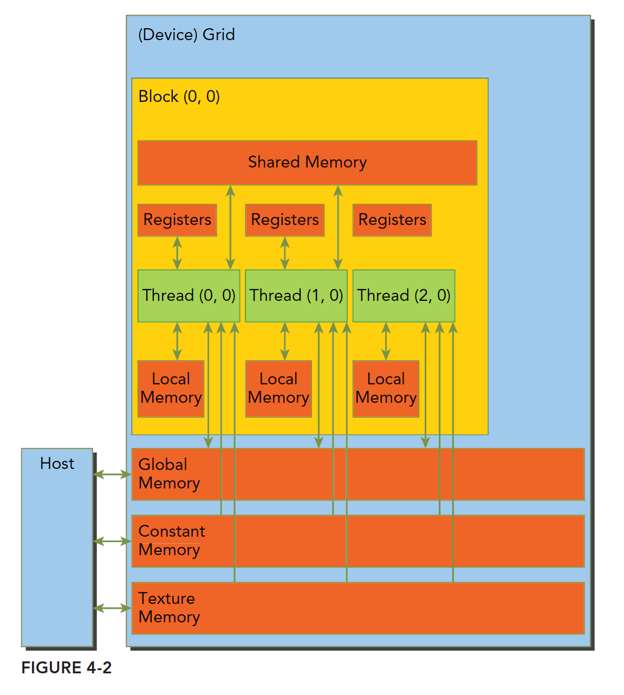

#### 内存结构


速度最快的是寄存器，他能和cpu同步的配合，接着是缓存，在CPU片上，然后是主存储器，现在常见的就是内存条，显卡上也有内存芯片，然后是硬盘

CPU和GPU的主存都是采用DRAM——动态随机存取存储器，而低延迟的内存，比如一级缓存，则采用SRAM——静态随机存取存储器。虽然底层的存储器延迟高，容量大，但是其中有数据被频繁使用的时候，就会向更高一级的层次传输，比如我们运行程序处理数据的时候，程序第一步就是把硬盘里的数据传输到主存里面。
GPU和CPU的内存设计有相似的准则和模型。但他们的区别是：CUDA编程模型将内存层次结构更好的呈献给开发者，让我们显示的控制其行为。

CPU内存结构中，一级二级缓存都是不可编程（完全不可控制）的存储设备。

**GPU上的内存设备有**：

- 寄存器
- 共享内存
- 本地内存
- 常量内存
- 纹理内存
- 全局内存

CUDA中每个线程都有自己的私有的本地内存；线程块有自己的共享内存，对线程块内所有线程可见；所有线程都能访问读取常量内存和纹理内存，但是不能写，因为他们是只读的；全局内存，常量内存和纹理内存空间有不同的用途。对于一个应用来说，全局内存，常量内存和纹理内存有相同的生命周期。下图总结了上面这段话，后面的大篇幅文章就是挨个介绍这些内存的性质和使用的。



#### 寄存器

当我们在核函数内不加修饰的声明一个变量，此变量就存储在寄存器中；

CPU中，只有当前在计算的变量存储在寄存器中，其余在主存中，使用时传输至寄存器。

为了避免寄存器溢出，可以在核函数的代码中配置额外的信息来辅助编译器优化，比如：

```c
__global__ void
__lauch_bounds__(maxThreadaPerBlock,minBlocksPerMultiprocessor)
kernel(...) {
    /* kernel code */
}
```

#### 本地内存

核函数中符合存储在寄存器中但不能进入被核函数分配的寄存器空间中的变量将存储在本地内存中，编译器可能存放在本地内存中的变量有以下几种：

- 使用未知索引引用的本地数组
- 可能会占用大量寄存器空间的较大本地数组或者结构体
- 任何不满足核函数寄存器限定条件的变量

本地内存实质上是和全局内存一样在同一块存储区域当中的，其访问特点——高延迟，低带宽。
对于2.0以上的设备，本地内存存储在每个SM的一级缓存，或者设备的二级缓存上。

#### 共享内存

在核函数中使用如下修饰符的内存，称为共享内存：

```
__share__
```


每个SM都有一定数量的由线程块分配的共享内存，共享内存是片上内存，跟主存相比，速度要快很多，也即是延迟低，带宽高。其类似于一级缓存，但是可以被编程。

共享内存在核函数内声明，生命周期和线程块一致，线程块运行开始，此块的共享内存被分配，当此块结束，则共享内存被释放。

#### 常量内存

#### 纹理内存

#### 全局内存

GPU上最大的内存空间，延迟最高，使用最常见的内存，global指的是作用域和生命周期，一般在主机端代码里定义，也可以在设备端定义，不过需要加修饰符，只要不销毁，是和应用程序同生命周期的。全局内存对应于设备内存，一个是逻辑表示，一个是硬件表示、
全局内存可以动态声明，或者静态声明，可以用下面的修饰符在设备代码中静态的声明一个变量：

```c
__device__
```


我们前面声明的所有的在GPU上访问的内存都是全局内存，或者说到目前为止我们还没对内存进行任何优化。

### 总结

用表格进行总结：

|   修饰符   |    变量名称    | 存储器 | 作用域 | 生命周期 |
| :--------: | :------------: | :----: | :----: | :------: |
|            |   float var    | 寄存器 |  线程  |   线程   |
|            | float var[100] |  本地  |  线程  |   线程   |
| __share__  |   float var*   |  共享  |   块   |    块    |
| __device__ |   float var*   |  全局  |  全局  | 应用程序 |
| __constant |   float var*   |  常量  |  全局  | 应用程序 |

设备存储器的重要特征：

| 存储器 | 片上/片外 |   缓存    | 存取 |     范围      | 生命周期 |
| :----: | :-------: | :-------: | :--: | :-----------: | :------: |
| 寄存器 |   片上    |    n/a    | R/W  |   一个线程    |   线程   |
|  本地  |   片外    | 1.0以上有 | R/W  |   一个线程    |   线程   |
|  共享  |   片上    |    n/a    | R/W  | 块内所有线程  |    块    |
|  全局  |   片外    | 1.0以上有 | R/W  | 所有线程+主机 | 主机配置 |
|  常量  |   片外    |    Yes    |  R   | 所有线程+主机 | 主机配置 |
|  纹理  |   片外    |    Yes    |  R   | 所有线程+主机 | 主机配置 |


参考：[【CUDA 基础】4.1 内存模型概述 | 谭升的博客 (face2ai.com)](https://face2ai.com/CUDA-F-4-1-内存模型概述/)