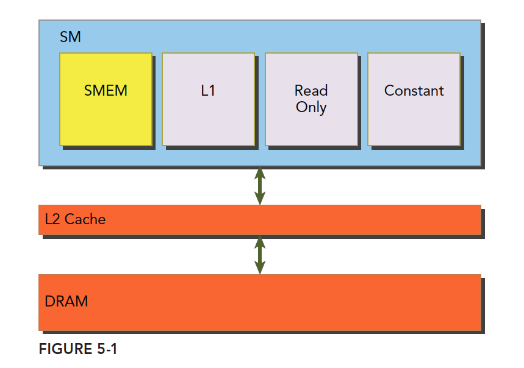
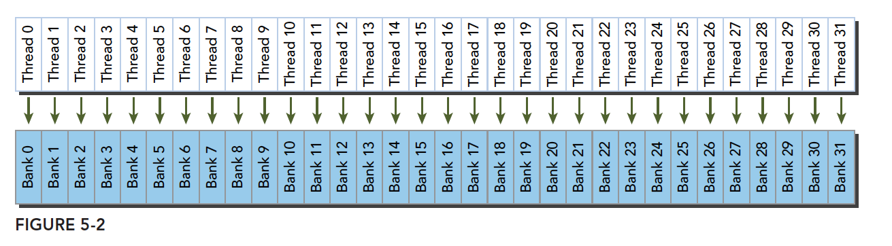
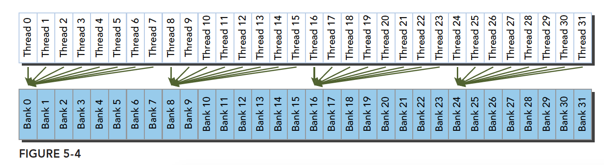
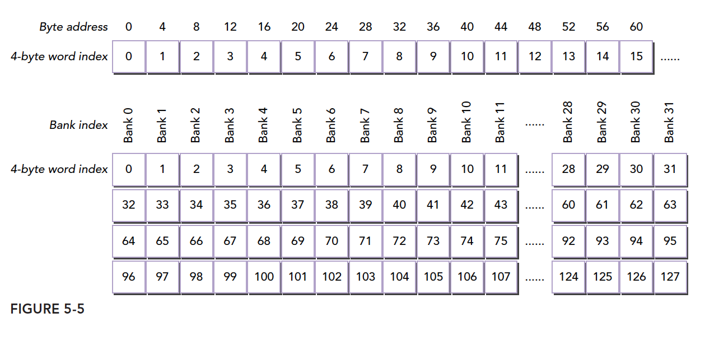
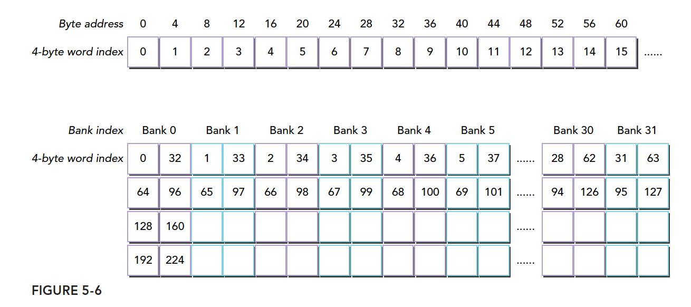

### GPU内存

可分为：

- 板载内存：全局内存
- 片上内存：共享内存

#### 共享内存

可编程的内存，用途：

- **块内**线程通信的通道
- 全局内存数据的**可编程管理**的缓存
- 暂存存储器，用于转换数据来优化全局内存访问模式

共享内存（shared memory，SMEM）是GPU的一个关键部分。物理层面，每个SM有一个小的内存池，被在SM上执行的线程块中的所有线程所共享。

共享内存使同一个线程块中可以相互协同，便于片上的内存可以被最大化的利用，降低回到全局内存读取的延迟。



共享内存和占用它的线程块有相同的声明周期。

1. 最好的情况是当前线程束中的每个线程都访问一个不冲突的共享内存，具体是什么样的我们后面再说，这种情况，大家互不干扰，一个事务完成整个线程束的访问，效率最高
2. 当有访问冲突的时候，具体怎么冲突也要后面详细说，这时候一个线程束32个线程，需要32个事务。
3. 如果线程束内32个线程访问同一个地址，那么一个线程访问完后以广播的形式告诉大家

### 共享内存分配

分配和定义共享内存的方法有多种，动态的声明，静态的声明都是可以的。可以在核函数内，也可以在核函数外（也就是本地的和全局的，这里是说变量的作用域，在一个文件中）

CUDA支持1，2，3维的共享内存声明

```C
__shared__ float a[size_x][size_y];

```

size是编译时确定的数字，不能是变量。

动态声明一个共享内存数组，可以使用extern关键字，并在核函数启动时添加第三个参数。
声明:

```c
extern __shared__ int tile[];
kernel<<<grid,block,isize*sizeof(int)>>>(...);
```

isize就是共享内存要存储的数组的大小。比如一个十个元素的int数组，isize就是10.
注意，**动态声明只支持一维数组**

### 存储体和访问模式

#### 存储体

共享内存是一个一维的地址空间，注意这句话的意思是，共享内存的地址是一维的，也就是和所有我们前面提到过的内存一样，都是线性的，二维三维更多维的地址都要转换成一维的来对应物理上的内存地址。
共享内存有个特殊的形式是，分为32个同样大小的内存模型，称为存储体，**可以同时访问**。32个存储体的目的是对应一个线程束中有32个线程，

这些线程在访问共享内存的时候，如果**都访问不同存储体**（无冲突），那么一个事务就能够完成，否则（有冲突）需要多个内存事务了，这样带宽利用率降低。

#### 存储体冲突

当多个线程要访问一个存储体的时候，冲突就发生了，注意这里是说访问同一个存储体，而不是同一个地址，访问同一个地址不存在冲突（广播形式）

线程束访问共享内存的时候有下面3种经典模式：

1. 并行访问，多地址访问多存储体
2. 串行访问，多地址访问同一存储体
3. 广播访问，单一地址读取单一存储体

广播访问是所有线程访问一个地址，这时候，一个内存事务执行完毕后，一个线程得到了这个地址的数据，他会通过广播的形式告诉其他所有线程，虽然这个延迟相比于完全的并行访问并不慢，但是他只读取了一个数据，带宽利用率很差。

串行模式是所有线程访问同一个存储体，注意不是同一个地址，是同一个存储体，一个存储体有很多地址。

最优访问模式（并行不冲突）：


不规则的访问模式（并行不冲突）：


不规则的访问模式（并行可能冲突，也可能不冲突）



#### 访问模式

存储体和地址的关系。

内存存储体的宽度随设备计算能力不同而变化，有以下两种情况：

1. 2.x计算能力的设备，为4字节（32位）
2. 3.x计算能力的设备，为8字节（64位）

对应的图如下。





### 解决冲突

#### 内存填充

#### 访问模式配置

更改存储体带宽（比如4字节改为8字节）

### 配置共享内存

每个SM上有64KB的片上内存，共享内存和L1共享这64KB，并且可以配置。CUDA为配置一级缓存和共享内存提供以下两种方法：

1. 按设备进行配置
2. 按核函数进行配置

配置函数：

```
cudaError_t cudaDeviceSetCacheConfig(cudaFuncCache cacheConfig);
```


其中配置参数如下：

```
cudaFuncCachePreferNone: no preference(default)
cudaFuncCachePreferShared: prefer 48KB shared memory and 16 KB L1 cache
cudaFuncCachePreferL1: prefer 48KB L1 cache and 16 KB shared memory
cudaFuncCachePreferEqual: prefer 32KB L1 cache and 32 KB shared memory
```


那种更好全看核函数：

1. 共享内存使用较多，那么更多的共享内存更好
2. 更多的寄存器使用，L1更多更好。

另一个函数是通过不同核函数自动配置的。

```
cudaError_t cudaFuncSetCacheConfig(const void* func,enum cudaFuncCacheca cheConfig);
```


这里的func是核函数指针，当我们调用某个核函数时，次核函数已经配置了对应的L1和共享内存，那么其如果和当前配置不同，则会重新配置，否则直接执行。

### 同步

参考：[【CUDA 基础】5.1 CUDA共享内存概述 | 谭升的博客 (face2ai.com)](https://face2ai.com/CUDA-F-5-1-CUDA共享内存概述/)