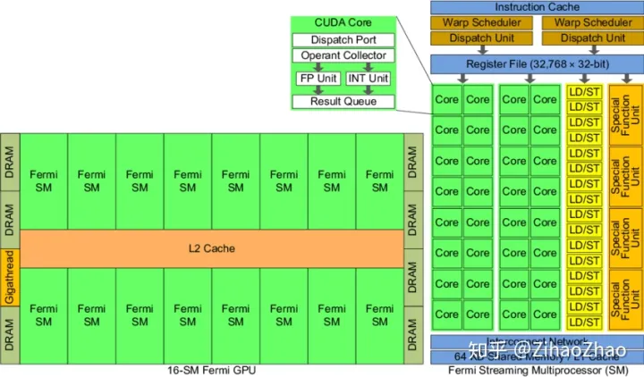

### 硬件结构

以Fermi架构的GPU为例，其结构如下图。

- GPU实际上是一个SM的阵列，即多个SM
- 每个SM包含N个核，现代GPU一般为128或192个

#### SM

SM由大量计算核（有时也称SP或CUDA核）、LDU（Load-Store Units）、SFU（Special-Function Units）、寄存器、共享内存等构成。这种结构正是GPU具有高并行度计算能力的基础。**通过一定的层级结构组织大量计算核，并给各级都配有相应的内存系统**，GPU获得了出色的计算能力。

每一个SM都能支持数百个线程并发执行。

当启动一个内核网络时，它的线程块会被分布在可用的SM上来执行。当线程块一旦被调度到一个SM上，其中的线程只会在那个指定的SM上并发执行。**多个线程块可能会被分配到同一个SM上**，而且是根据SM资源的可用性进行调度的。

- 当启动一个内核网络时，它的线程块会被分布在可用的SM上来执行。当线程块一旦被调度到一个SM上，其中的线程只会在那个指定的SM上并发执行。多个线程块可能会被分配到同一个SM上，而且是根据SM资源的可用性进行调度的。
- LDU（Load-Store Units）负责将值加载到内存或从内存中加载值
- SFU（Special-Function Units）用来处理sin、cos、求倒数、开平方特殊函数。

参考：[CUDA编程入门（二）GPU硬件基础 - 知乎 (zhihu.com)](https://zhuanlan.zhihu.com/p/97131966)