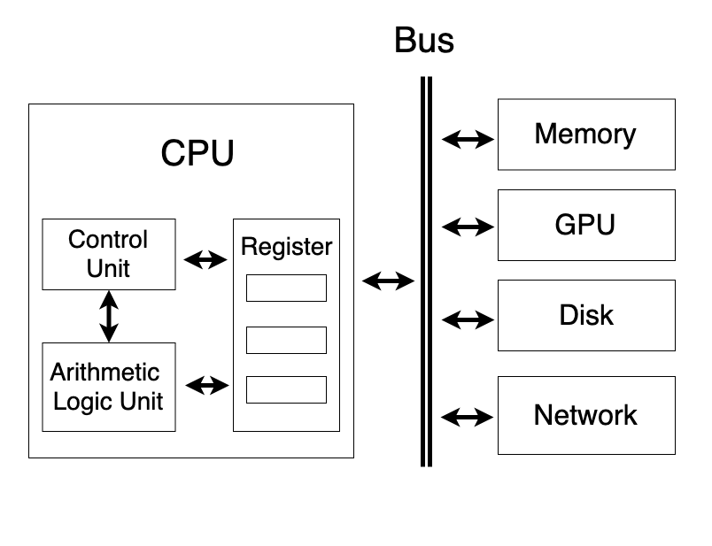
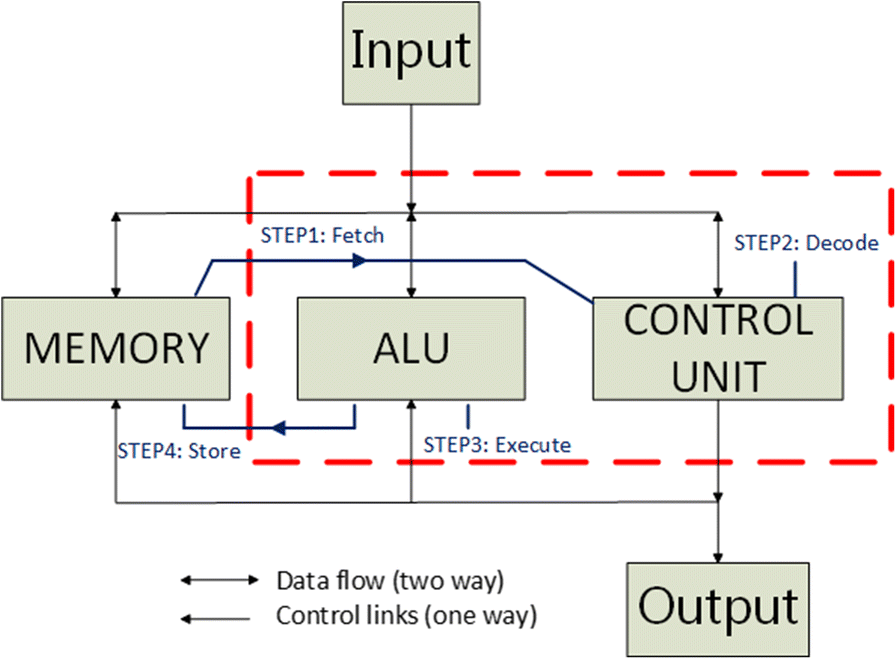
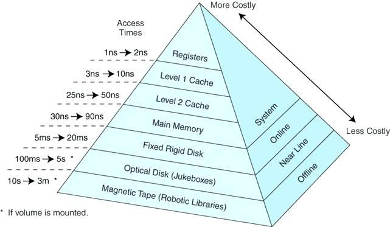
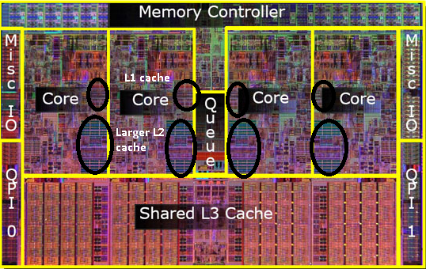
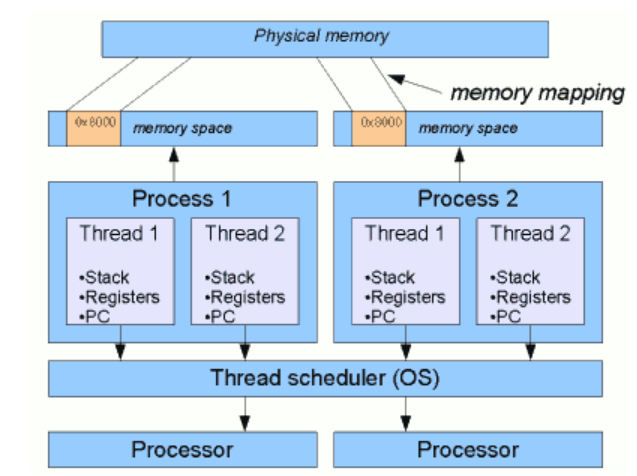

### 1. CPU工作原理

只接受二进制语言，其中的0和1用来控制高低电位。

不同厂商的电路设计不同，在电路上所能进行的二进制码不同。某类CPU能支持一种指令集（instruction set architecture）。指令集相当于一种设计图纸，规定了一种CPU架构实现哪些指令。

#### 指令集

比较常见的指令集有x86、ARM、MIPS、SPARC、Power等。x86和ARM被广泛应用在我们身边的电子产品上，相对比较知名，此外，龙芯实现了MIPS，IBM小型机则采用Power指令集。

#### 通信

CPU的架构：

- Control Unit（CU）起协调管理功能。
- Arithmetic Logic Unit（ALU）接受控制单元的命令，负责进行加减乘与或非运算。所有数据都存放在寄存器（Register）里。
- 寄存器以极高的速度与CU和ALU交互，通常小于1纳秒。从寄存器的名字可以看出来，里面的数据是临时寄存的，这些数据和指令会被ALU和CU拿来立即进行计算。如果寄存器没有CPU想要的数据，CPU会去内存或硬盘中读取。
- CPU通过Bus（总线）读取内存或其他设备的数据。计算机中有多条总线。

#### 工作机制

计算机需要知道两个问题：

1. 本次所执行的是哪个指令。
2. 该指令的执行对象是什么

控制单元先取指令 Fetch，然后指令译码 Decode解析出要执行什么指令，并确认指令是对哪些数据（操作数 Operand）进行操作，并将操作数从主存加载到寄存器中。ALU执行指令 Execute后结果写回 Store。

### 存储金字塔

随着技术的发展，计算机的速度瓶颈已经变成了超高速的CPU运算速度与落后的数据读取速度之间的矛盾。CPU计算速度在纳秒级别，但是CPU读取主存的速度竟有百纳秒，CPU进行完计算后，要闲置几十倍的时间，实在是巨大的浪费。从计算本身来说，某个程序一般不需要把硬盘或主存中的所有数据都拿来进行计算，绝大多数时间只需要处理部分热点数据，因此，把热点数据加载到缓存中能解决绝大多数问题。综合计算速度、技术水平、生产成本，设计人员给CPU增加了很多中间的缓存Cache。

### 多核

绕过主频问题，在一块CPU中增加多个核心（Core）。

一个核心是一个可以运行指令的独立单元，它包含了前面所提到的ALU和寄存器，并配备L1和L2 Cache。多个核心共享L3 Cache。

### 线程与进程

进程（Process）具有单独的计算资源，如内存空间。

线程（Thread）是进程的一个子集，一个进程默认启动一个线程，也可以通过多线程编程，启动多个线程，多个线程共享进程的资源。

在多核架构出现之前，CPU在某个特定时刻只能执行某个程序，无法并行。就像人在某个时刻只能做一件事情，不可能“吃着火锅还唱着歌”，因为两项活动都要占用嘴。如果要干另一件事，就必须把其中一件事停下来。