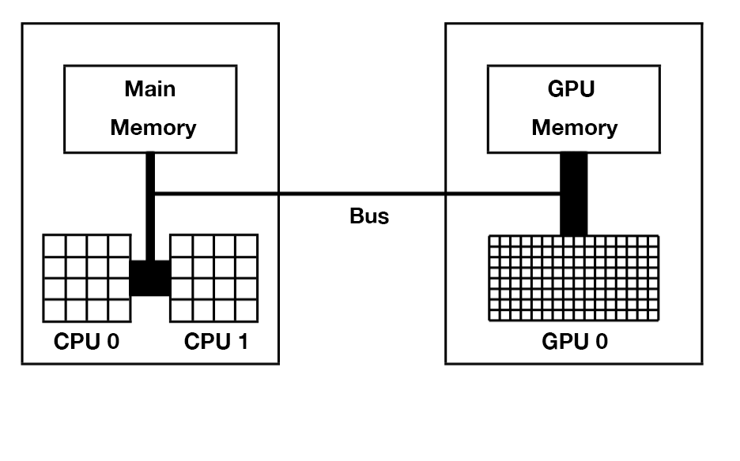
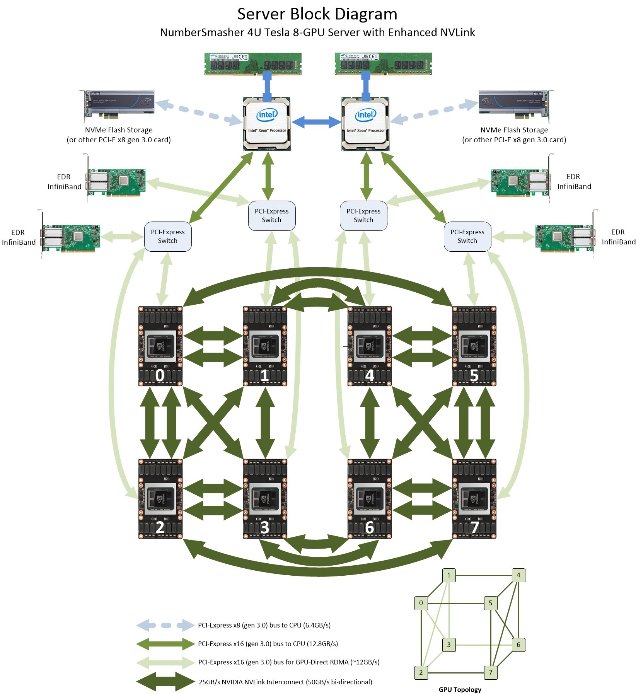
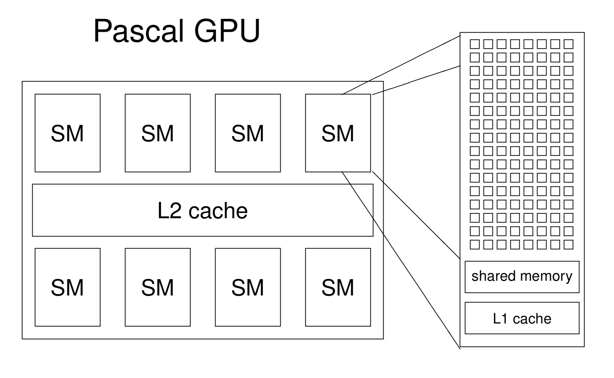
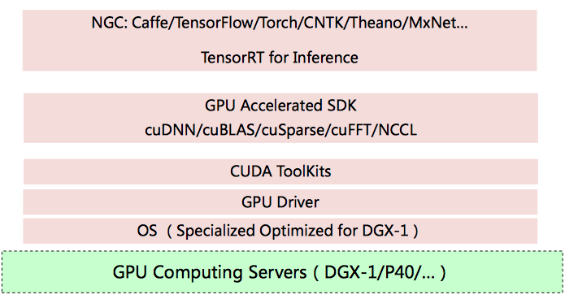
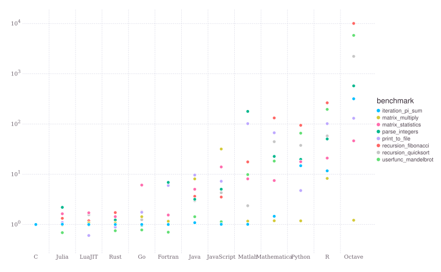

CPU主要从主存（Main Memory）中读写数据，并通过总线（Bus）与GPU交互。GPU除了有超多计算核心外，也有自己独立的存储，被称之为显存。一台服务器上可以安装多块GPU卡，但GPU卡的发热量极大，普通的空调系统难以给大量GPU卡降温，所以大型数据中心通常使用水冷散热，并且选址在温度较低的地方。

GPU核心在做计算时，只能直接从显存中读写数据，程序员需要在代码中指明哪些数据需要从主存和显存之间相互拷贝。这些数据传输都是在总线上，因此**总线的传输速度和带宽成了部分计算任务的瓶颈**。也因为这个瓶颈，很多计算任务并不适合放在GPU上，比如笔者前两年一直关注的推荐系统虽然也在使用深度学习，但因为模型输入是大规模稀疏特征，GPU加速获得的收益小于数据互相拷贝的时间损失。

在英伟达的设计理念里，CPU和主存被称为**主机（Host）**，GPU被称为**设备（Device）**。Host和Device概念会贯穿整个英伟达GPU编程，甚至包括OpenCL等其他平台。

#### 异构计算

CPU+GPU组合来加速计算。

绝大多数的高性能计算中心会使用下图所示的结构，比如一台服务器上有2至4块Intel Xeon CPU和1至8块英伟达GPU显卡，多台机器之间通过InfiniBand高速网络互联。

图示：*高性能计算场景硬件设计拓扑图：单台机器共有8张英伟达显卡，每张显卡之间通过NVLink互联，显卡和Intel CPU之间使用PCI-E总线相连，多台机器之间通过InfiniBand高速互联网络互联。*

异构计算对于人工智能和超级计算机至关重要。几乎主流的高性能和超级计算中心均使用了异构计算来提升算力。

### 英伟达GPU硬件架构

多个核心组成一个Streaming Multiprocessor（**SM**），一张GPU卡有多个SM。从“Multiprocessor”这个名字上也可以看出SM包含了多个处理器。实际上，英伟达主要以SM为运算和调度的基本单元。

#### Nvidia架构类型

- Ampere 安培
  - 2020年5月发布
  - 专业显卡：Telsa A100
- Turing 图灵
  - 2018年发布
  - 消费显卡：GeForce RTX 2080 Ti、Titan RTX
- Volta 伏特
  - 2017年末发布
  - 专业显卡：Telsa V100 (16或32GB显存 5120个CUDA核心)
- Pascal 帕斯卡
  - 2016年发布
  - 专业显卡：Telsa P100(12或16GB显存 3584个CUDA核心)

一个SM种包含了计算核心、存储等部分：

- 针对不同类型计算的小核心，包括64位浮点核心（FP64），整型核心(INT)，32位浮点核心(FP32)，优化深度学习的Tensor Core。
- 计算核心直接从寄存器（Register）中读写数据。
- 调度和分发器（Scheduler和Dispatch Unit）。
- L0和L1级缓存。

具体而言，SM中的FP32进行32位浮点加乘运算，INT进行整型加乘运算，SFU（Special Functional Unit）执行一些倒数和三角函数等运算。

**Tensor core**：混合精度的计算核心。当前深度神经网络中使用到最频繁的矩阵运算是：$D = A \times B + C$。Tensor Core可以对$4*4$的矩阵做上述运算。其中，涉及乘法的A*A*和B*B*使用FP16的16位浮点运算，精度较低；涉及加法的C*C*和D*D*使用FP16或FP32精度。Tensor Core是在Volta架构开始提出的，使用Volta架构的V100在深度学习上的性能远超Pascal架构的P100。

产品线**：

- 消费级产品 GeForce 系列：GeForce RTX 2080 Ti ...
- 针对数据中心的高性能计算产品 Telsa 系列：Telsa V100、Telsa P100、Telsa P40 ...

### 软件

CUDA（Compute Unified Device Architecture）编程模型

继CUDA之后，英伟达不断丰富其软件技术栈，**提供了科学计算所必需的cuBLAS线性代数库，cuFFT快速傅里叶变换库等**，当深度学习大潮到来时，英伟达提供了cuDNN深度神经网络加速库，目前常用的TensorFlow、PyTorch深度学习框架的底层大多基于cuDNN库。关于英伟达的软件栈，可以总结为：

- 最底层是GPU硬件，包括各类GPU显卡，DGX工作站等。
- 操作系统是基于硬件的第一层软件，在操作系统上我们需要安装GPU驱动。
- CUDA在GPU驱动之上，有了CUDA，我们可以进行一些GPU编程。
- 英伟达对相似计算进一步抽象，进而有了cuBLAS、cuFFT、cuDNN等库，这些库基于CUDA提供常见的计算。
- 最顶层是应用，包括TensorFlow和PyTorch的模型训练和推理过程。

#### 编程实现

GPU编程可以直接使用CUDA的C/C++版本进行编程，也可以使用其他语言包装好的库，比如Python可使用Numba库调用CUDA。CUDA的编程思想在不同语言上都很相似。

### 语言性能

